# Lab 01: Organization Setup

## Overview

### Background

In this lab for Microsoft Cloud for Sustainability you will build on top of demo data to configure the “Set up organization and reference data” scenario. Contoso Corp (*organization present in the demo data*) is a specialty Coffee distribution business with operations in APAC, US, Africa, and Europe.

Contoso Corp is experiencing Supply chain challenges to transport its finished goods across the USA and wants to augment its transportation and logistics capacities. To meet this challenge, Contoso Corp acquires a transportation business called Wide World Importers based in Florida, USA. Wide World Importers has two office facilities with 100 employees that coordinate a fleet of 40 electric trucks that will be used for transportation of finished goods across the USA.

### Learning Objectives

In this lab, you will perform the following:

- Review the company profile for Contoso Corp, add Wide World Importers to the organizational structure, and add the two Florida facilities

- Create reference data for contractual types

- Create units with conversion factor

- The newly created data during this lab exercise will form the foundation for the rest of the scenarios (data ingestion, calculations, and reporting) in the upcoming lab exercises.

### Prerequisites

- Microsoft Sustainability manager environment is set up with sample data

### Solution Focus Area

Organization setup focuses on the foundational steps required to configure the Microsoft Sustainability Manager application. These foundational steps will create the company profile, set up organizational structure and hierarchy, and corresponding facilities. After this, reference data will be set up that includes important information such as fuel types, vehicle types, contractual instrument types, and units. Some of this reference data is unique to an organization, and some will come from standard or industry sources.

### Personas and Scenarios

In this lab, Jessie Irwin – Sustainability lead for Contoso Corp and Amber Rodriguez - Sustainability Specialist for Contoso Corp educate Alex Serra of Wide World importers on the tools and processes used for Contoso’s Sustainability reporting. Jessie guides Alex to build an inventory management plan by listing out the operating boundaries, facilities, and emission sources. Jessie and Amber demonstrate “Microsoft Sustainability Manager” and share the inventory plan template with Alex Serra – Emissions Analyst and Reed Flores – IT Admin. After completing the Inventory plan template - together, Alex and Reed set up the Company Profile, Organization data and Reference data based on the data provided by Amber in the Inventory plan.

In this lab exercise, we will focus on the scenarios illustrated below:

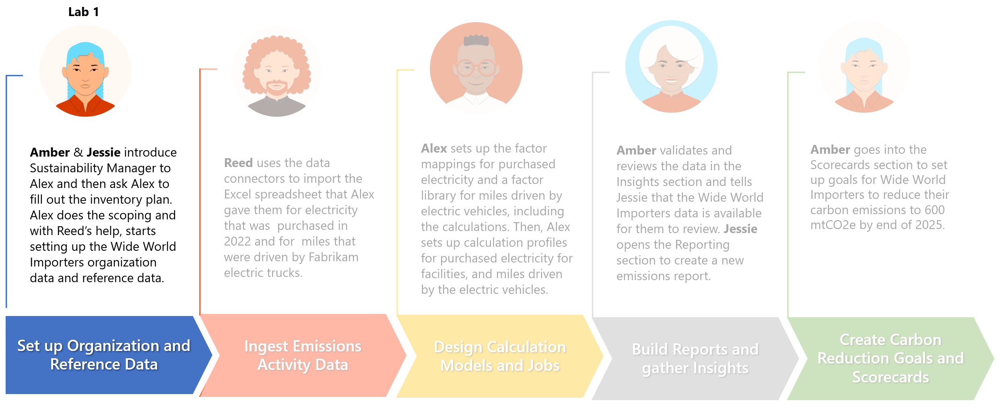

## Exercise 1: Set up company profile and reference data

In this exercise, you will learn about the steps that Alex and Reed take to set up Wide World Imports company profile, organizational data, and reference data. You can explore this functionality in deeper detail on Microsoft Docs, please visit Set up a company profile at +++https://docs.microsoft.com/en-us/industry/sustainability/setup-company-profile+++.

1. Open the **Sustainability Manager** Application

    

You will land on the **Home** page for Microsoft Sustainability Manager.

 >[!NOTE]**Note**: You can dismiss the Product tour by scrolling down and selecting the **Dismiss tour** button.

 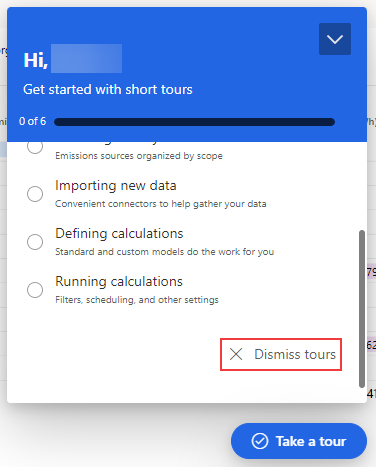

Area navigation is a common first step in each lab and exercise. You can find the area navigation menu in the bottom corner of your screen.

## Task 1: Setup the Company profile, hierarchy, and facilities

In this task, Alex sets up the Company profile, hierarchy, and facilities for the Wide World Importers organization in Microsoft Sustainability Manager.

1. In the bottom left corner, change your Area to **Settings**.

    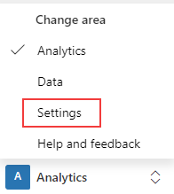

1. Navigate to **Company profile** on the left side of the page.

    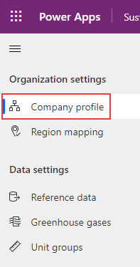

1. The Company profile page includes basic information about the organization, such as name, address, company logo, the annual reporting period, and relevant industries. Additionally, there are tabs at the top of the page for setting up organization structure and facilities, both will be covered in this exercise.

    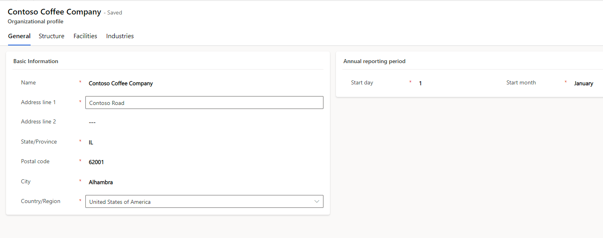

1. On the **Company profile** page, select **Industries** tab. Microsoft Sustainability Manager includes a selection of pre-defined industries and sub-verticals based on NACE standards, see NACE Code at +++https://nacev2.com/en. Select **+Add**.

    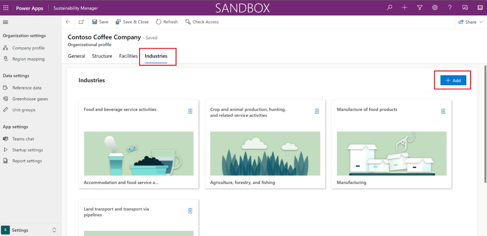

1. In the **Industries** section, select **Transportation and storage**.

    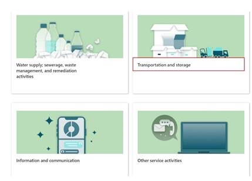

1. In the next screen, select **Land transport and transport via pipelines** and select **Add**.

    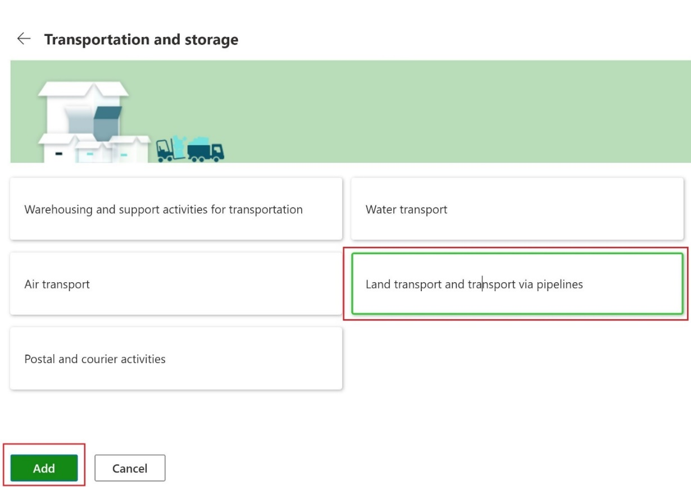

1. **Land transport and transport via pipelines** is now visible in the Industries section at the bottom of the **Company profile** page.

    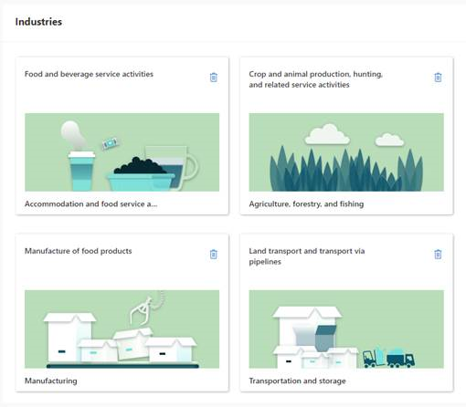

1. In the **Company profile** page, switch to the **Structure** tab.

    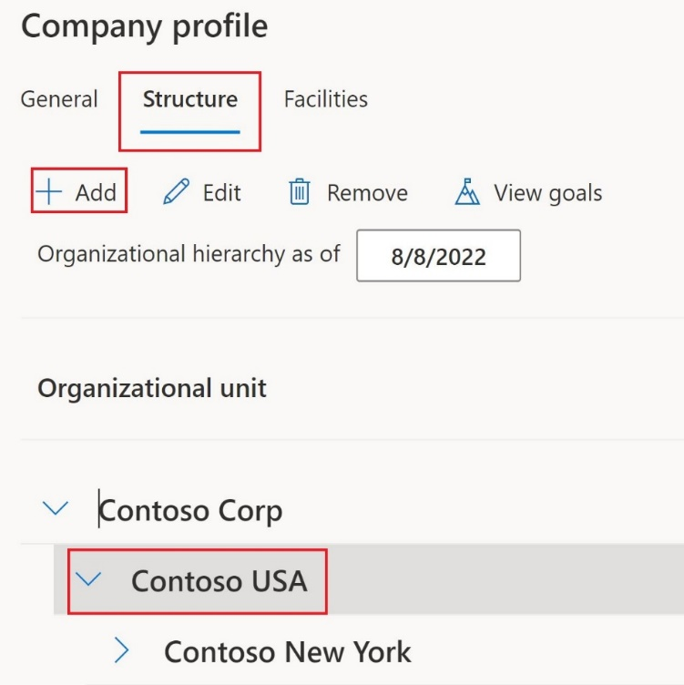

1. Select **Contoso USA** and select **Add** to add a new organizational unit under it.

    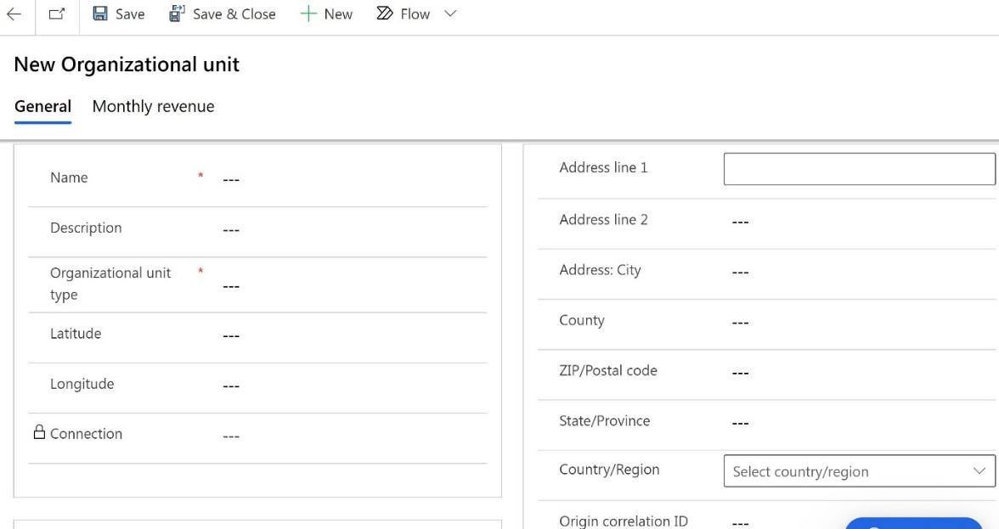

1. Enter the following data for organizational unit and select **Save** in the button pane:

    1. **Name**: Wide World Importers
    1. **Organizational unit type**: Department

    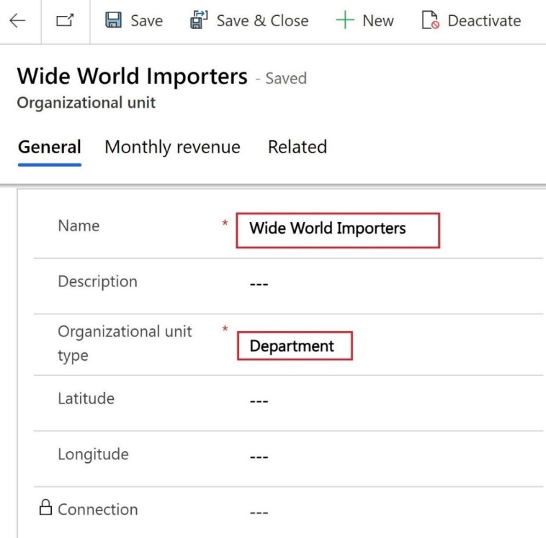

1. In the **Organizational hierarchies** section, which appears after selecting **Save**, select **+ New Organizational hierarchy**.

    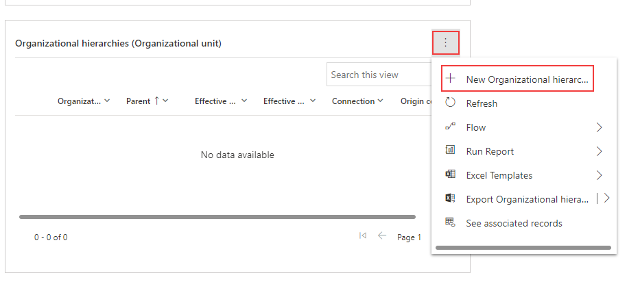

1. Set the following values and select **Save & Close**:

    1. **Parent**: Contoso USA
    1. **Effective start date**: The first day of the current month (MM/DD/YYYY)

    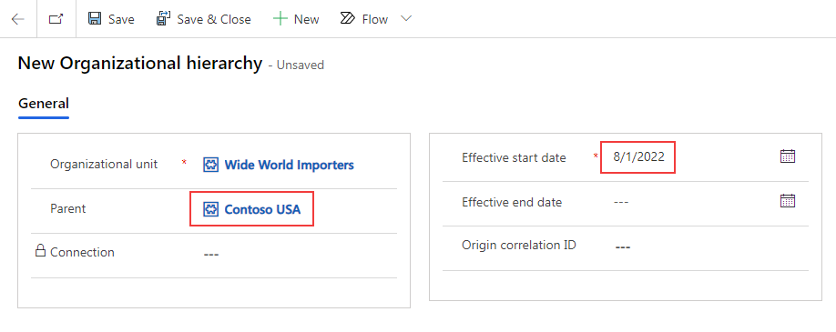

1. After being returned to the **Organizational Unit**, select **Save & Close** to return to the **Company profile**.

    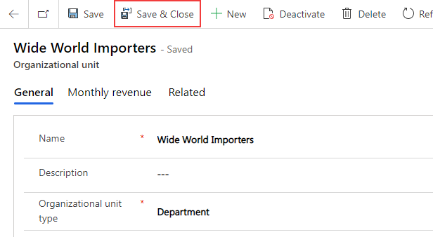

1. Navigate to **Company profile**, switch to the **Facilities** tab page and select **Add facility**.

    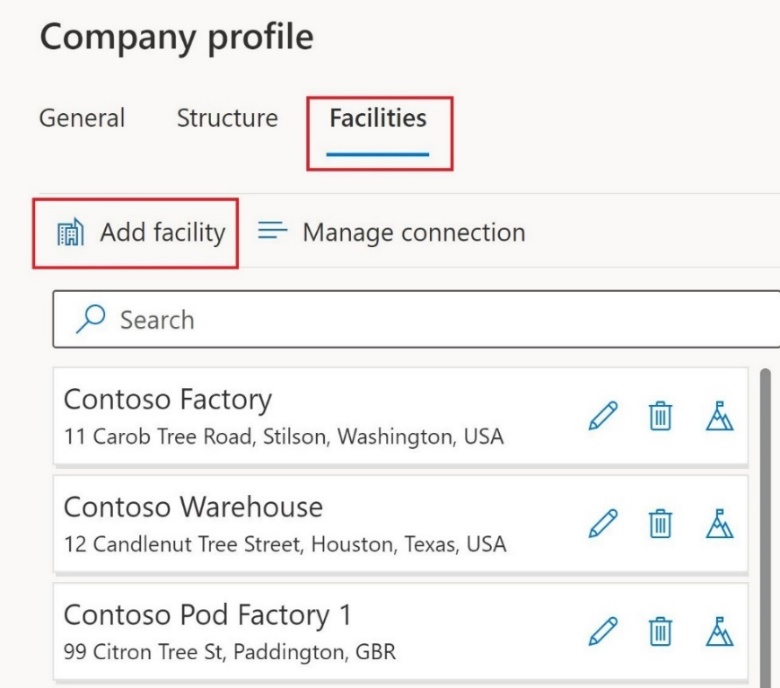

1. Create a new Facility with the following details. Once the values are entered, select **Save & Close**:

    >[!NOTE] **Note:** Pay close attention to the data used in this lab. The following labs will reference this data, and it will need to match exactly as seen in the lab.

    1. **Name**: Wide World Importers - Miami Office
    1. **Address line 1**: Brickell Avenue
    1. **City**: Miami
    1. **State**: Florida
    1. **Zip**: 33132
    1. **Country**: United states of America
    1. **Latitude**: 25.774320
    1. **Longitude**: -80.187720

    >[!NOTE] **Note:** Latitude and Longitude are not required but are used to display a pin on the Facilities map. They can be automatically added by selecting an address from the autocomplete options in Address line 1, or manually entered.

    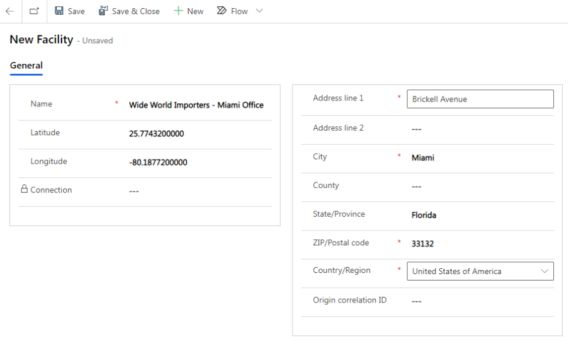

1. Using the same steps, add another new **Facility**. Once the values are entered, select **Save & Close**.

    >[!NOTE] **Note:** Pay close attention to the data used in this lab. The following labs will reference this data, and it will need to match exactly as seen in the lab.

    1. **Name**: Wide World Importers - Tampa Office
    1. **Address line 1**: Lois Avenue
    1. **City**: Tampa
    1. **State**: Florida
    1. **Zip**: 33609
    1. **Country**: United states of America
    1. **Latitude**: 27.944830
    1. **Longitude**: -82.514050

    >[!NOTE] **Note:** Latitude and Longitude are not required but are used to display a pin on the Facilities map. They can be automatically added by selecting an address from the autocomplete options in Address line 1, or manually entered.

    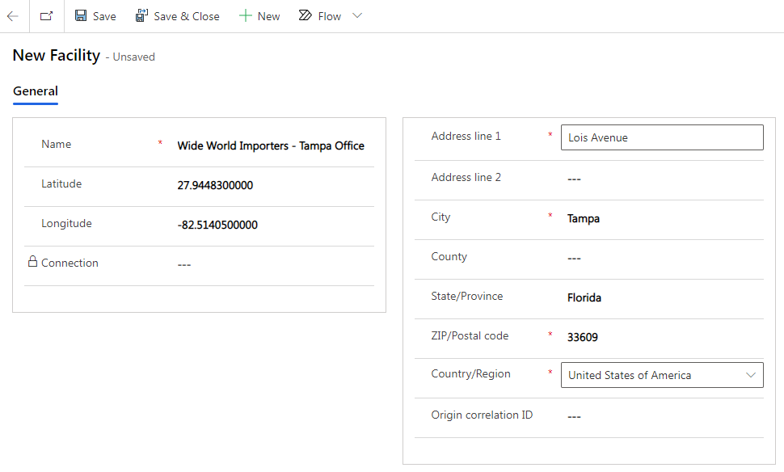

Great job, by completing these steps, you have completed the organizational setup. Organizational structure and facility management will be linked to activity and emission data to group emissions by Organization, facility, and even regions. This is an important part of carbon emission reporting and organization disclosures. **Please continue to the next task.**

## Task 2: Setup reference data

In this task, Reed sets up the reference data for contractual instrument types in Microsoft Sustainability Manager. Contractual instrument types are the different types of contractual agreements that a firm has with their providers and suppliers.

1. In the bottom left corner, change the Area to **Settings**

    

1. Navigate to **Reference data** on the left side of the page.

    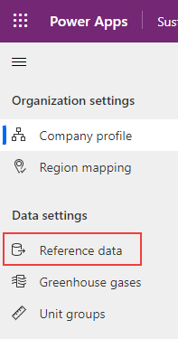

1. Select **Contractual instrument types** and select **View**.

    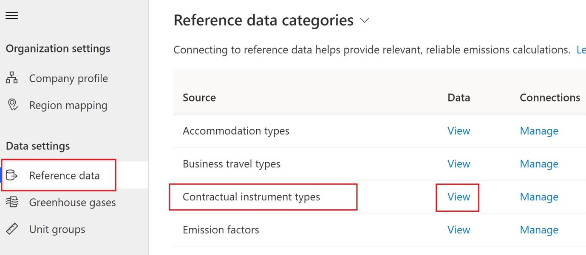

1. Under **Active contractual instrument types**, select **New** to create new contractual types

    

1. Create a new Contractual Instrument with the following details. Once entered, select **Save & Close** in the button pane.

    1. **Name**: VanArsdel Ltd
    1. **Energy source**: Nuclear

    >[!NOTE] **Note:** Pay close attention to the data used in this lab. The following labs will reference this data, and it will need to match exactly as seen in the lab.

    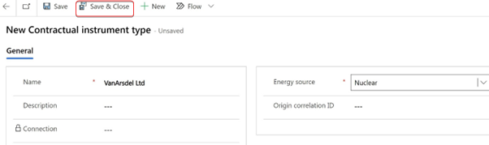

    >[!NOTE]**Note:** Pay close attention to the data used in this lab. The following labs will reference this data, and it will need to match exactly as seen in the lab.

1. In the same way, again create a new Contractual Instrument with the following details. Once entered, select **Save & Close** in the button pane.

    1. **Name**: Adatum Corp
    1. **Energy source**: Other

    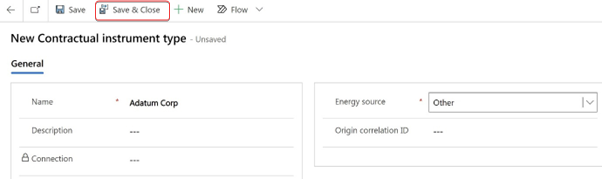

Great job, by completing these steps, you have added contractual instrument types. There are many types of reference data, take some time after this lab to explore the other reference data types, they will be used throughout Microsoft Cloud for Sustainability, and Microsoft Sustainability Manager. **Please continue to the next task.**

## Task 3: Setup Unit conversion factor

In this task, Reed sets up a unit conversion factor in Microsoft Sustainability Manager. While reviewing the inventory management plan, Alex identifies a missing unit of distance needed to calculate emissions for the fleet of electric vehicles. They ask Reed to add a new unit to the Length/Distance unit group.

Unit Groups are used to group units together and define a base unit used to convert between unit types. For example, the Length/Distance unit group contains units of length and distance, with a base unit of meter (m). The units within the Length/Distance unit group have conversions between the unit type and meter, such as miles convert to 1,609.344 meters. You can explore this functionality in deeper detail on Microsoft Docs, please visit **Set up unit groups** at +++https://docs.microsoft.com/en-us/industry/sustainability/setup-unit-groups+++.

1. In the bottom left corner, change the Area to **Settings**.

    

1. Navigate to **Unit groups** on the left side of the page.

    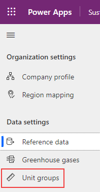

1. Under **Active unit groups**, select **Length/distance** and open it.

    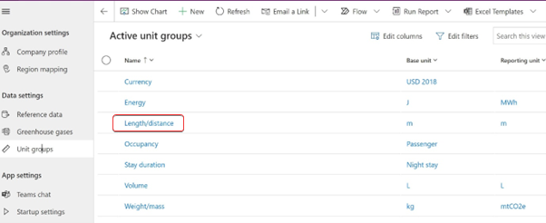

1. Select **New unit** to create a new unit.

    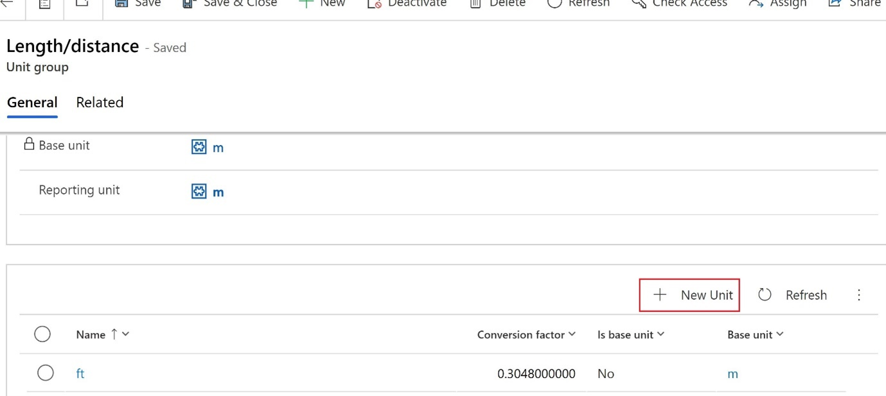

1. Enter the following details to create a new unit. Once entered, select **Save & Close** from the button pane.

    1. **Name**: 100 mile
    1. **Conversion factor**: 160934.40

    >[!NOTE] **Note:** The EPA calculates electric vehicle efficiency by the number of kilowatt hours (kWh) used per 100 miles. For consistency, it is best practice to utilize the same

    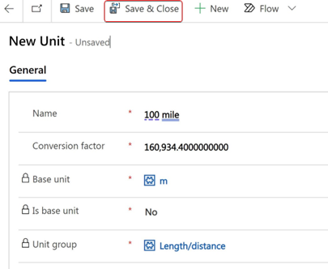

**Congratulations!** By completing these steps, you have completed the organizational and reference data setup. Organization and reference data is the foundation of the Microsoft Cloud for Sustainability and Microsoft Sustainability Manager. These data points are used throughout the tools, so it is important to spend the time to ensure that your organization and reference data is set up correctly.
