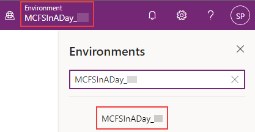

# Lab 01: Organization Setup

## Overview

### Background

In this lab for Microsoft Cloud for Sustainability you will build on top of demo data to configure the “Set up organization and reference data” scenario. Contoso Corp (*organization* *present in the demo data*) is an specialty Coffee distribution business with operations in APAC, US, Africa, and Europe.

Contoso Corp is experiencing Supply chain challenges to transport its finished goods across the USA and wants to augment its transportation and logistics capacities. To meet this challenge, Contoso Corp acquires a transportation business called Wide World Importers based in Florida, USA. Wide World Importers has two office facilities with 100 employees that coordinate a fleet of 40 electric trucks that will be used for transportation of finished goods across the USA.

### Learning Objectives

In this lab, you will perform the following:

-   Review the company profile for Contoso Corp, add Wide World Importers to the organizational structure, and add the two Florida facilities
-   Create reference data for contractual types
-   Create units with conversion factor
-   The newly created data during this lab exercise will form the foundation for the rest of the scenarios (data ingestion, calculations, and reporting) in the upcoming lab exercises.

### Prerequisites

-   Microsoft Sustainability manager environment is set up with sample data

### Solution Focus Area

Organization setup focuses on the foundational steps required to configure the Microsoft Sustainability Manager application. These foundational steps will create the company profile, set up organizational structure and hierarchy, and corresponding facilities. After this, reference data will be set up that includes important information such as fuel types, vehicle types, contractual instrument types, and units. Some of this reference data is unique to an organization, and some will come from standard or industry sources.

### Personas and Scenarios

In this lab, Jessie Irwin – Sustainability lead for Contoso Corp and Amber Rodriguez - Sustainability Specialist for Contoso Corp educate Alex Serra of Wide World importers on the tools and processes used for Contoso’s Sustainability reporting. Jessie guides Alex to build an inventory management plan by listing out the operating boundaries, facilities, and emission sources. Jessie and Amber demonstrate “Microsoft Sustainability Manager” and share the inventory plan template with Alex Serra – Emissions Analyst and Reed Flores – IT Admin. After completing the Inventory plan template - together, Alex and Reed set up the Company Profile, Organization data and Reference data based on the data provided by Amber in the Inventory plan.

In this lab exercise, we will focus on the scenarios illustrated below:

## Exercise 1: Set up company profile and reference data

In this exercise, you will learn about the steps that Alex and Reed take to set up Wide World Imports company profile, organizational data, and reference data. You can explore this functionality in deeper detail on Microsoft Docs, please visit [Set up a company profile](https://docs.microsoft.com/en-us/industry/sustainability/setup-company-profile).

-   For our Instructor Lead Training, we suggest using In-private browsing, or a new browser profile.
-   For our Instructor Lead Training, log in to <https://make.powerapps.com> using the mcfsiaduserXX@powerplatformopenhacks.onmicrosoft.com account that has been assigned to you.
-   For our Instructor Lead Training, please use the environment selector to select the MCFSInADay_XX environment that has been assigned to you

    

-   Open the **Sustainability Manager** Application

You will land on the **Home** page for Microsoft Sustainability Manager

>   [!NOTE] **Note**: You can dismiss the Product tour by scrolling down and clicking on the “Dismiss tour” button.

Area navigation is a common first step in each lab and exercise. You can find the area navigation menu in the bottom corner of your screen.

