# Module X Lesson X Lab 2: Data ingestion

## Overview

### Background

In the previous lab, Wide Word Importers’ company profile, facilities, and reference data such as Contractual instrument types were created to lay the Master data foundation for Emissions calculations and Reporting. In this lab - we will perform the Activity data ingestion for the Purchased Electricity of the two newly acquired Florida facilities. In addition, we will also ingest emission data related to the charging of the fleet of 50 Fabrikam Electric trucks. The built-in connectors in the Microsoft Sustainability Manager will be used to ingest the Activity data into the application.

### Learning Objectives

In this lab, you will do the following:

-   Use Microsoft Sustainability Manager connectors to ingest data
-   Use Power Query to transform the data before ingestion
-   Review the ingested data in the “Purchase Electricity Activity Data” Dataverse Table
-   The newly ingested activity data during this lab exercise will be utilized in the remaining scenarios (calculations and reporting) in the upcoming lab exercises.

### Prerequisites

-   Microsoft Sustainability manager environment is set up with sample data
-   Lab 01 organization and reference data is entered.

### Solution Focus Area

In this lab, the focus is on the “Data Ingestion” aspect of the Solution Focus Area. It follows the “Organization and Reference data Set up” and forms the basis for the emission calculations and the reporting thereafter. The Microsoft Sustainability Manager is flexible with multiple automated options to ingest data – such as the connectors as well as manual inputs. For scenarios that may require complex data transformation and/or ETL, tools like Azure Data Factory are recommended. You can explore this functionality in deeper detail on Microsoft Docs at **Overview of Microsoft Cloud for Sustainability Data Import**, +++https://docs.microsoft.com/en-us/industry/sustainability/import-data+++.

### Personas and Scenarios

In this lab, Reed Flores – IT Admin for Wide World Importers utilizes the activity data Excel spreadsheets sourced by Alex Serra – Emissions Analyst. The Activity data spreadsheets contain Electricity Purchased for the year 2021 and Miles driven by the fleet of Fabrikam Electric Trucks for the calendar year 2021. Reed utilizes Microsoft Sustainability Manger’s connector functionality to import from the Excel spreadsheets, and reviews other connectors available for future purposes. Reed uses the built-in Power Query functionality to transform the data to match Microsoft Sustainability Manager’s data schema and looks for other potential issues such as case-sensitive d data fields.

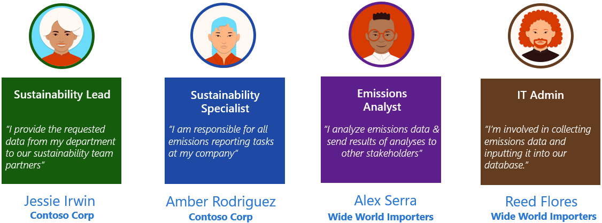

In this lab exercise, we will focus on the Lab 02 scenario illustrated below:

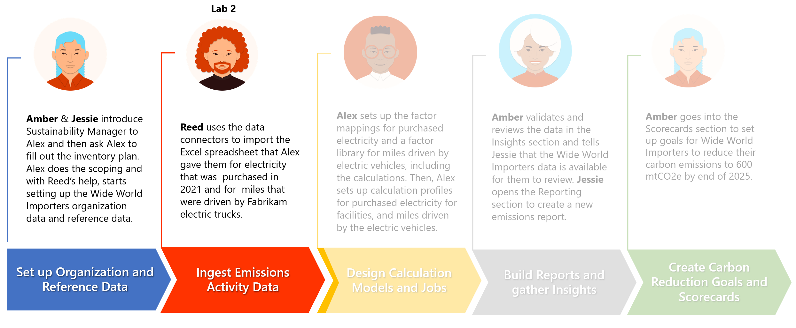

## Exercise 1: Import Data

In this exercise, you will learn about the steps that Reed takes to ingest the spreadsheets given by Alex. Data import is a vital task to bringing large volumes of data into Microsoft Sustainability Manager. Excel is utilized in this lab; however, many pre-built connectors are available, and Partners can build custom connectors to integrate with additional data sources. You can explore this functionality in deeper detail on Microsoft Docs, please visit **Overview of data connectors** at +++https://docs.microsoft.com/en-us/industry/sustainability/import-data-connectors+++.

>[!NOTE] **Important** Please ensure you have completed the previous lab to create Reference Data. **The data import process requires all Reference Data to exist, and the process is case sensitive, so please ensure the Reference data that was added has the exact same case formatting as what is found in the lab**. Failure to do so will result in errors during the data import process

-   For our Instructor Lead Training, we suggest using In-private browsing, or a new browser profile.
-   For this lab, you will be utilizing OneDrive. Please ensure that your personal one drive has been initialized by selecting the app selector button in the top left corner of the screen

    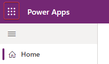

1. Select **OneDrive** from the Apps list

    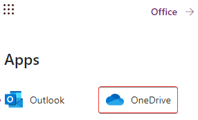

1. This will open a new tab with your new OneDrive. You can close this tab and return to the Power Apps maker portal.

    

1. Open the **Sustainability Manager** Application.

    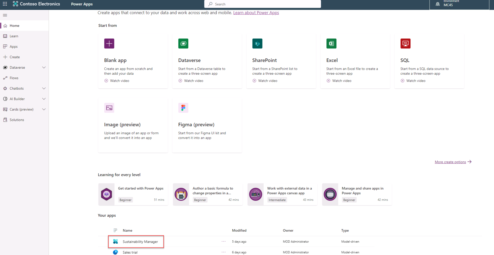

    You will land on the **Home** page for Microsoft Sustainability Manager.

    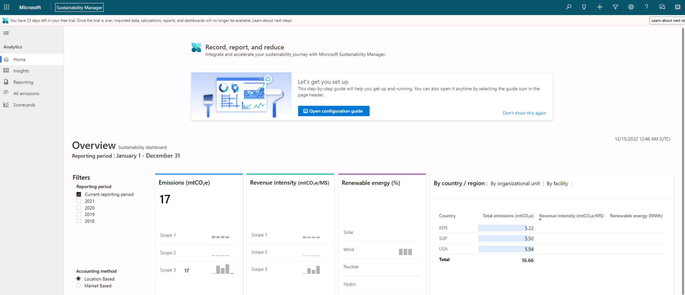

    Area navigation is a common first step in each lab and exercise. You can find the area navigation menu in the bottom corner of your screen.

   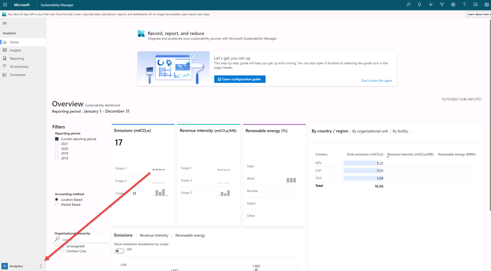 

### Task 1: Import 2021 data for “Purchased Electricity“ for Facilities

In this task, Reed imports the first excel spreadsheet provided by Alex, Purchased electricity Wide World Importers – 2021.xlsx. This brings in the Electricity Purchased by Wide World Importers facilities for the year 2021 into the Purchased electricity activity data.

1.  In the bottom left corner, change the Area to **Data**.

    

1.  Navigate to **Activity data** on the left side of the page.

    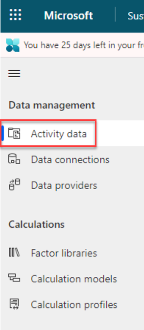

1.  Find **Purchased electricity** in the **Scope 2: Indirect emissions** section, and select **Manage**.

    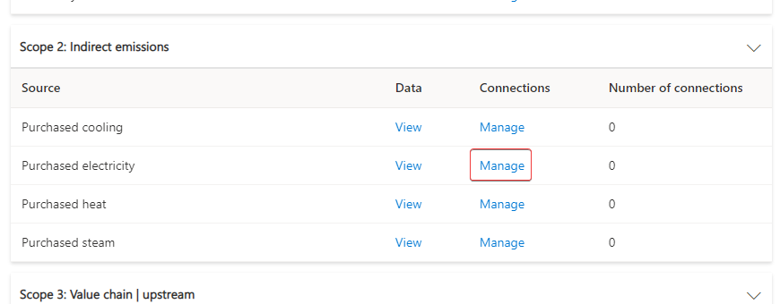

1.  On the **Connections** view, select **+New**.

    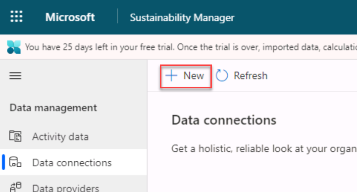

1.  On the **New data connection** wizard:

     1.  (1) Select **Activity data** from data type screen.
     1.  (2) Choose **Purchased electricity** from the Activity data drop down list.
     1.  (3) Select **Next** when finished.

    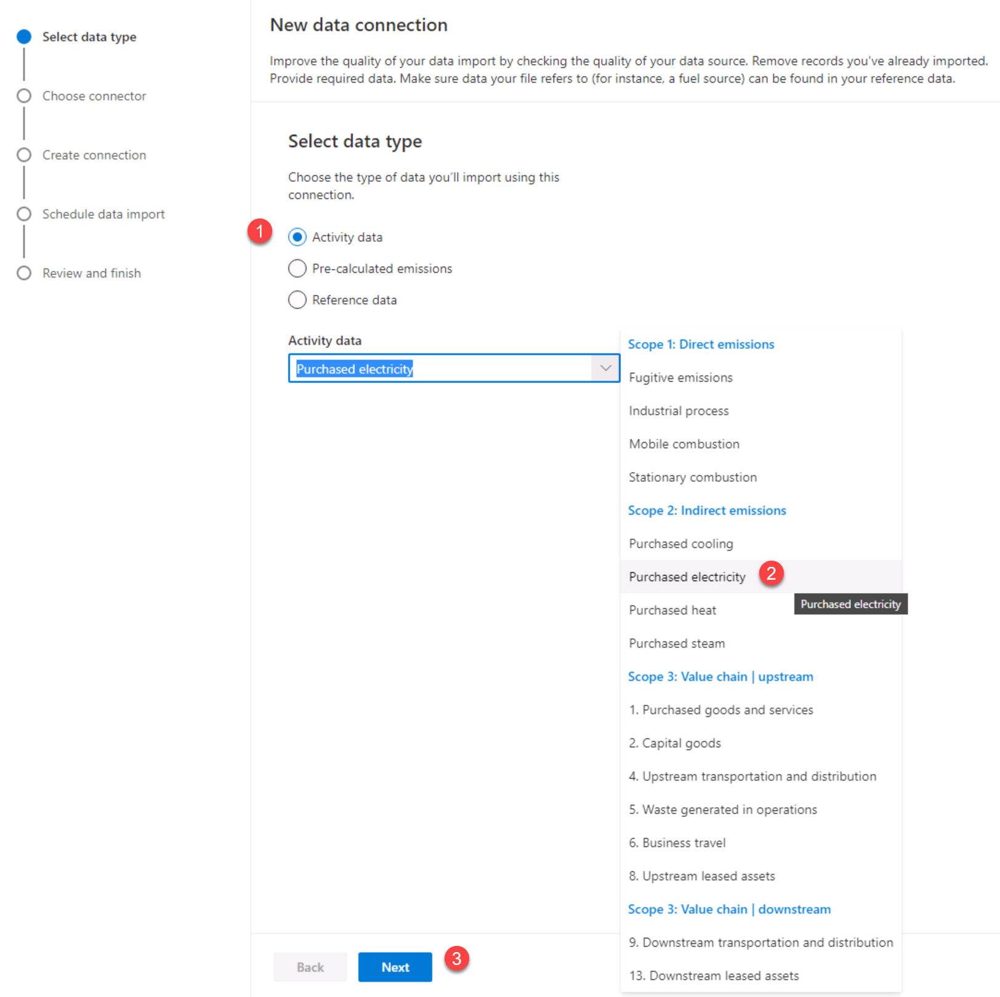

1.  Take a moment to review the large list of connectors by selecting the **See all Power Query connectors** link.

    

1.  Microsoft Sustainability Manager utilizes Power Query for its data ingestion connectors; there is a broad list of connectors available in Power Query. Select **Cancel** or the **X** in the top right corner to close the **Power Query** dialog.

    

1.  On the **Choose connector** page:

     1.  (1) Select **Excel**.
     1.  (2) Select **Next**.

    >[!NOTE]**Note:** Notice the Adatum Utility Management connector at the bottom. Data providers and Partners can create their own connectors to be available in Microsoft Sustainability Manager.

    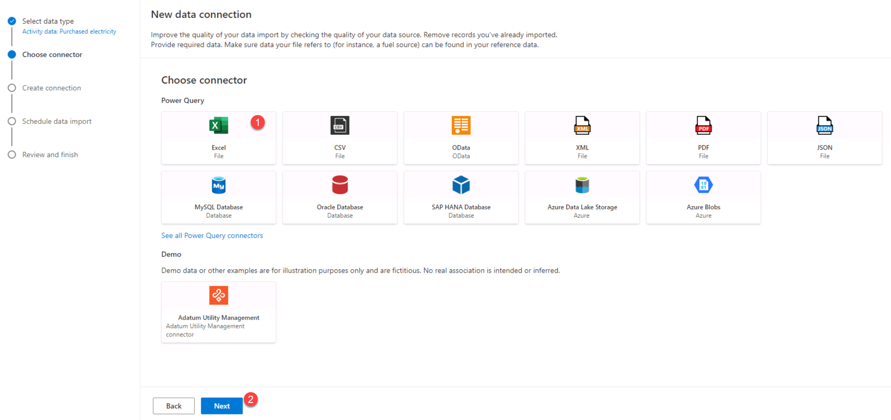

1.  A new dialog will open for Power Query. On the **Power Query** dialog:

     1.  (1) Select **Upload file**.
     1.  (2) Select **Browse**.

    >[!NOTE]**Note:** You can also choose to import an existing file located in OneDrive. For simplicity of this lab, we are using the Upload file functionality.

    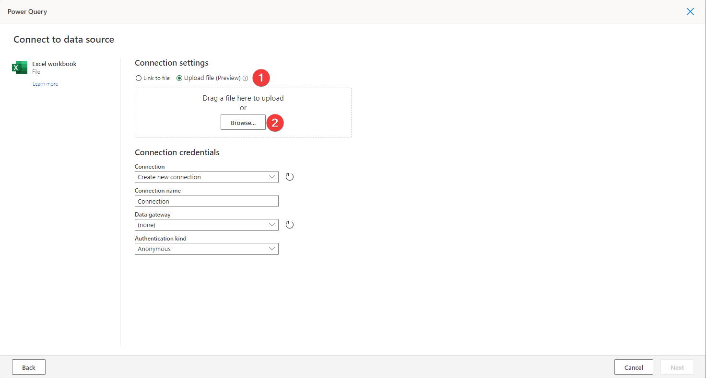

1.  On the file selection window, browse to the location of the excel files that were downloaded.

     1.  (1) Select the **Purchased electricity Wide World Importers - 2021.xlsx** file.
     1.  (2) Select **Open**.

    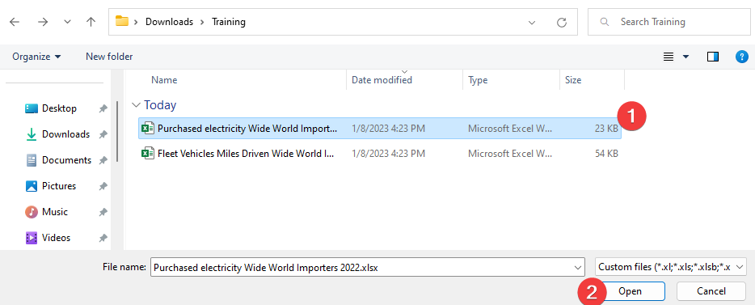

1.  Once the file is successfully uploaded, it may be required to select the sign in button below to create a new Connection credential, this is done by selecting **Sign in**.

    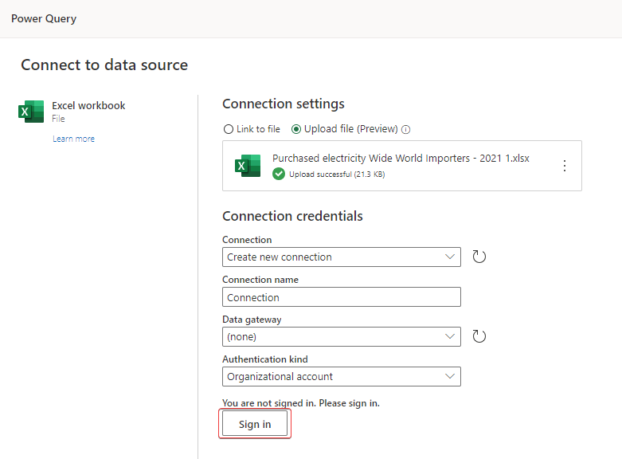

1.  An Office 365 Sign in dialog will appear. Reed selects their user from the list. (For the purposes of this lab, select your lab user account from the list).

    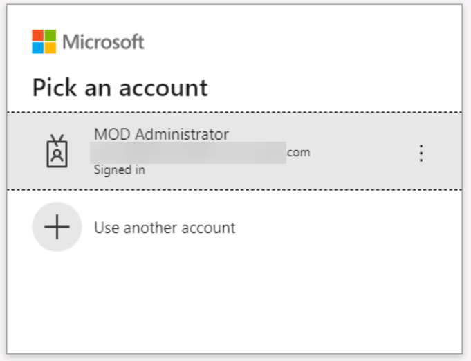

1.  Once the sign in process is completed, the new connection is automatically selected. Select **Next**.

    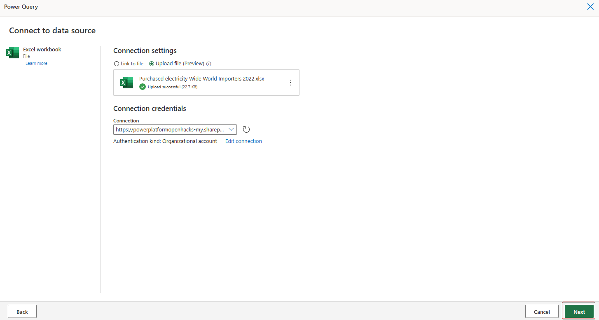

1.  On the **Choose data** page of the **Power Query** wizard:

     1.  (1) Select the **Purchased electricity** sheet.
     1.  (2) Select **Transform data**.

    

    On the **Transform data** page of the Power Query wizard, various data and column transformations can be performed. This will allow for the adjusting of data types, update column mappings, and even perform advanced transformations familiar with in Power Platform Dataflows or Power BI Datasets.

1.  In this scenario, Reed will need to map the columns from the spreadsheet to the columns in Microsoft Sustainability Manager. To do this select **Map to entity** in the upper right corner of the dialog window.

    

1.  On the **Map to CDM entity** of the dialog window we need to:

     1.  (1) Select the table name, **Purchased energy**.
     1.  (2) Select **Auto map** to allow any automatic mappings to occur.
     1.  (3) **Contractual Instrument Type** was **Not mapped**, hence Reed selects **Contracted firm** from the list of options in the **Query output column**.
     1.  (4) **Energy Provider name** was **Not mapped**, select **Provider** from the list of options in the **Query output column**.
     1.  (5) When finished, select **OK**.

    

1.  The **Transform data** page should now look like this:

    >[!NOTE]**Note:** Observe that the column names have changed to Contractual Instrument Type and Energy Provider Name.

    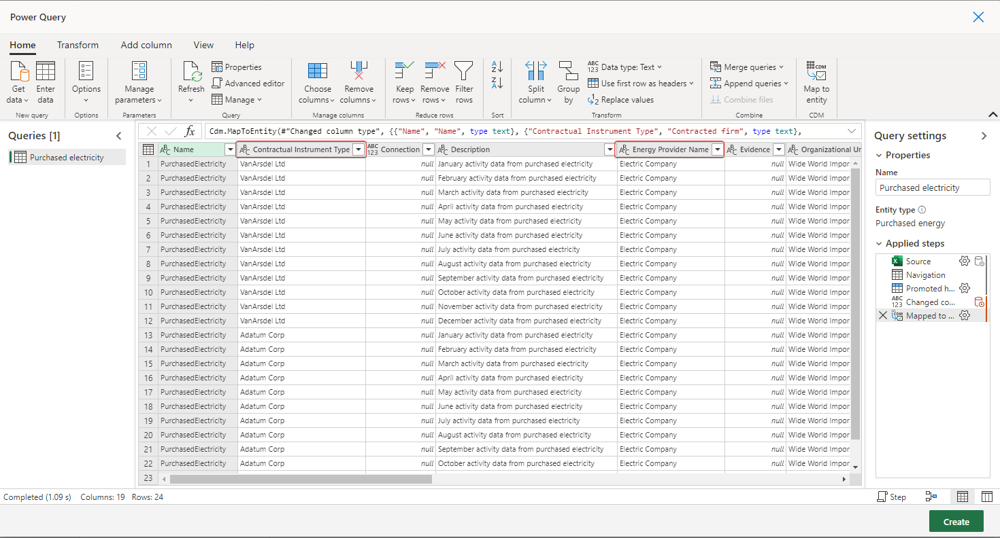

1.  Select **Create** to start the data import process:

    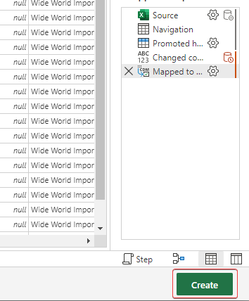

1.  The **New data connection** wizard will now be on the Schedule data import page.

    Turning on **Import data automatically** will give the option to set a schedule to have the data imported automatically, this may be a good option if the connector will be used in a scenario where the data will change frequently such as a web API or FTP server.

    Turning on **Replace previously imported data** will remove all previously imported data and bring in the full data set that was retrieved, this may be a good option if the data source is not only providing data from the last import or always includes a full set of data. For this scenario of importing historical data, leave both options turned off.

    1. Select **Next** when finished.

    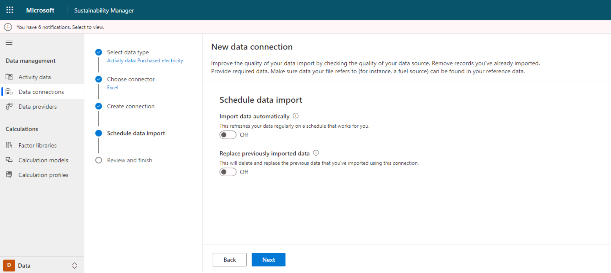

1.  On the **Review and finish** page:

     1.  (1) Enter a name for the new connection, such as +++**Wide World Importers - Purchased Electricity - 2021**+++.
     1.  (1) Select **Connect**.

    

1.  At the bottom of the window, there will be a message, **Creating connection…**

    

1.  Once the connection is created, select **Done**.

    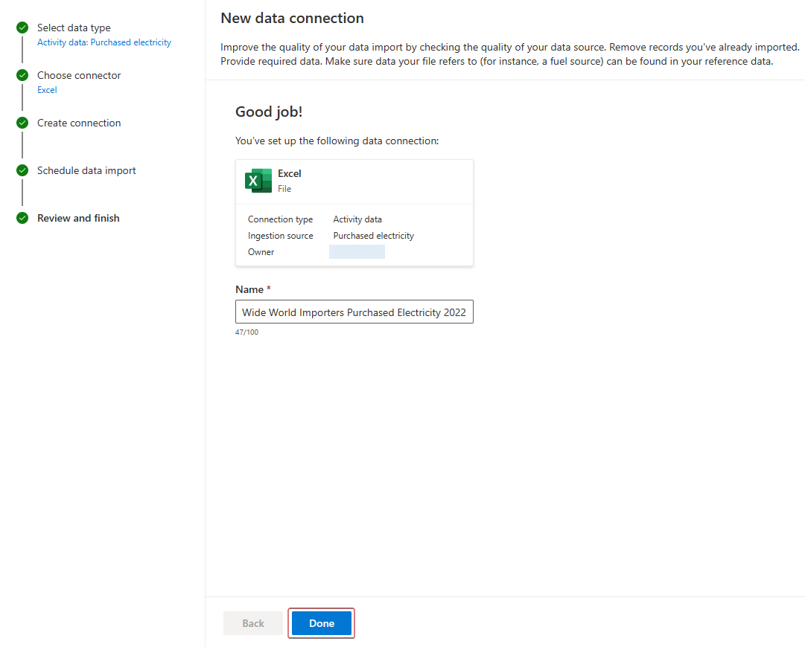

1.  The **Connections** view will now be visible, along with the status of the recently created connection. It should say **Processing**.

    

1.  After a minute or two select the **Refresh** button above the list to see the updated status, which should be **Completed**.

    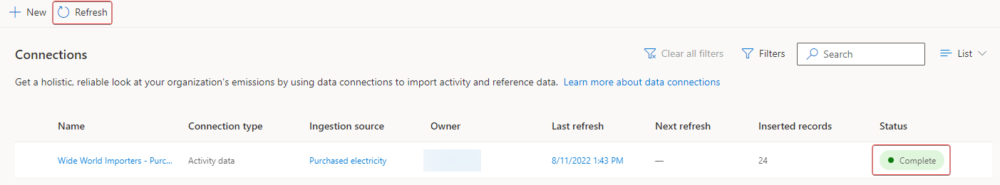

1.  Navigate to **Activity data** on the left side of the page.

    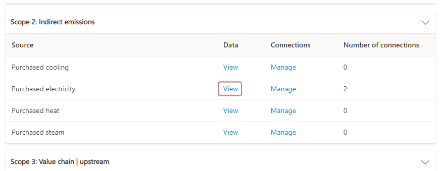

1.  Find **Purchased electricity** in the **Scope 2: Indirect emissions** section, and select **View**.

    

1.  The **Purchased electricity** view shows all purchased electricity activity data that has been imported.

    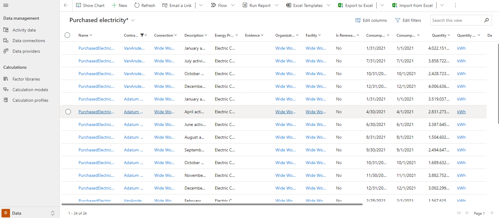

1.  Filter the view by selecting the down arrow next to the **Organizational Unit** column, and selecting **Filter by**.

    

1.  Select **Wide World Importers** from the **Filter By** dialog.

    

1.  Select **Apply** to apply the filter to the column.

    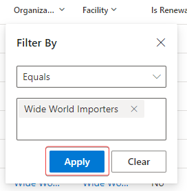

1.  After a few moments, the view will refresh, and the activity data records that were imported during this lab will be displayed.

    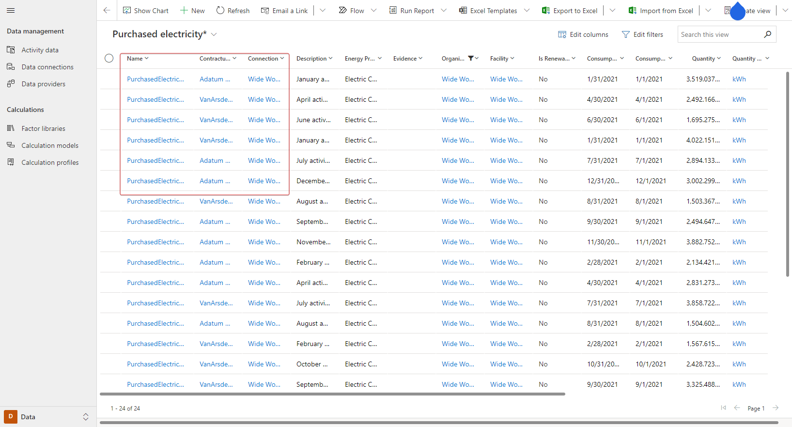

Great job, you have helped Reed complete the data import of 2021 Purchased Electricity for Wide World Importers. This is an important step to realizing the goal of recording, reporting, and reducing carbon emissions. Next, you will import the 2021 Miles Driven for Wide World Importers fleet of electric vehicles. **Please continue to the next task.**

### Task 2: Import 2021 data “Miles Driven” for Electric Trucks

In this task, Reed imports the second excel spreadsheet provided by Alex - “Fleet Vehicles Miles Driven Wide World Importers - 2021.xlsx”. While electric vehicles do not produce direct tailpipe emissions, they do produce “Scope 2: Purchased electricity from charging”. This brings in the Miles driven by Wide World Importers fleet of electric truck for the year 2021 into the Purchased electricity activity data.

1.  Navigate to **Data connections** on the left side of the page.

    

1.  On the **Connections** view, select **+New**.

    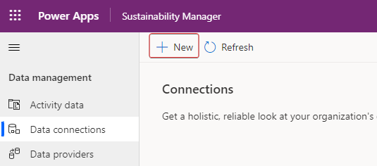

1.  On the **New data connection** wizard:

     1.  (1) Select **Activity data** from data type screen.
     1.  (2) Choose **Purchased electricity** from the **Activity data** drop down list.
     1.  (3) Select **Next** when finished.

    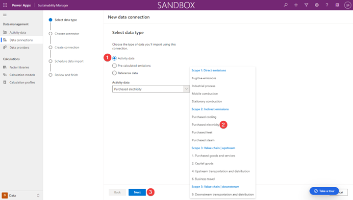

1.  On the **Choose connector** page:

     1.  (1) Select **Excel**.
     1.  (2) Select **Next** when finished.

    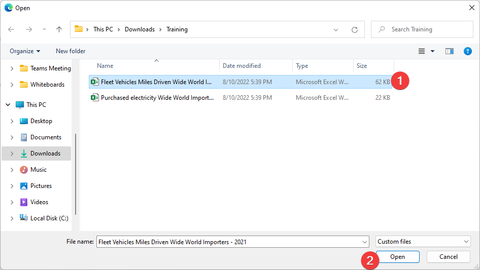

1.  A new dialog will open for Power Query. On the **Power Query** dialog:

     1.  (1) Select **Upload file**.
     1.  (2) Select **Browse**.

    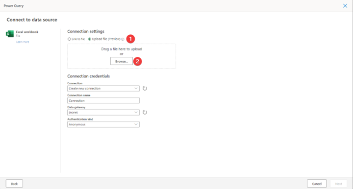

1.  On the file selection window, browse to the location of the excel files that were downloaded.

     1.  (1) Select the **Fleet Vehicles Miles Driven Wide World Importers - 2021.xlsx** file.
     1.  (2) Select **Open**.

    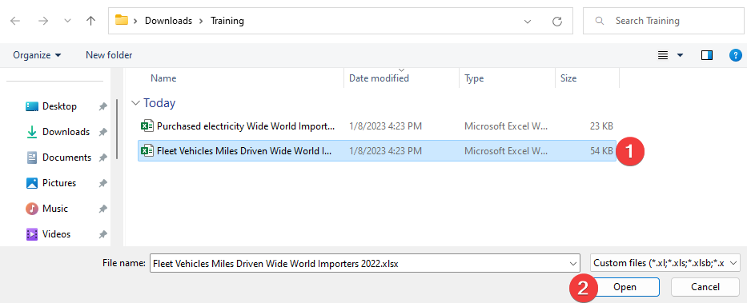

1.  Once the file is uploaded, the Connection credentials automatically selects the previous connection for authentication. Select **Next**.

    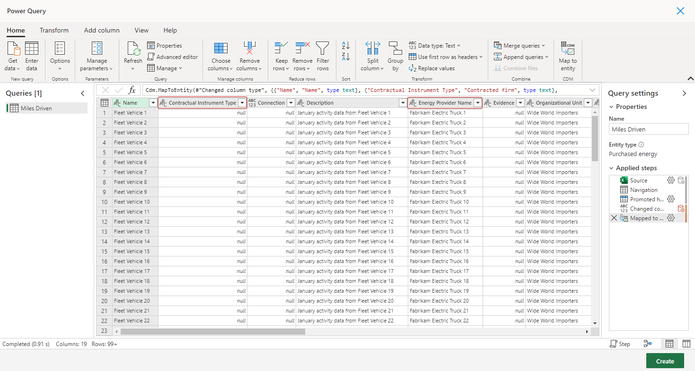

1.  On **Choose data** page of the **Power Query** wizard:

     1.  (1) Select the **Miles Driven** sheet.
     1.  (2) Select **Transform data**.

    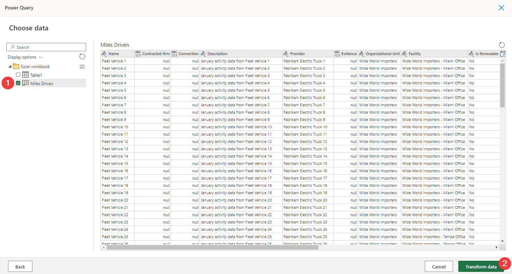

    On the **Transform data** page of the **Power Query** wizard, various data and column transformations can be performed. This will allow the adjusting of data types, column mappings updates, and even perform advanced transformations familiar with in Power Platform Dataflows or Power BI Datasets.

1.  In this scenario, Reed will need to map the columns from the spreadsheet to the columns in Microsoft Sustainability Manager. To do this select **Map to entity** in the upper right corner of the dialog window.

    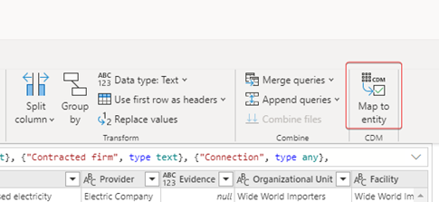

1.  On the **Map to CDM entity** dialog window we need to:

     1.  (1) Select the table name, **Purchased energy**.
     1.  (2) Select **Auto map** to allow any automatic mappings to occur.
     1.  (3) **Contractual Instrument Type** was **Not mapped**, hence Reed selects **Contracted firm** from the list of options in the **Query output column**.
     1.  (4) **Energy Provider Name** was **Not mapped**, select **Provider** from the list of options in the **Query output column**.
     1.  (5) When finished, select **OK**.

    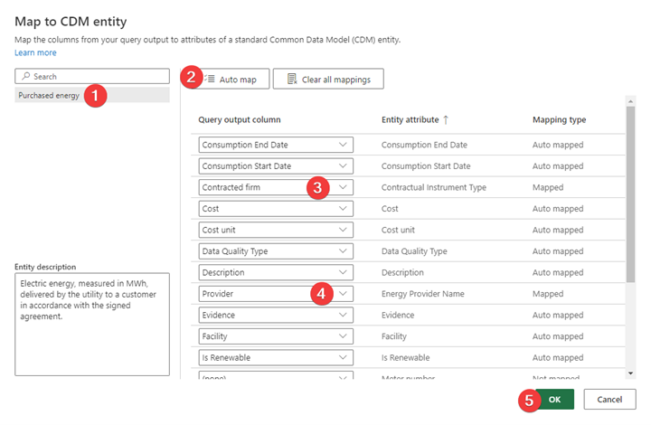

1.  The **Transform data** page should now look like this:

    >[!NOTE] **Note:** Observe that the column names have changed to Contractual Instrument Type and Energy Provider Name.

    

1.  Select **Create** to start the data import process.

    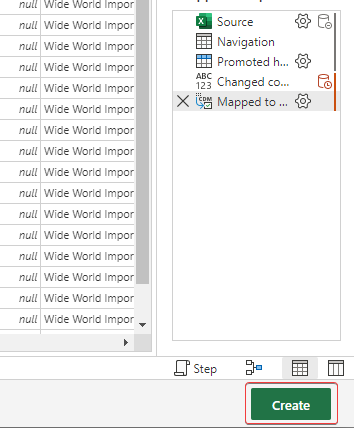

1.  The **New data connection** wizard will now be on the Schedule data import page.

    Turning on **Import data automatically** will give the option to set a schedule to have the data imported automatically, this may be a good option if the connector will be used in a scenario where the data will change frequently such as a web API or FTP server.

    Turning on **Replace previously imported data** will remove all previously imported data and bring in the full data set that was retrieved, this may be a good option if the data source is not only providing data from the last import or always includes a full set of data. For this scenario of importing historical data, leave both options turned off.

    1. Select **Next** when finished.

    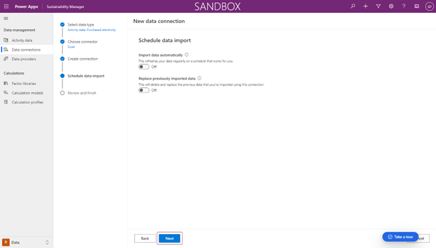

1.  On the **Review and finish** page:

     1.  (1) Enter a name for the new connection, such as +++**Wide World Importers - Electric Vehicle Miles Driven - 2021**+++.
     1.  (2) Select **Connect**.

    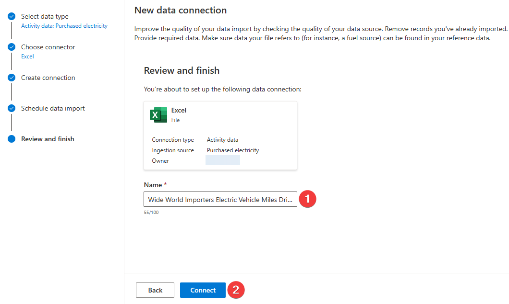

1.  At the bottom of the window, there will be a message, **Creating connection…**.

    

1.  Once the connection is created, select **Done**.

    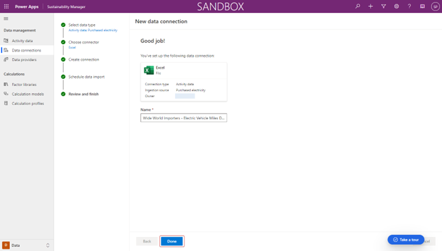

1.  The **Connections** view will now be visible, along with the status of the recently created connection. It should say **Processing**.

    

1.  After a minute or two select the **Refresh** button above the list to see the updated status, which should be **Completed**. Ensure you have the correct number of records as below and the status of the data connections are **Complete** before moving to next steps.

    >[!NOTE] **Note:** In case if you have more duplicate records than below screenshot, due to an issue with the following the correct data import steps , you have to delete the activity data and redo the process .Reach out to the lab instructor for support.

    

1.  Navigate to **Activity data** on the left side of the page.

    

1.  Find **Purchased electricity** in the **Scope 2: Indirect emissions** section, and select **View**.

    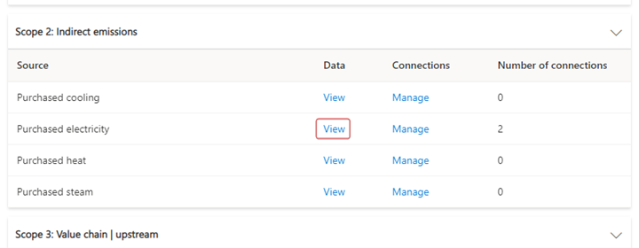

1.  The **Purchased electricity** view shows all purchased electricity activity data that has been imported.

    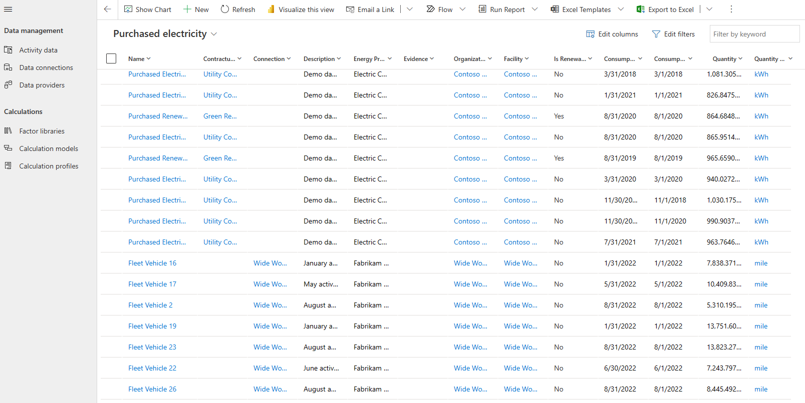

1.  Filter the view by selecting the down arrow next to the **Organizational Unit** column, and selecting **Filter by**.

    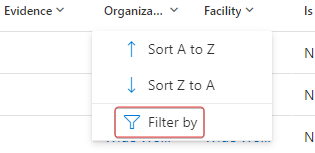

1.  Select **Wide World Importers** from the **Filter By** dialog.

    

1.  Select **Apply** to apply the filter to the column.

    

1.  After a few moments, the view will refresh, and the activity data records that were imported during this lab will be displayed.

    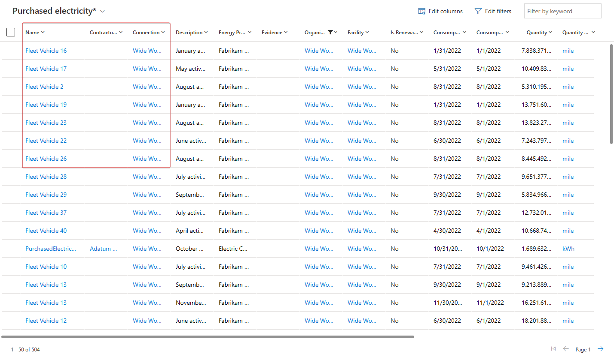

Great job, by completing these steps you have helped Reed by using the Microsoft Sustainability Manger’s connector functionality to import from the  “Fleet Vehicles Miles Driven Wide World Importers - 2021.xlsx” spreadsheet, and used the built-in Power Query functionality to transform the data to match Microsoft Sustainability Manager’s data schema. This brings the Miles driven by Wide World Importers fleet of electric truck for the year 2021 into the Purchased electricity activity data.

**Congratulations!** Reed and Alex can use the imported data for emission calculations and reporting. This is an important step to realizing the goal of recording, reporting, and reducing carbon emissions. In the following labs we will calculate emissions, review insights and reporting, and define our reduction scorecards and goals.
