---
lab:
    title: 'Lab 2: Data ingestion'
    module: 'Module 4: Configure data ingestion'
---

# Module 4 Lesson 2 Lab 2: Data ingestion

## Overview

### Background

In the previous lab, Wide Word Importers’ company profile, facilities, and reference data such as Contractual instrument types were created to lay the Master data foundation for Emissions calculations and Reporting. In this lab - we will perform the Activity data ingestion for the Purchased Electricity of the two newly acquired Florida facilities. In addition, we will also ingest emission data related to the charging of the fleet of 50 Fabrikam Electric trucks. The built-in connectors in the Microsoft Sustainability Manager will be used to ingest the Activity data into the application.

### Learning Objectives

In this lab, you will do the following:

-   Use Microsoft Sustainability Manager connectors to ingest data
-   Use Power Query to transform the data before ingestion
-   Review the ingested data in the “Purchase Electricity Activity Data” Dataverse Table
-   The newly ingested activity data during this lab exercise will be utilized in the remaining scenarios (calculations and reporting) in the upcoming lab exercises.

### Prerequisites

-   Microsoft Sustainability manager environment is set up with sample data
-   Lab 01 organization and reference data is entered.

### Solution Focus Area

In this lab, the focus is on the “Data Ingestion” aspect of the Solution Focus Area. It follows the “Organization and Reference data Set up” and forms the basis for the emission calculations and the reporting thereafter. The Microsoft Sustainability Manager is flexible with multiple automated options to ingest data – such as the connectors as well as manual inputs. For scenarios that may require complex data transformation and/or ETL, tools like Azure Data Factory are recommended. You can explore this functionality in deeper detail on Microsoft Docs at **Overview of Microsoft Cloud for Sustainability Data Import**, https://docs.microsoft.com/en-us/industry/sustainability/import-data.

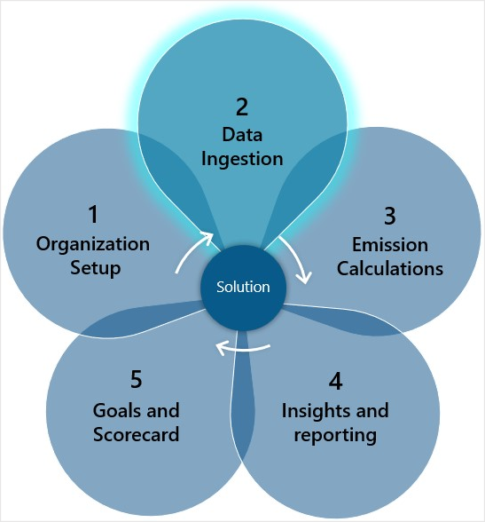

### Personas and Scenarios

In this lab, Reed Flores – IT Admin for Wide World Importers utilizes the activity data Excel spreadsheets sourced by Alex Serra – Emissions Analyst. The Activity data spreadsheets contain Electricity Purchased for the year 2022 and Miles driven by the fleet of Fabrikam Electric Trucks for the calendar year 2022. Reed observes that associated information such as product, model and Vehicle size needs to be added as custom dimension meta data before importing which are required to run the emission calculation and gather the Emission insights reports for monitoring. After adding this information, Reed uses Microsoft Sustainability Manger’s connector functionality to import from the Excel spreadsheets, and reviews other connectors available for future purposes. Reed uses the built-in Power Query functionality to transform the data to match Microsoft Sustainability Manager’s data schema and looks for other potential issues such as case-sensitive d data fields.

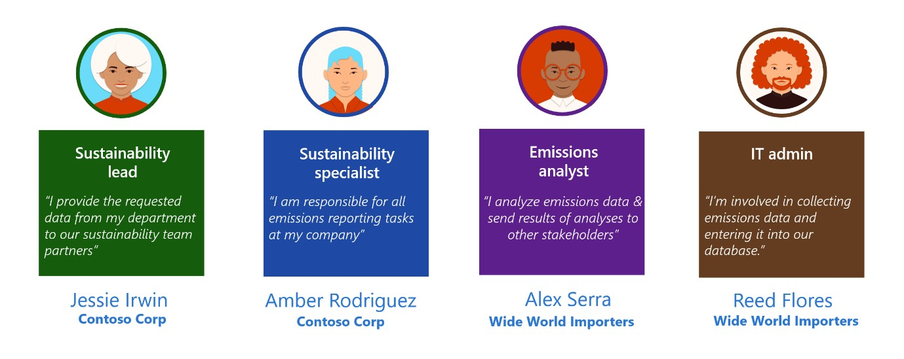

In this lab exercise, we will focus on the Lab 02 scenario illustrated below. 

**Note:** Make sure that you note the newly ingested activity data during this exercise because it will be used in the remaining scenarios (calculations and reporting) in the upcoming exercises.

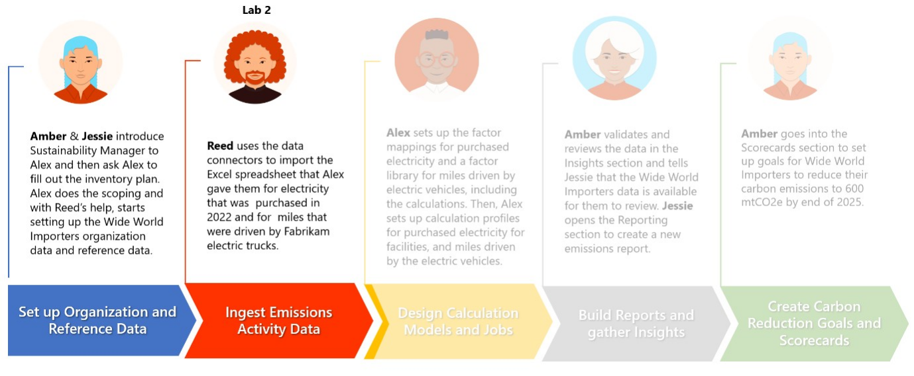

## Exercise 1: Import Data

In this exercise, you will learn about the steps that Reed takes to ingest the spreadsheets given by Alex. Data import is a vital task to bringing large volumes of data into Microsoft Sustainability Manager. Excel is utilized in this lab; however, many pre-built connectors are available, and Partners can build custom connectors to integrate with additional data sources. You can explore this functionality in deeper detail on Microsoft Docs, please visit **Overview of data connectors** at https://docs.microsoft.com/en-us/industry/sustainability/import-data-connectors.

**Important** Please ensure you have completed the previous lab to create Reference Data. **The data import process requires all Reference Data to exist, and the process is case sensitive, so please ensure the Reference data that was added has the exact same case formatting as what is found in the lab**. Failure to do so will result in errors during the data import process

1. Log into the virtual machine using the virtual machine credentials located on the **Resources** tab above.

1. Open a new browser window and navigate to https://make.powerapps.com.
 
1. Log into your Microsoft 365 tenant using the credentials for the tenant located on the **Resources** tab above.

1. If needed, change the environment to your trial on the top bar.

2. For this exercise, you'll use OneDrive.

   Ensure that your personal OneDrive has been initialized by selecting the app selector button in the upper-left corner of the screen.

  	

3. Select OneDrive from the Apps list.
   
   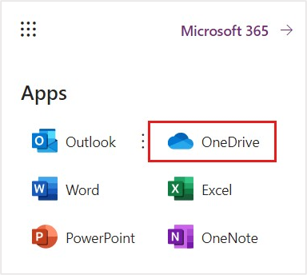

5. A tab with your new OneDrive will open. Close this tab and return to Power Apps.

   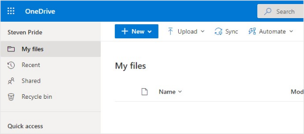

1. Open the **Sustainability Manager** Application.

    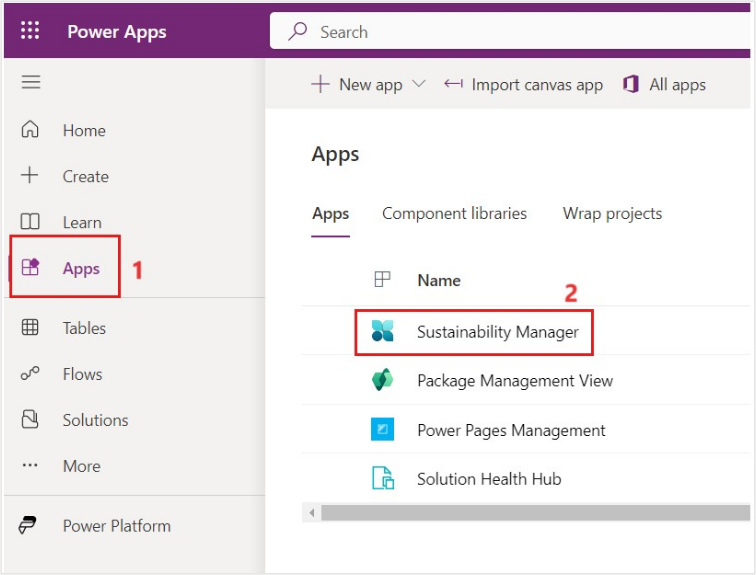

    You will land on the **Home** page for Microsoft Sustainability Manager.

    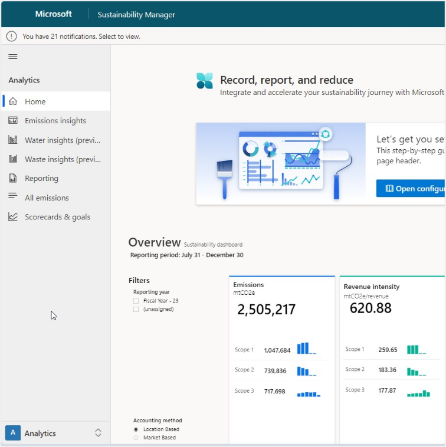

### Task 1: Add custom dimension metadata

In this task, Reed will add additional information to the Excel spreadsheet that Alex provided: **Purchased electricity Wide World Importers 2022.xlsx**. Reed will add custom dimensions metadata for the mapping before importing the data from the Excel spreadsheet. 

 
3.	Select the **Custom dimensions** tab under **Data**.
     
 
4.	Select **New** on the top right on the Active Custom dimensions page.

   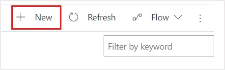
 
5.	Enter the details as follows: 

  	 1. Logical name - Product
   
     2. Display name – Product

     3. Description - Product (This is optional)
  	
      4. Click **Save & Close**.

    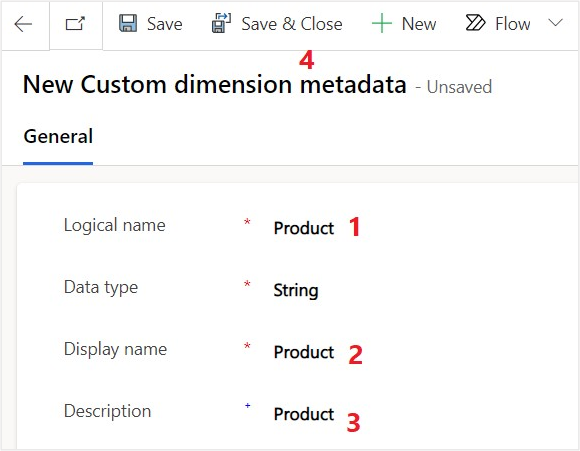
 
6.	Repeat the previous steps to create another custom dimension metadata as follows 

•	Logical name - Model

•	Display name - Model

•	Logical name - Vehicle Size  

•	Display name – Vehicle Size

 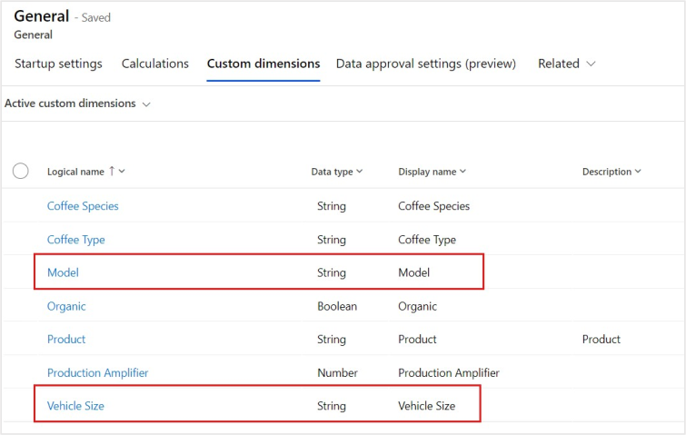

### Task 1: Import 2022 data for “Purchased Electricity“ for Facilities

In this task, Reed imports the Excel spreadsheet provided by Alex, _Purchased electricity Wide World Importers 2022.xlsx_. This brings in the Electricity Purchased by Wide World Importers facilities for the year 2022 into the Purchased electricity activity data.

1.  In the left navigation pane, under **Data**, select **Imports** and select **New**

2. Go to **Carbon activities** on the left side of the page under **Data management**.

   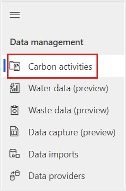
   
3. Find **Purchased electricity** in the **Scope 2: Indirect emissions** section and then select **Manage**.

    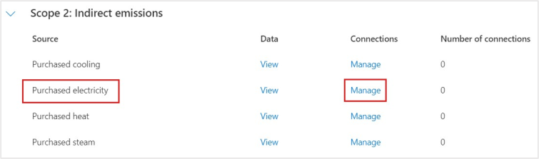

4. On the **Data Imports** view, select **+New**.

   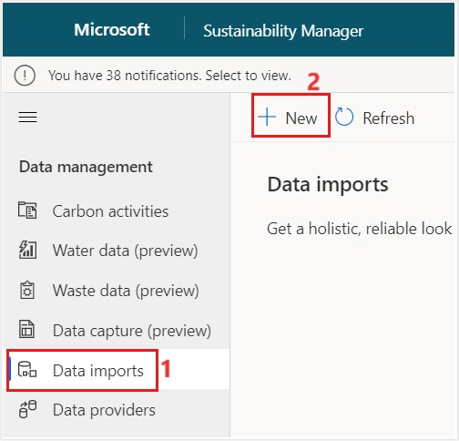
   
5. On the **Data imports**, select **POWER QUERY GUIDED EXPERIENCE**.

   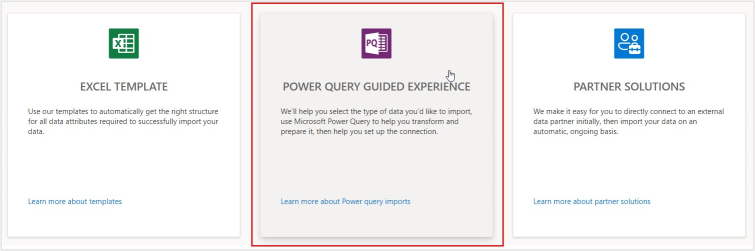
 
6. Under **Carbon activities**, Select **Add**, next to **Purchased electricity** under Category name

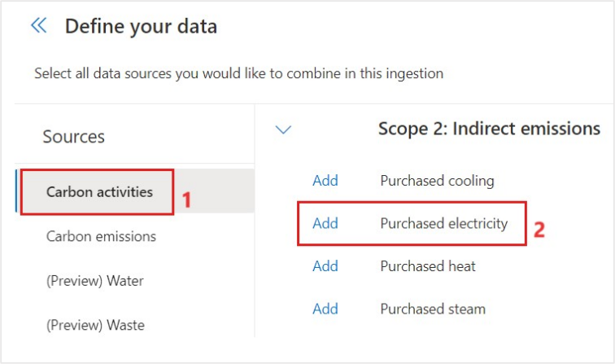
 
7. Select **Next**.
   
8. Review the large list of connectors by selecting the **Excel workbook**, as the Data source.
 
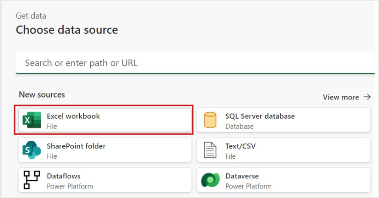

9. A new dialog will open for Power Query. Select the **Upload file** option and then select **Browse**.

    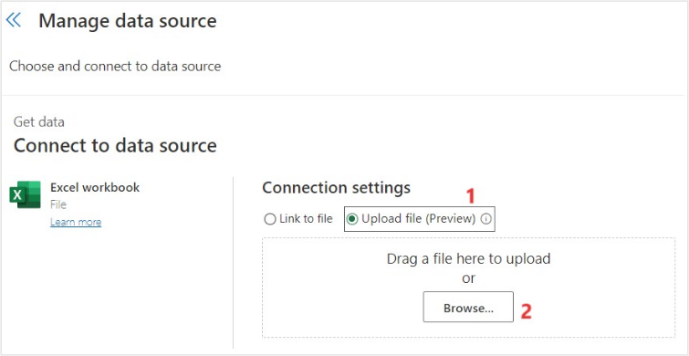
    
Note - You can also choose to import an existing file that's located in OneDrive. For simplicity of this exercise, you'll use the Upload file functionality.
 
10. On the file selection window, browse to the location of the Excel files that were downloaded.
    
    1.	Select the **Purchased electricity Wide World Importers 2022.xlsx file**.

    2.	Select **Open**.

 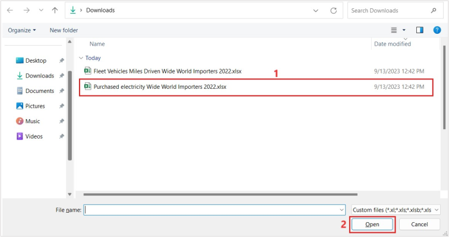
 
11. After the file has successfully uploaded, you might be required to select **Sign in** to create a new connection credential.

    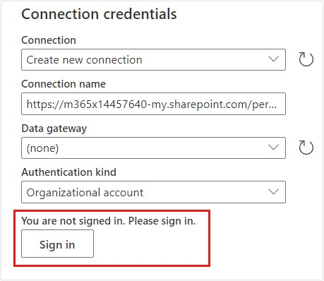
 
12. An Office 365 Sign-in dialog will appear. Reed will select their user from the list. In this exercise, select your  user account from the list.

13. After the sign-in process is complete, the new connection will be selected automatically. Select **Next**.

**Note** - If you receive an error after uploading the Excel file, check your browser cookie settings.

14. On the Choose data page of the Power Query wizard:

    1. Select the **Purchased electricity** Excel spreadsheet.

    2. Select **Transform data**.

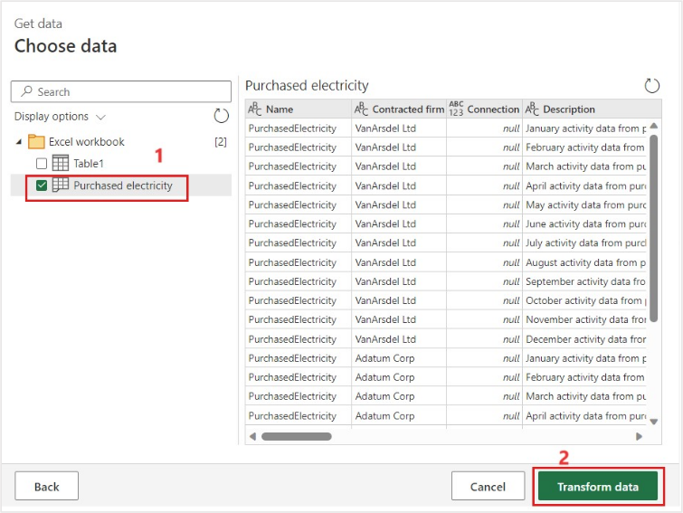 

15. You can complete various data and column transformations on the **Transform data** page of the Power Query wizard. As a result, you can adjust data types, update column mappings, and perform advanced transformations that you're familiar with in Microsoft Power Platform dataflows or Microsoft Power BI datasets. For this exercise, do not apply any transformations, click **Create**.

**Note** - Wait for the transformations to be applied properly, before you click **Create**, else you may get an error.

 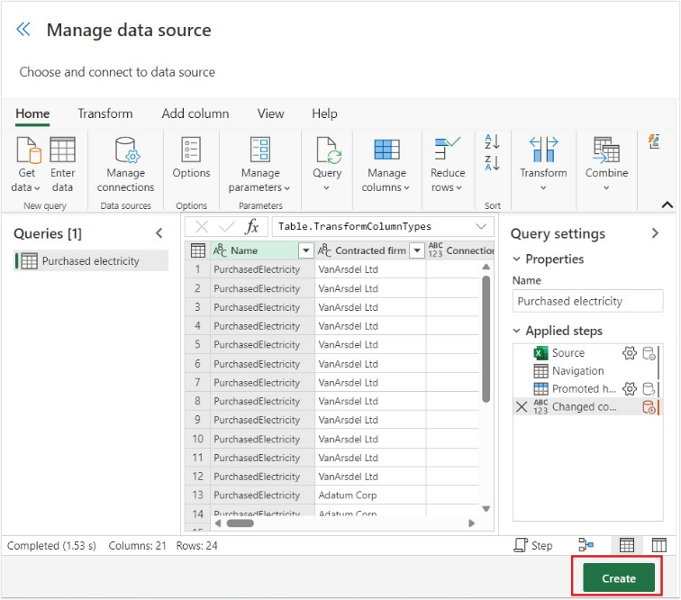
    
16. The **New data connection** wizard will now be on the **Schedule data** **import** page, where you'll complete the following actions:

     1. Turn on the **Import data automatically** toggle to allow the option to set a schedule for the data to be imported automatically. Selecting this     
        option is beneficial if the connector will be used in a scenario where the data will change frequently, such as a web API or FTP server.

      2. Turn on the **Replace previously imported data** toggle to remove all previously imported data and bring in the full dataset that was retrieved. 
         Selecting this option is beneficial if the data source isn't providing data from only the last import or if it always includes a full set of data. For 
         this scenario of importing historical data, leave both options turned off.
    
17. Select **Next** when finished.

 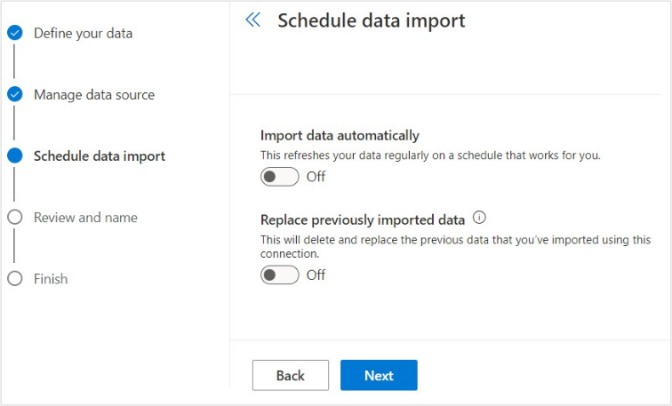
 
18. On the Review and finish page, complete the following tasks:
    
    1. Enter a name for the new connection, such as **Wide World Importers Purchased Electricity 2022**

    2. Select **Connect**.

 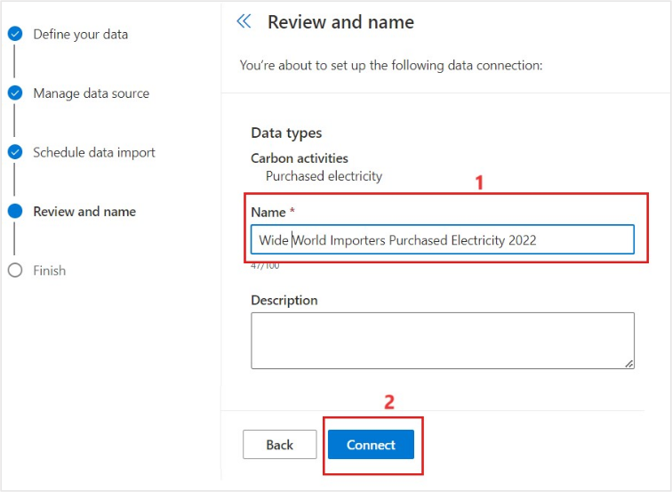
 
19. Next, you'll need to map your source data to the data model. Data will not appear until this step is complete. Select on **Map fields**.

 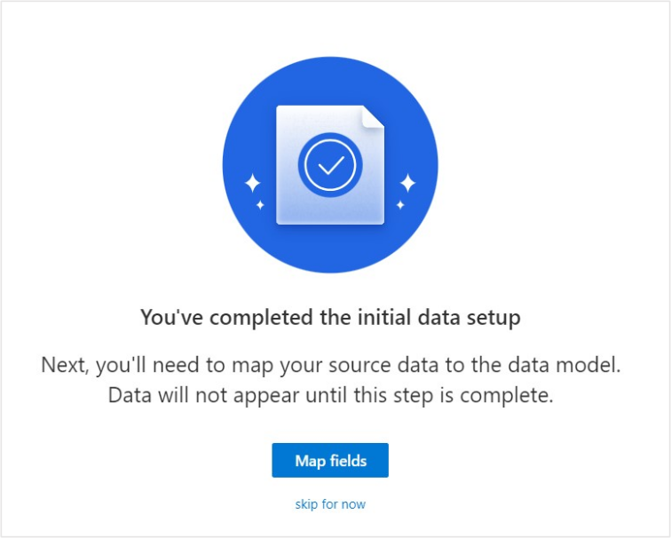
 
20. Select the **Data source** to map, in this exercise select **Purchased electricity** under **Carbon Activities.**

 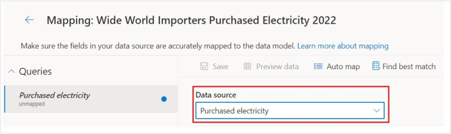
 
21. In this scenario, Reed will need to map the columns from the spreadsheet to the columns in Microsoft Sustainability Manager. Select **Auto Map** for the solution to automatically map the file’s source fields with the destination fields, for any field that is not an exact match the best match will be found and highlighted in blue, make sure to review them. Review the custom dimensions to ensure Model and Product are added as part of mapping. Remove the unnecessary custom dimensions if they are added When you are done with the mapping, select **Save**.

 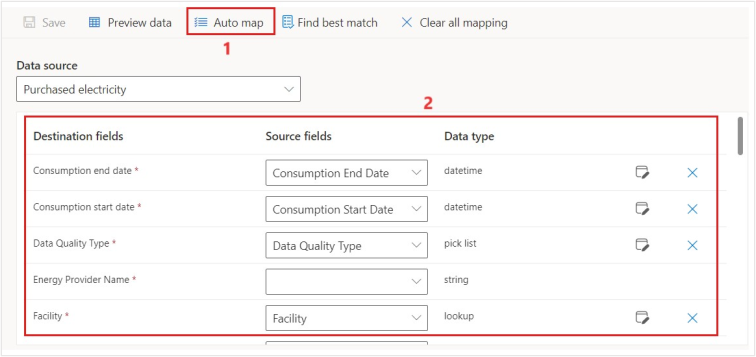

  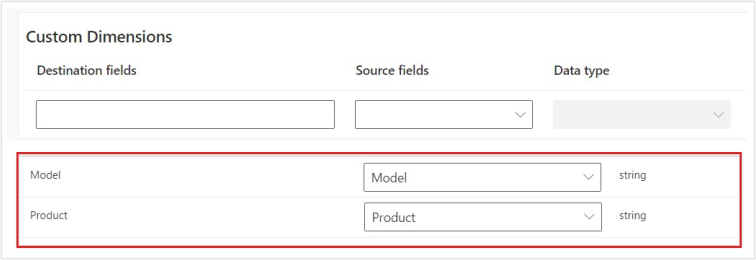

23. Now that we have reviewed our field mappings, toggle **Ready to Import** as yes. Click the back arrow. Click on **Done**.

  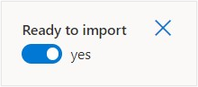

   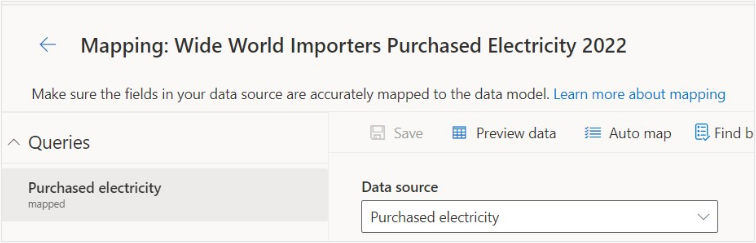
 
24. You will be navigated back to **Data imports** where you can view the import you created.

25. The **Data Import** job will run, and the status will display **Scheduled** and then in a moment it switches to **Processing**. You might need to refresh your page to view the change.

26. After a minute or two select **Refresh** above the list to view the updated status, which should be **Complete**.
 
 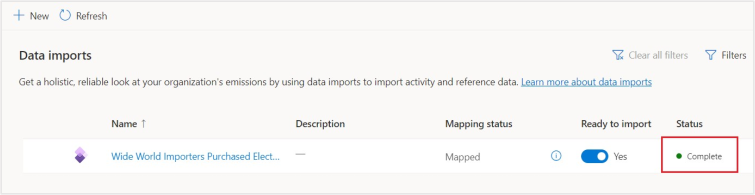
 
27. Go to **Carbon Activities** on the left navigation pane under **Data management**.

28. Find **Purchased electricity** in the **Scope 2: Indirect emissions** section and then select **View**.

     
 
The Purchased electricity view shows all purchased electricity activity data that has been imported.

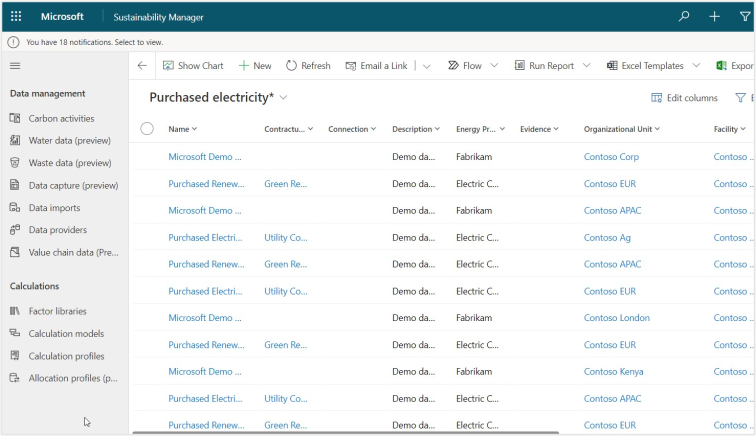
 
28. Filter the view by selecting the **Organizational Unit** dropdown menu and then selecting **Filter By**.

29. Select **Wide World Importers** from the **Filter By** dialog.

30. Select **Apply** to apply the filter to the column.

 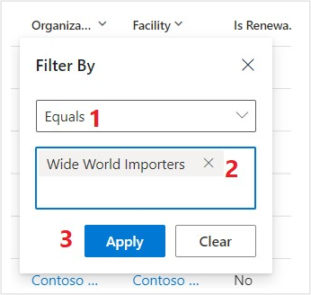
 
After a few moments, the view will refresh and the activity data records that were imported during this exercise will be displayed.

 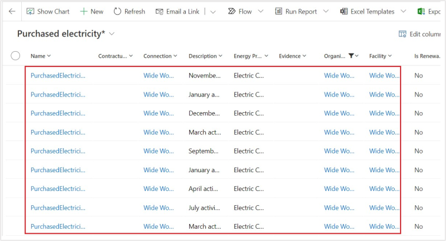
 
You've now completed the data import of 2022 Purchased Electricity for Wide World Importers. This step is imperative in realizing the goal of recording, reporting, and reducing carbon emissions. Next, you'll import the 2022 Miles Driven for Wide World Importers fleet of electric vehicles.

### Task 3: Import 2022 data “Miles Driven” for Electric Trucks

In this task, Reed will import the second Excel spreadsheet that Alex provided: Fleet Vehicles Miles Driven Wide World Importers 2022.xlsx. While electric vehicles don't produce direct tailpipe emissions, they do produce **Scope 2: Purchased electricity** from charging. This import will bring in the Miles driven by Wide World Importers fleet of electric trucks for the year 2022 data into the Purchased electricity carbon activity data.

1.  Select **Imports** on the left navigation pane, select **+New** again.

    
 
2.	On the Data imports, select POWER QUERY GUIDED EXPERIENCE.

      
  
3. Select **Add**, next to **Purchased Electricity.**

    
 
4. Select **Next**.
   
5. On the list of connectors. select **Excel workbook**, as the Data Connector.

    
 
6. A new dialog will open for Power Query, where you'll select **Upload file > Browse.**

 
 
7. On the file selection window, browse to the location of the downloaded Excel files.

    1.	Select the **Fleet Vehicles Miles Driven Wide World Importers 2022.xlsx file.**

    2.	Select **Open**.
   
     
 
8. Once the file is successfully uploaded, you may be required to select the sign in button to create a new Connection credential, this is done by selecting **Sign in.**

  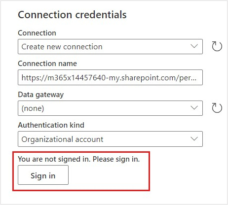
  
9. An Office 365 Sign in dialog will appear. Reed selects their user from the list. For the purposes of this exercise, select your user account from the list.

10. If signed in, the new connection is automatically selected. Select **Next**.

11. On the Choose data page of the Power Query wizard, select the **Miles Driven** spreadsheet, and then select **Transform data**.

     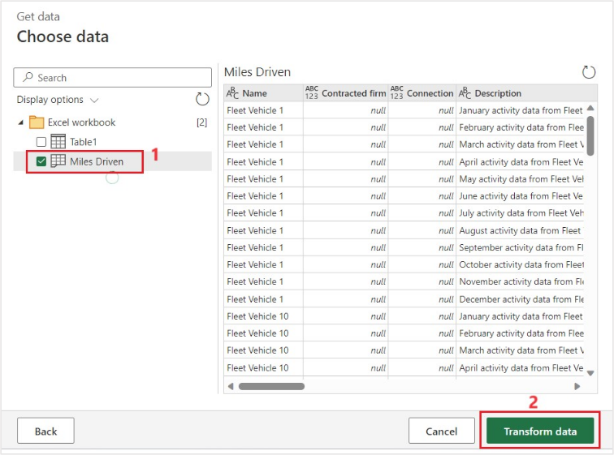

12. On the Transform data page of the Power Query wizard, you can complete various data and column transformations. These transformations will allow you to adjust data types, column mappings updates, and perform advanced transformations that you're familiar with in Microsoft Power Platform dataflows or Power BI datasets. For this exercise, you do not need to apply any transformations, select **Create**.
    
**Note** - Wait for the transformations to be applied properly, before you click Create, else you may get an error.

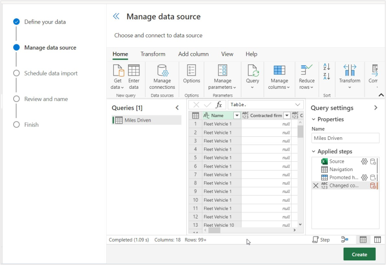

13. The New data connection wizard will now be on the Schedule data import page, where you'll complete the following tasks:

    1.	Turn on the **Import data automatically** toggle to allow the option to set a schedule for the data to be imported automatically. Selecting this option 
       is beneficial if the connector will be used in a scenario where the data will change frequently, such as a web API or FTP server.

    2.	Turn on the **Replace previously imported data** toggle to remove all previously imported data and to bring in the full dataset that was retrieved. 
        Selecting this option is beneficial if the data source isn't providing data from only the last import or if it always includes a full set of data.
        For this scenario of importing historical data, leave both options turned off.

14. Select **Next** when you're finished.

 

15. On the Review and finish page, complete the following tasks:

    1.	Enter a name for the new connection, such as Wide World Importers Electric Vehicle Miles Driven 2022

    2.	Select **Connect**.
   
    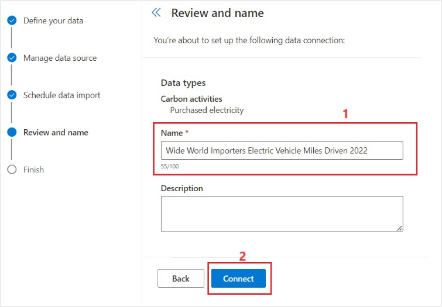

Next, you'll map your source data to the data model. Data will not appear until this step is complete. Select **Map fields**.

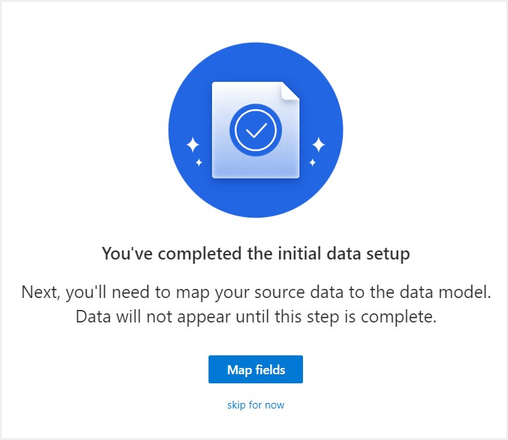
 
16. Select the data source to map. In this exercise, it is **Purchased electricity** under **Carbon Activities**.

    
 
17. In this scenario, Reed needs to map the columns from the spreadsheet to the columns in Microsoft Sustainability Manager. To do so, you'll select **Auto Map** for the solution to automatically map the file’s source fields with the destination fields, for any field that is not an exact match the best match will be found and highlighted in blue. Also, ensure the custom dimensions metadata Vehicle size is added as part of mapping. Please delete if any other dimensions are added.
 
 

 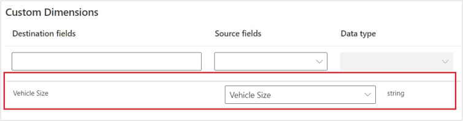

18. You will review them and select **Save**.

    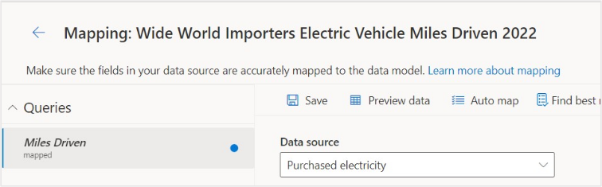

19. Select the toggle as **Yes** for **Ready to import**. Click on back arrow.  
 
20. Click on **Done**. The **Data Import** job will run, and you can view the status as **Scheduled** and then in a moment it will switch to **Processing**. Refresh the page to see the change.

 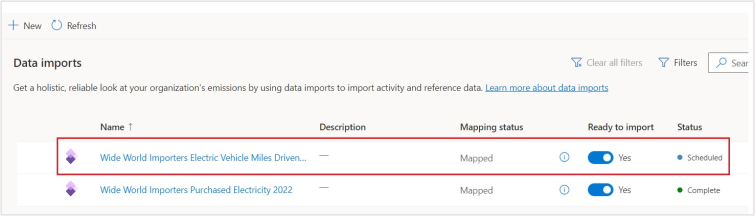
 
21. After a minute or two, select the Refresh button above the list to view the updated status, which should be **Completed**. Ensure you have the correct number of records, and the status of the data connections is Complete before you go to the next steps.
 
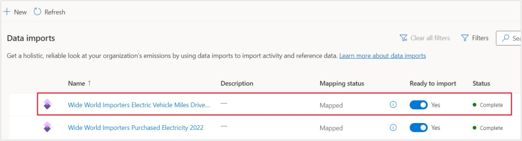

22. Go to **Carbon activities** data on the left side of the page.
 
23. Find **Purchased electricity** in the **Scope 2: Indirect emissions** section and then select **View**.

    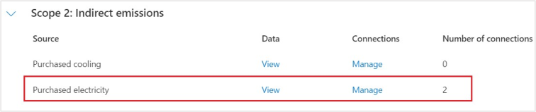
 
The Purchased electricity view shows all purchased electricity activity data that has been imported.

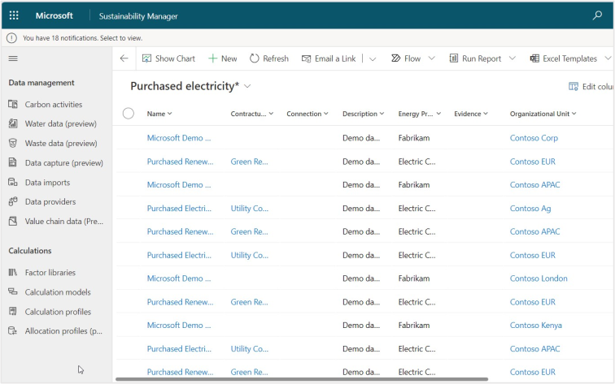
 
24. Filter the view by selecting the **Organizational Unit** dropdown menu and then selecting **Filter By**.

    1.	Select **Wide World Importers **from the Filter by dialog.

    2.	Select **Apply** to apply the filter to the column.
 
25. After a few moments, the view will refresh. You should be able to view the activity data records that were imported during this exercise.

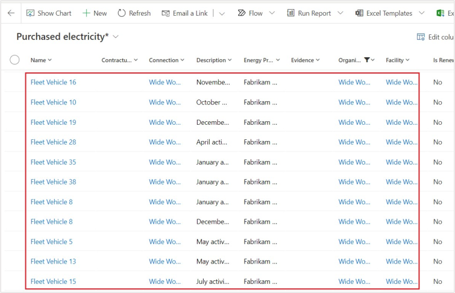
 
You've completed the data import for 2022 Miles Driven for Wide World Importers. This step is important for realizing the goal of recording, reporting, and reducing carbon emissions. In the following exercises, you calculate emissions, review insights and reporting, and define your reduction scorecards and goals.

