# Lab 03: Emission calculations

## Overview

### Background

In the previous two labs, we laid the foundation for emission calculations by setting up the organization, reference data such as Contractual instrument types and ingesting the Activity data. Now that the groundwork and data has been laid for emission calculations, this lab will focus on performing the emission calculations using a combination of factor libraries, emission factors, estimation factors and calculation profiles. Once the calculations are performed, we will review the emission calculations output.

### Learning Objectives

In this lab, you will do the following:

-   Review the Microsoft Sustainability Manager’s Dynamic calculation capabilities using Factor libraries, Emission factors and more.
-   Review the existing “EPA 2021 - eGRID” factor library and emission factors
-   Create a new custom factor library for estimating miles to kilowatt hours (kWh)
-   Create new calculation models and new calculation profiles for calculation jobs
-   The emissions calculated during this lab exercise will be utilized in the remaining scenarios (reporting and goals) in the upcoming lab exercises.

### Prerequisites

-   Microsoft Sustainability manager environment is set up with sample data
-   Lab 01 organization and reference data is entered
-   Lab 02 activity data is ingested

### Solution Focus Area

In the Emission calculations focus area calculation models are designed to calculate the emissions produced by the ingested activity data. The setup of the calculations breaks it down into two concepts: factor mappings and calculation models. Currently, Sustainability Manager has been verified with EPA default calculations and factor sets only. Additional factor sets will be available over time. Any factor set can easily be added or created by organizations based on their own business needs and regional requirements.

The following terminologies will be used throughout the configuration of Emission Calculations:

-   **Estimation Factor**: Provides a way to convert from one unit type to another, such as night stays to kilowatt hour (kWh) used.
-   **Emission Factor**: Defines the amount of greenhouse gas emitted by a given unit type, this includes defining gas emissions such as CO2, CH4, and N20.
-   **Factor Mapping**: Provides a way to map reference data to a specific emission factor, simplifying calculation models by allowing customers to choose a reference data type and allowing the system to find the appropriate emission factor.
-   **Factor Library**: A collection/grouping of emission or estimation factors and factor mappings, used by calculation models.
-   **Calculation Model**: Thought of as the instruction set used by the application to perform the emission calculations, utilizes factor libraries, factor mappings, and emission/estimation factors to perform the emission calculations.
-   **Calculation Profile**: Provides the scheduling for calculation jobs, defining activity data filter and the calculation model (instruction set) to use.

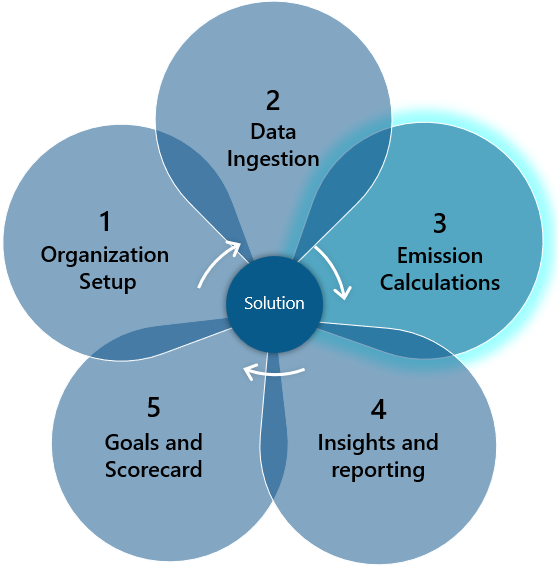

### Personas and Scenarios

In this lab, Alex Serra – Emissions Analyst for Wide World Importers sets up factor mappings for Purchased electricity for facilities, mapping Contractual instrument types to the Florida electric grid (FRCC).

Alex also creates a new estimation factor library for estimating miles driven to kilowatt hours (kWh) for Fabrikam electric trucks. Alex then creates calculation models for calculating the carbon emissions produced per the facility’s purchased electricity. Post that, Alex creates a calculation model for estimated carbon emissions produced by the purchased electricity for charging Fabrikam Electric trucks (based on the kWh per mile driven estimate).

Finally, Alex creates and runs calculation profiles, filtering to Wide World Importers activity data. Post running the Calculation profile, Alex reviews the calculated emissions data before notifying Amber Rodriguez – Sustainability specialist that the emission calculations are complete.

In this lab exercise, we will focus on the scenarios illustrated below:

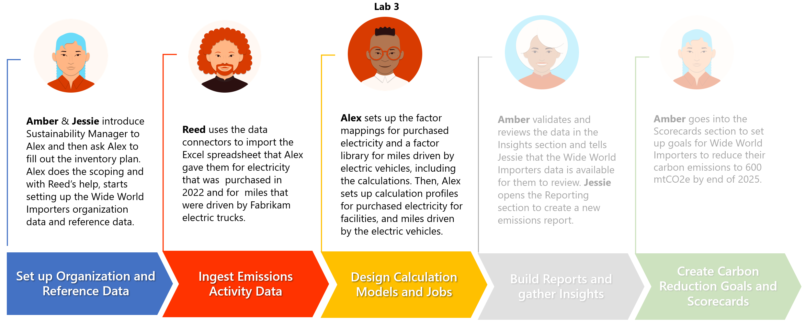

## Exercise 1: Set up Factor Libraries

In this exercise, you will learn about the steps that Alex takes to define the factor mappings for Purchased electricity, and an estimation factor library for estimating the amount of electricity purchased based on the Miles driven by Wide World Importers fleet of electric trucks. While electric vehicles do not have Scope 1, direct tailpipe emissions, they do have to be charged while transporting goods, in this case - across the USA. This charging of Electric trucks results in Scope 2 purchased electricity.

Wide World Importers may not know exactly how much electricity was purchased for charging the Electric Trucks, which grids the electricity came from, or what the energy source is. However, Wide World Importers can estimate the amount of electricity purchased by identifying how many kilowatt hours (kWh) are used per 100 miles, based on EPA vehicle efficiency data. You can explore this functionality in deeper detail on Microsoft Docs, please visit [Overview of Emission factors](https://docs.microsoft.com/en-us/industry/sustainability/calculate-emission-factors).

Log in to your Cloud for Sustainability environment at <https://make.powerapps.com>

Open the **Sustainability Manager** Application

### Task 1: Add eGRID Factor mappings

In this task, Alex will create factor mappings to map the Contractual instrument types, for Wide World Importers that were added by Reed previously, to the respective electric grid emission factor. This allows Microsoft Sustainability Manager to find the correct electric grid for a given Contractual instrument type. This can be expanded to map other reference data to specific emission factors, avoiding the need to create calculations models that are for specific emission factors.

1.  In the bottom left corner, change your Area to **Data**

    >[!NOTE] **Important** Please make sure that you have completed the previous lab to create Activity Data. **The emissions calculations require all the Data Ingestion processes from the previous lab to be completed**. Failure to do so will result in errors or incorrect values during the calculations

    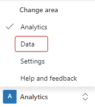

1.  Navigate to “**Factor libraries**” on the left side of the page.

    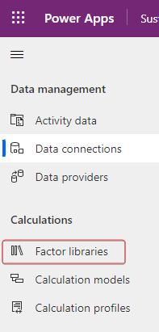

1.  Click on the “**EPA 2021 - eGRID**” Factor library to open the Factor library

    >[!NOTE] **Note**: Microsoft Sustainability Manager includes EPA and IPCC based Factor libraries for emissions and estimations. Additional libraries are on the roadmap. Take time to review the existing factor libraries.

    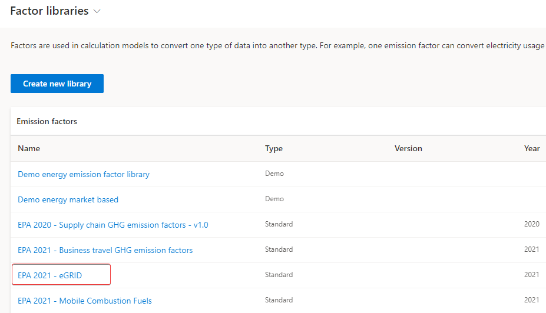

1.  Let’s take a moment to **explore** the EPA 2021 - eGRID factor library. The General tab includes identifying information about the Factor library.
    -   **Name**: this is used for identifying the factor library in the list.
    -   **Description**: this is used to provide more information about the factor library
    -   **Documentation reference**: this is used to identify the documentation used to generate the factor library
    -   **Type of factor library**: this is used to identify if this factor library is a Custom, Demo (sample), or Standard (pre-loaded based on EPA libraries)
    -   **Library type**: this functionally switches the library type between Emission or Estimation Library. Emission Libraries are used to calculate emission gases, and Estimation Libraries are used to create estimated conversions from one unit type to another, such as night stays at a hotel to kWh used.

    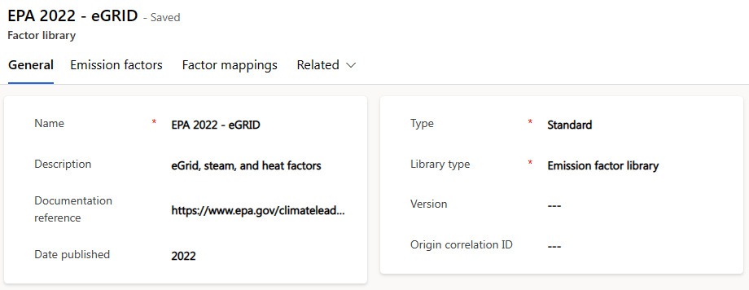

1.  Click on the “Emission factors” tab to see a list of Emission factors in the Factor library.

    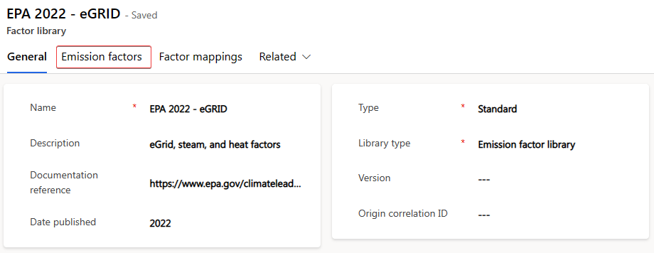

1.  The Emission factors list displays the name of the emission factor, the unit type, sub type, documentation reference, and gases generated. As Wide World Importers is a Florida based business and is connected to the FRCC electrical grid, **select FRCC (FRCC All)** from the list of Emission factors.

    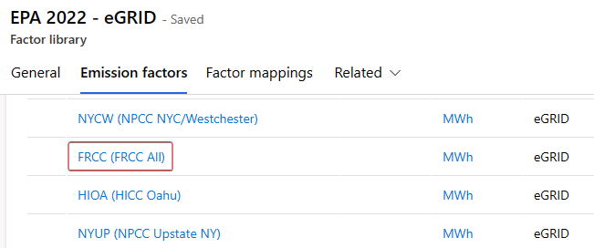

1.  The FRCC (FRCC All) Emission factor shows us the carbon emissions produced, 861lb of CO2, 0.055lb of CH4, and 0.007lb of N2O, **per megawatt hour (MWh) of energy consumed**.

    This information is important to understand how our final CO2E (Carbon equivalent) will be calculated later. When creating a new emission factor, you will want to define how much of each gas is produced per a given unit. There are several other gas types that can be tracked as seen on the screen, depending on the scenario some or all of them may be used.

    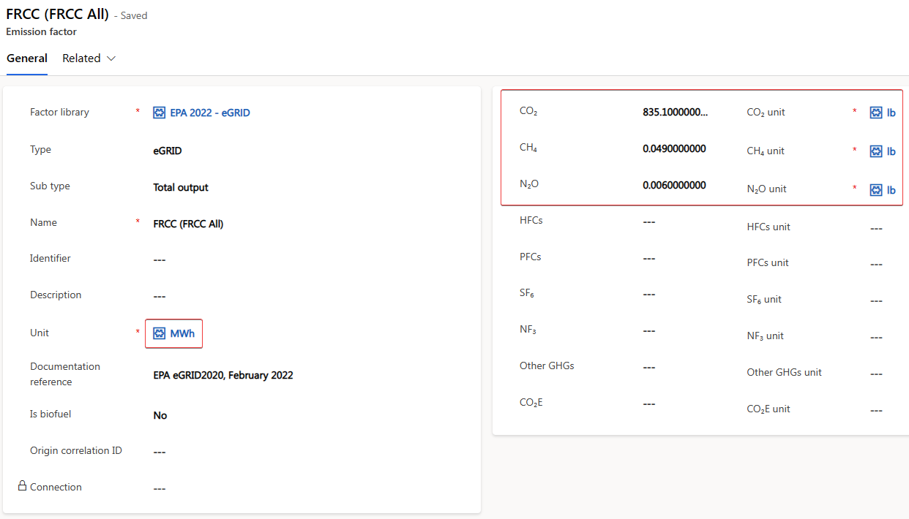

1.  Return to EPA 2021 - eGRID by clicking on the back arrow, and click on the “**Factors mapping**” tab

    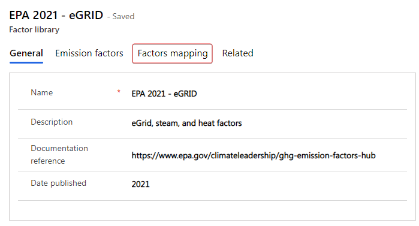

    >[!NOTE] **Note**: Factor mappings help map emission factors to reference data. Microsoft Sustainability Manager will use the factor mappings to find the correct emission factor to be used in an emission calculation for a given activity data. This is based on the reference data linked on the activity data, such as vehicle type or contractual instrument type

1.  Alex will create factor mappings for the two Contractual instrument types created in previous labs and associate them to the FRCC (FRCC All) emission factor. Each of the Contractual instruments are local power providers in Florida and are part of the FRCC electric grid. Click “**+New Factor mapping**”

    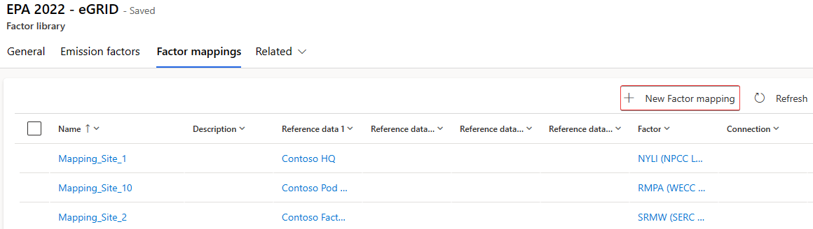

1.  Alex will use the following information to populate the fields on the new Factor mapping:
    -   **Name**: FRCC - Purchased Electricity - VanArsdel Ltd
    -   **Reference Data**: VanArsdel Ltd
    -   **Factor**: FRCC (FRCC All)

1.  The fields and their values are **explained** below:
    1.  The **Name** of the factor mapping is used for identifying the factor mapping in the list.
    1.  The **Reference Data** is mapping the Contractual Instrument Type.
    1.  The **Factor** is mapping the Emission Factor
    1.  Click “**Save & Close**” to save the record.

    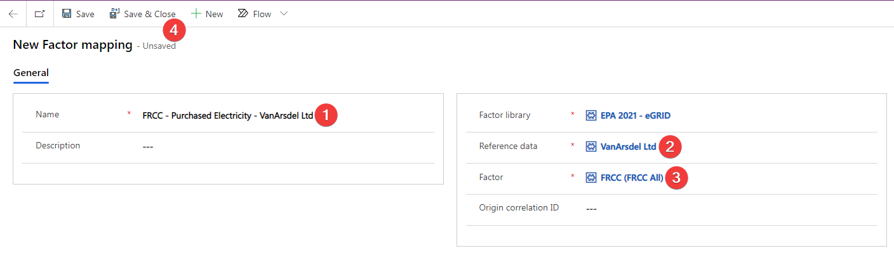

1.  Click “**+New Factor mapping**”

    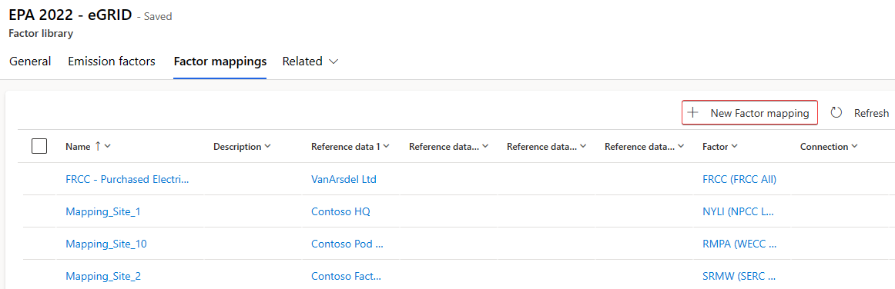

1.  Alex will use the following information to populate the fields on the new Factor mapping:
    -   **Name**: FRCC - Purchased Electricity - Adatum Corp
    -   **Reference Data**: Adatum Corp
    -   **Factor Library:** EPA 2021 -eGRID
    -   **Factor**: FRCC (FRCC All)

1.  The fields and their values are **explained** below:
    1.  The **Name** of the factor mapping is used for identifying the factor mapping in the list.
    1.  The **Reference Data** is mapping the Contractual Instrument Type.
    1.  The **Factor** **Library** is the library used
    1.  The **Factor** is mapping the Emission Factor
    1.  Click “**Save & Close**” to save the record.

    

1.  There are now two **Factor mappings**, one for each of the contractual instruments added during the previous labs.

    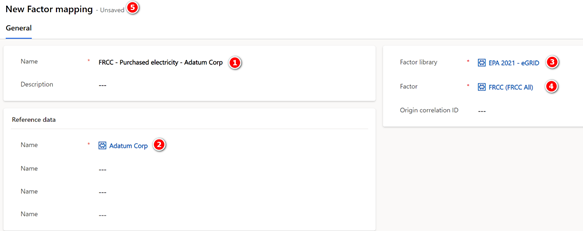

Great job, you have completed adding the factor mappings for your Purchased electricity activity data! This is an important step toward the creation of calculation models that will calculate emissions for multiple emission factors based on reference data, such as Contractual Instrument Types or Facilities.

By creating these factor mappings, we can choose Contractual Instrument Types as emission factor during our calculation model creation. This tells Microsoft Sustainability Manager to map the contractual instrument type on an activity data record to the emission factor listed in the factor mapping. This allows you to create more dynamic calculations rather than calculations specific to a given emission factor. We will go into more detail on this later in this lab. **Please continue to the next task.**

### Task 2: Create Estimation Factor Library

In this task, Alex will create an estimation factor library to define the estimation factor for estimating the kilowatt hours (kWh) used per miles driven. While electric vehicles do not have Scope 1, direct tailpipe emissions, they do have to be charged while transporting goods across the USA, resulting in Scope 2 purchased electricity. Wide World Importers may not know exactly how much electricity was purchased, what grid the electricity came from, or what the energy source is; however, Wide World Importers can estimate the amount of electricity purchased by identifying how many kilowatt hours (kWh) are used per 100 miles, based on EPA vehicle efficiency.

1.  Navigate to “**Factor libraries**” on the left side of the page.

    

1.  Click “**Create new library**”

    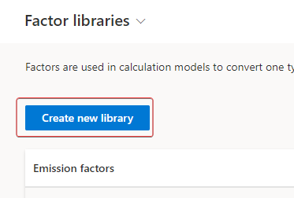

1.  Alex will use the following information to populate the fields on the new Factor library:
    -   **Name**: Electric Vehicle Estimation Library
    -   **Description**: Scope 2 Emissions from Electric Vehicles
    -   **Documentation reference**: https://fueleconomy.gov/feg/byfuel/EV2022.shtml
    -   **Type**: Custom
    -   **Library Type**: Estimation factor library

1.  The fields and their values are **explained** below:
    - (1) The **Name** of the factor library, this is used for identifying the factor library in the list.
    - (2) The **Description** of the factor library is used to provide more information about the factor library for others
    - (3) The **Documentation reference** for the factor library is used to identify the documentation used to generate the factor library
    - (4) The **Type** of factor library is used to identify if this factor library is a Custom, Demo (sample), or Standard (pre-loaded based on EPA libraries)
    - (5) The **Library Type** of the factor library, this functionally switches the library type between Emission or Estimation Library. Emission Libraries are used to calculate emission gases, and Estimation Libraries are used to create estimated conversions from one unit type to another, such as 100 miles driven to kWh.
    - (6) Click “**Save & Close**” saves the record.

    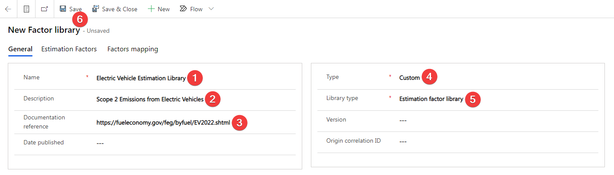

Great job, you have created an **Estimation Library**. Estimation Libraries are the first step to utilizing estimations for emissions where you may not be able to determine the exact emissions. Some examples of estimations include estimating the amount of natural gas and electricity per hotel night stay during business travel, or vehicle fuel consumption by distance traveled. **Please continue to the next task.**

### Task 3: Create Estimation Factor

In this task, Alex will create the estimation factor for estimating the kilowatt hours (kWh) used per miles driven. The EPA estimates electric vehicle efficiency in kilowatt hours (kWh) per 100 miles. Alex will use this same metric in the estimation factor to ensure that the estimation factor is consistent with the EPA.

1.  On the Factor library view, select the Electric Vehicle Estimation Library (this will be near the bottom of your page).

    >[!NOTE] **Note**: For the purposes of this lab, we chose the largest electric vehicle available on the EPA, fueleconomy.gov website. **This is only an example**.

    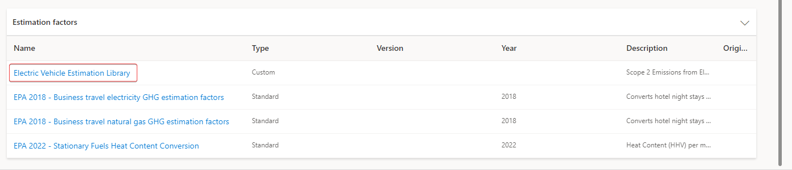

1.  Click on the “**Estimation Factors**” tab

    

1.  Click **+New Estimation factor**

    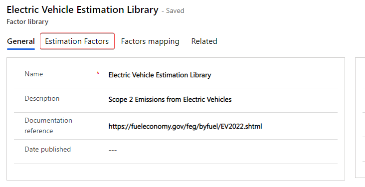

1.  Alex, reviews the Fabrikam electric truck details on the EPA website and determines the following information needs to be populated on the new Estimation factor:
    -   **Name**: Fabrikam Electric Truck - EPA Estimate
    -   **Documentation reference**: https://fueleconomy.gov/feg/noframes/45318.shtml
    -   **Factor Library**: Electric Vehicle Estimation Library
    -   **Unit**: 100 Mile
    -   **Factor value**: 49.00
    -   **Factor value unit**: kWh

1.  The fields and their values are **explained** below:
    - (1) The **Name**, this is used for identifying the emission factor in the list.
    - (2) The **Documentation reference**, this is used to identify the documentation used to generate the estimation factor
    - (3) The **Factor library** links the estimation factor to the factor library. This will default if you click “New Estimation factor” while you are in a factor library.
    - (4) The **Unit** is used to identify what unit will be converted
    - (5) The **Factor value** is used to determine the amount to be estimated per the Factor value unit
    - (6) The **Factor value unit** is used to specify the unit type to be converted to.
    - (7) Click “**Save & Close**” saves the record.

    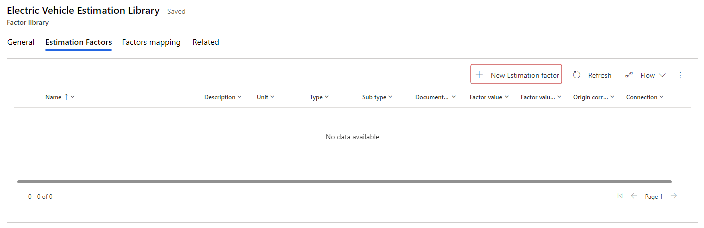

1.  The new Estimation factor is estimating that every 100 miles is equivalent to 49 kWh

    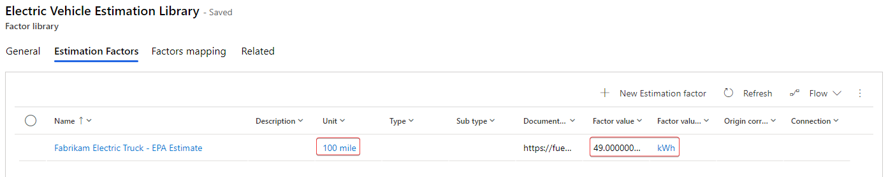

Great job, you have created an estimation factor. Estimation factors are important to be able to convert from one unit type to another when an estimate is appropriate, such as estimated fuel or battery economy of vehicles, or estimating gas and electric utilization of hotel stays. **Please continue to the next task.**

## Exercise 2: Set up Calculation Models

In this exercise, you will learn about the steps that Alex takes to define Calculation Models used by Microsoft Sustainability Manager to calculate emissions. Calculation Models are the instruction sets, or recipes, which define all the steps and values to use during the emission calculations. Microsoft Sustainability Manager provides several calculation models.

Take the opportunity review some of the pre-built models, they are a great source of knowledge when creating new calculation models. The calculation models can also be used as a template for new models.. The algorithm used to calculate emissions will be discussed in this exercise and the next. You can explore this functionality in deeper detail on Microsoft Docs, please visit [Overview of Calculation models](https://docs.microsoft.com/en-us/industry/sustainability/calculate-calculation-models).

### Task 1: Create Purchased Electricity Model

In this task, Alex will create a new calculation model to calculate carbon emissions for purchased electricity based on the contractual instrument type. They will leverage the factor mappings created in the previous exercise to make the calculation model dynamically find the emission factor to be used per line of activity data.

1.  Navigate to “**Calculation models**” on the left side of the page.

    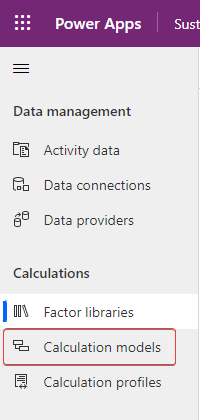

1.  Click “**+New**” to create a new Calculation model

    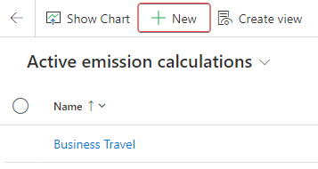

1.  A new page will open to configure the Calculation model. A source action is added by default.

    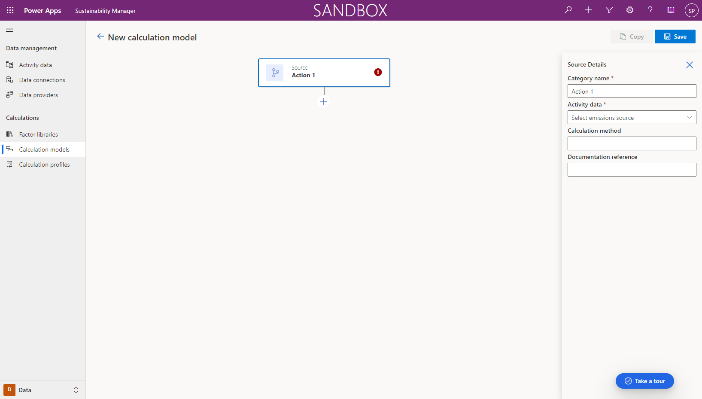

1.  Populate the Source action with the following data:
    -   **Category name**: Purchased Electricity: Contractual Instrument Based - 2021
    -   **Activity data**: Purchased electricity
    -   **Calculation method**: EPA Equation 1: Electricity (MWh) \* EF
    -   **Documentation reference**: https://www.epa.gov/sites/default/files/2020-12/documents/electricityemissions.pdf

1.  The fields and their values are **explained** below:
    1.  The **Category name** is used for identifying the calculation model in the list.
    1.  The **Activity data** is used to identify which type of activity data the model will process
    1.  The **Calculation method** is used to roughly note what the calculation will be doing.
    1.  The **Documentation reference** is used to identify the documentation used to create the calculation model
    1.  Click “**Save**” to save the record.

    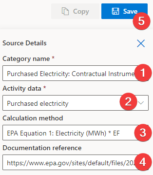

1.  Click the **+** to add a new action to the calculation model

    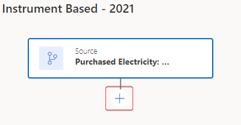

1.  Click “**Report**” on the list of Available actions.

    >[!NOTE] **Note**: Only **Source**, **Report**, and **Estimation** actions are covered in this lab. Additional details about each available action can be found here: [Calculation models \| Microsoft Docs](https://docs.microsoft.com/en-us/industry/sustainability/calculate-calculation-models#add-a-calculation-model)

    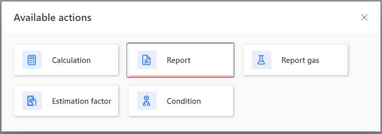

1.  A new “**Report**” action is added to the Calculation model. Select that action to configure it.

    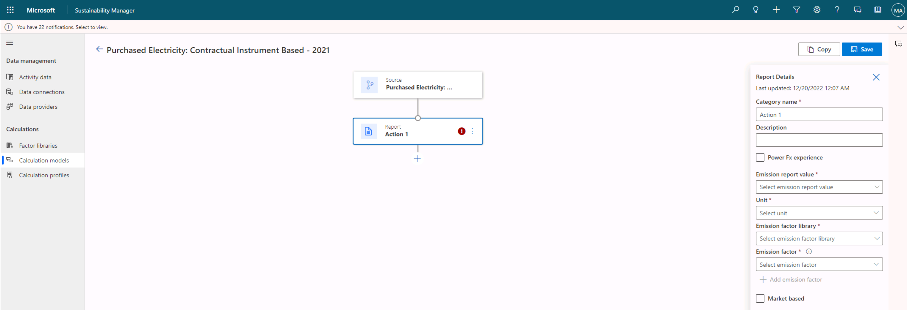

    The **Report** action is used to calculate and report carbon emissions to the emissions table. This action will use the emission factor or factor mapping to identify the emission factor to be used, based on the emission factor dropdown. In this lab, the action will use contractual instrument type field to identify the factor mapping and emission factor to use in the calculation.

    Once the emission factor for the activity data line has been determined, the activity data quantity and quantity unit will be converted to the same unit type as the emission factor. In this lab, the kWh from the Activity data will be converted to MWh.

    After the quantity has been converted, the converted value will be multiplied against each gas listed in the emission factor, determining the volume of gases produced.

    To determine the CO2E (Carbon Dioxide Equivalency), the gases produced are multiplied against their GWP factor (Global Warming Potential factor), which is stored in the “Greenhouse Gases” Dataverse table and are added together.

    The **Report** action stores the gases produced values, CO2E value, and other identifying information about the activity data row in the emissions table.

1.  Populate the Report action with the following data:
    -   **Category name**: Electricity \* EF (Contractual Instrument Type)
    -   **Description**: EPA Equation 1: Electricity (MWh) \* EF
    -   **Emission report value**: Quantity
    -   **Unit**: Quantity unit
    -   **Emission factor library**: EPA 2021 - eGRID
    -   **Emission factor**: Contractual Instrument Type

1.  The fields and their values are **explained** below:
    1.  The **Category name** is used for identifying the action in the calculation model.
    1.  The **Description** is used to roughly note what the calculation will be doing.

    >[!NOTE] **Note**: This value can also be determined by a Power Fx expression if a more complex value is needed instead of a specific field.

    1.  The **Emission report value** is used to identify which field from the activity data type should be used to retrieve the value used in the emission calculation.
    1.  The **Unit** is used to identify the field from the activity data type to be used to retrieve the unit type of the value. Alternatively, a unit can be specified to always be used in the action, regardless of which unit is specified on the activity date type.
    1.  The **Emission factor library** is used to identify which factor library will be used to identify the emission factor.
    1.  The **Emission factor** is used to identify which emission factor or factor mapping will be used to calculate the emissions. Choosing a factor mapping will allow multiple reference data values to map to an emission factor, allowing for a calculation model to not be bound to a single emission factor.
    1.  Click “**Save**” to save the record.

    

1.  Click the **back arrow on the record** to return to the list of Calculation models

    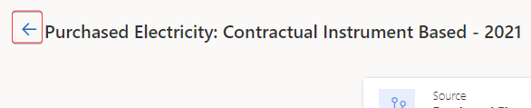

1.  The new Calculation model should now appear in the list

    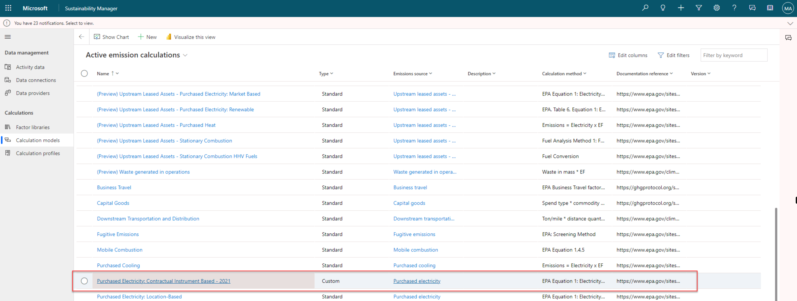

Great job, you have created a new Calculation model. In this Calculation model you have utilized factor mappings, an important differentiator for Microsoft Cloud for Sustainability. Factor mappings allow the Calculation models to be more dynamic by mapping reference data to emission factors, allowing you to have one model that can calculate for multiple emission factors. Calculation models are the instruction sets that are used by Microsoft Cloud for Sustainability to calculate emissions. There are several calculation models that are included with Microsoft Cloud for Sustainability based on EPA calculations. Sometimes these included models may not match your unique customer needs and you will need to create new models to provide custom calculations, be sure to review some of the included models to see other types of complex calculation models. **Please continue to the next task.**

### Task 2: Create Electric Vehicle Miles Driven Model

In this task, Alex will create a new calculation model to calculate carbon emissions for miles driven by electric vehicles. They will leverage the estimation factor library created in the previous exercise to first estimate the kilowatt hours (kWh) used by an electric vehicle, then calculate the carbon emissions for that electricity based on the US Average emission factor.

1.  Navigate to “**Calculation models**” on the left side of the page.

    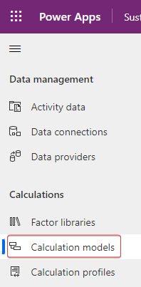

1.  Click “**+New**” to create a new Calculation model

    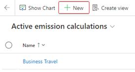

1.  A new page will open to configure the Calculation model. A source action is added by default.

    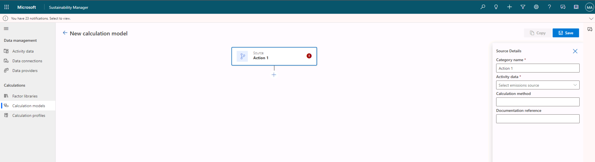

1.  Populate the Source action with the following data:
    -   **Category name**: Electric Vehicle Miles Driven - 2021
    -   **Activity data**: Purchased electricity
    -   **Calculation method**: Miles Driven to kWh \* EF
    -   **Documentation reference**: <https://fueleconomy.gov/feg/byfuel/EV2022.shtml>

1.  The fields and their values are **explained** below:
    1.  The **Category name** is used for identifying the calculation model in the list.
    1.  The **Activity data** is used to identify which type of activity data the model will process
    1.  The **Calculation method** is used to roughly note what the calculation will be doing.
    1.  The **Documentation reference** is used to identify the documentation used to create the calculation model
    1.  Click “**Save**” to save the record.

    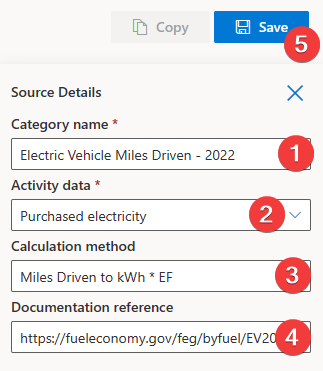

1.  Click the **+** to add a new action to the calculation model

    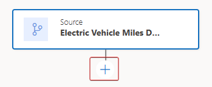

1.  Click “**Estimation factor**” on the list of Available actions

    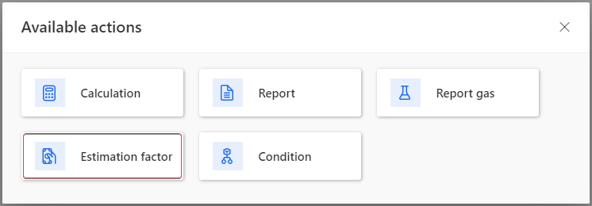

1.  A new action is added to the Calculation model. Select that action to configure it.

    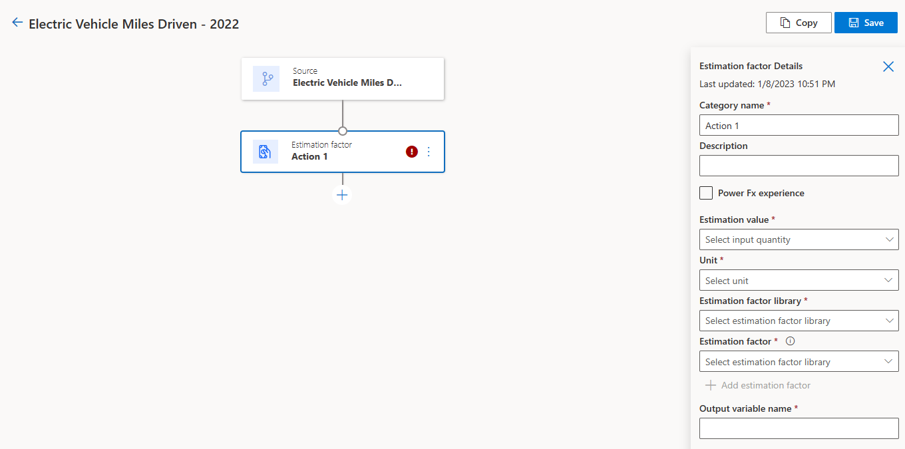
    
    The **Estimation factor** action is used to create an estimated value for converting one unit type to another in a different unit group, such as converting night stays to kilowatt hours (kWh) used. This is important when it may be difficult to know the exact amount of a given emission source that is used. In this lab, the action will be used to convert miles driven by the fleet of electric vehicles to kWh used. This helps Wide World Importers estimate the carbon emissions for their fleet of electric vehicles that are driving across the USA and may be charging various amounts and on different grids and energy sources.

    The activity data quantity and quantity unit will be converted to the same unit type as the estimation factor. In this lab, the mile unit from the Activity data will be converted to 100 mile units.

    After the quantity has been converted, the converted value will be multiplied against the Factor quantity and stored in the output variable. The output variable is only accessible within the calculation model, available for use by actions further down the chain. The estimated value will not be stored in a table.

1.  Populate the Estimation factor action with the following data:
    -   **Category name**: Estimate kWh/100 Mile
    -   **Estimation value**: Quantity
    -   **Unit**: Quantity unit
    -   **Estimation factor library**: Electric Vehicle Estimation Library
    -   **Estimation factor**: Fabrikam Electric Truck - EPA Estimate
    -   **Output variable name**: kWhQuantity
1.  The fields and their values are **explained** below:
    1.  The **Category name** is used for identifying the action in the calculation model.
    1.  The **Estimation value** is used to identify which field from the activity data type should be used to retrieve the value used in the estimation calculation.

        >[!NOTE] **Note**: This value can also be determined by a Power Fx expression if a more complex value is needed instead of a specific field.

    1.  The **Unit** is used to identify the field from the activity data type should be used to retrieve the unit type of the value. Alternatively, a unit can be specified to always be used in the action, regardless of which unit is specified on the activity date type.
    1.  The **Estimation factor library** is used to identify which factor library will be used to identify the estimation factor.
    1.  The **Estimation factor** is used to identify which estimation factor or factor mapping will be used calculate the estimation. In this scenario only one estimation factor has been created so, it does not make sense to select a factor mapping currently.
    1.  The **Output variable name** is used to name the output of the estimation factor calculation for use in actions further down the chain
    1.  Click “**Save**” to save the record.

    

1.  Click the **+** to add a new action to the calculation model

    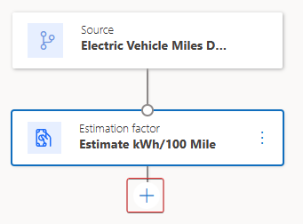

1.  Click “**Report**” on the list of Available actions

    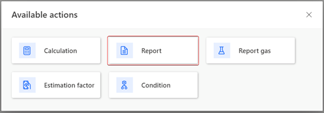

1.  A new action is added to the Calculation model. Select that action to configure it.

    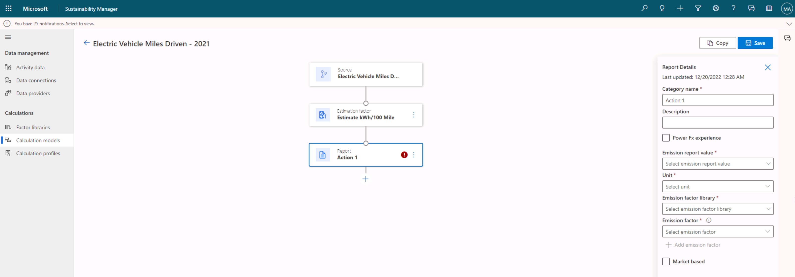

1.  Populate the Report action with the following data:
    -   **Category name**: kWh \* EF
    -   **Emission report value**: kWhQuantity
    -   **Unit**: kWh
    -   **Emission factor librar**y: EPA 2021 - eGrid
    -   **Emission factor**: US Average

1.  The fields and their values are **explained** below:
    1.  The **Category name** is used for identifying the action in the calculation model.
    1.  The **Emission report value** is used to identify which field should be used to retrieve the value used in the emission calculation. In this scenario, the Output variable from the Estimation factor action is used.

        >[!NOTE] **Note**: In this scenario, the Unit is automatically selected based on the Unit type of the Output variable from the Estimation factor node

    1.  The **Emission factor library** is used to identify which factor library will be used to identify the emission factor.
    1.  The **Emission factor** is used to identify which emission factor or factor mapping will be used to calculate the emissions. In this scenario, Alex and Wide World Importers may not know which electric grid a vehicle was charged on or the energy source, so Alex chooses the US Average emission factor to provide the estimated emissions.
    1.  Click “**Save**” to save the record.

    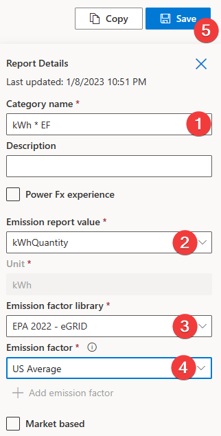

1.  Click the **back arrow on the record** to return to the list of Calculation models

    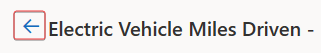

1.  The new Calculation model should now appear in the list

    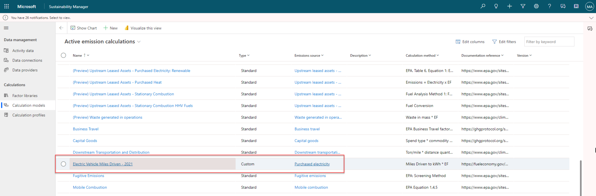

Great job, you have created a new Calculation model. This Calculation model included an estimation factor, allowing you to calculate emissions in areas where you may not know the exact quantity of an emission source, but still need to account for the carbon emissions. Calculation models are the instruction sets that are used by Microsoft Cloud for Sustainability to calculate emissions. There are several calculation models that are included with Microsoft Cloud for Sustainability based on EPA calculations. Sometimes these included models may not match your unique customer needs and you will need to create new models to provide custom calculations, be sure to review some of the included models to see other types of complex calculation models. **Please continue to the next task.**

## Exercise 3: Run Calculations

In this exercise, you will learn about the steps that Alex takes to define and run Calculation Profiles. Microsoft Sustainability Manager uses calculation profiles to define the parameters and scheduling of calculation jobs. Calculation profiles allow an organization to define what activity data to calculate emissions for, any filters on that data, which Calculation model to use, and if the calculation should be redone every time the chosen activity data changes. Calculation profiles use the parameters to create calculation jobs, which are the background worker jobs iterating over an organization’s activity data and determining the carbon emissions, based on the calculation model defined in the calculation profile. You can explore this functionality in deeper detail on Microsoft Docs, please visit [Overview of Calculation profiles](https://docs.microsoft.com/en-us/industry/sustainability/calculate-calculation-models#calculation-profile).

### Task 1: Create Purchased Electricity Calculation Profile

In this task, Alex will create a Calculation Profile for the electricity purchased by Wide World Importers for their facilities for the year 2021. Alex will use the calculation model defined early in this lab and filter the profile to only activity data for the Wide World Importers organizational unit, and where the unit type is kWh. These filters will ensure that only the purchased electricity for Wide World Importers is included in the calculation job. This will exclude the miles driven by the fleet of electric vehicles, which is covered in the next task.

1.  Navigate to “**Calculation profiles**” on the left side of the page.

    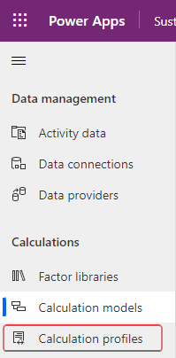

1.  Click “**+New Calculation profile**” to create a new Calculation profile

    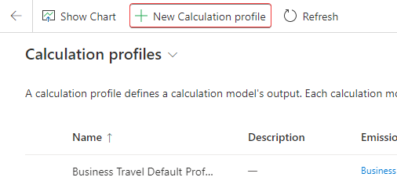

1.  Populate the following information on the New calculation profile wizard
    -   **Calculation profile name**: Purchased Electricity: Contractual Instrument Based - 2021 - Wide World Importers
    -   **Emission source**: Purchased electricity
    -   **Activity data to include in calculation**: Organizational Unit equals Wide World Importers AND Quantity Unit equals kWh
    -   **Calculation model**: Choose Purchased Electricity: Contractual Instrument Based - 2021 in the dropdown list
    -   **Check Schedule Automatically run**

1.  The fields and their values are **explained** below:
    1.  The **Calculation profile** name is used for identifying the calculation profile in the list.
    1.  The **Emission source** is used to identify which activity data type should be used in the calculation.
    1.  The **Activity data to include filter** is used to filter activity data to a specific subset of the activity data type.  
    To create the filter perform the following steps:
        1.  Click **Add-\>Add row**

            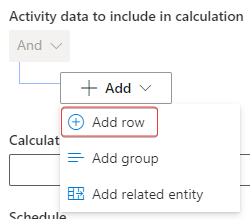

        1.  In the “Select a field” dropdown, choose **Organizational Unit**

            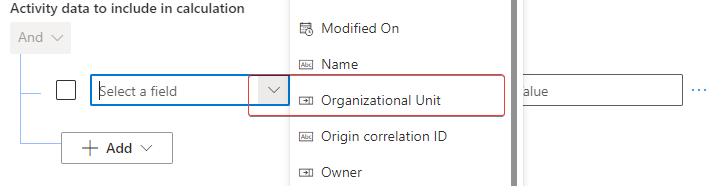

        1.  In the “Value” dropdown, choose “**Wide World Importers (Organizational unit)**”
        
            

        1.  Click **Add-\>Add row** again

            

        1.  In the “Select a field” dropdown, choose “**Quantity unit**”

            

        1.  In the “Value” dropdown, choose “**kWh**”

            

    1.  The **Calculation model** is used to identify which calculation model should be used for the calculation. **Be sure to choose the Calculation model from the dropdown list.**
    1.  “**Automatically run this calculation when data is refreshed**” is used to automatically trigger calculations when the matching activity data is refreshed.
    1.  The form should resemble the image below, Click “**Next**”

    >[!NOTE] **Note**: Choose the Calculation model from the dropdown list

    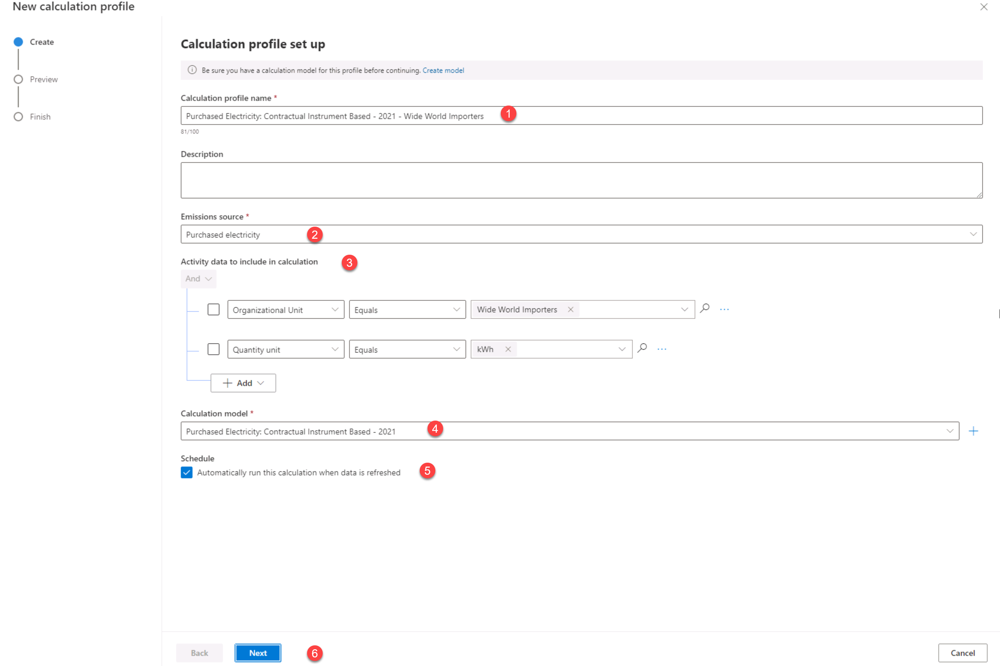

    On the “Preview” page of the New calculation profile wizard the emissions are calculated for the first row of data that matches the Activity data to include filter. **In this scenario, the values seen in the preview may be different than the image below.**

    These values were determined by converting the consumed kWh to MWh: 3519.038/1000 = 3.519038 MWh

    The values of emissions gasses are determined by multiplying the converted consumption by each of the greenhouse gas factors from the emission factor (FRCC) determined in the factor mapping:

    -   CO2: 3.519038 \* 861 = 3,029.892 lb
    -   CH4: 3.519038 \* .055 = 0.194 lb
    -   N20: 3.519038 \* .007 = 0.025 lb

    Finally, multiplying the greenhouse gases by their GWP factor (Global Warming Potential) found in the Greenhouse gases table, and adding up the values.

    >[!NOTE] **Note**: the values in this by hand demonstration have been rounded to 3 decimal points resulting in a slightly different value. Microsoft Sustainability Manager computes up to 10 decimal points

    -   CO2: 3,029.892 \* 1 = 3,029.892 lb
    -   CH4: 0.194 \* 25 = 4.85 lb
    -   N20: 0.025 \* 298 = 7.45 lb
    -   CO2E: 3,029.892 + 4.85 + 7.45 = 3,042.19 lb
1.  You can click “**Save**” to save your Calculation profile.

    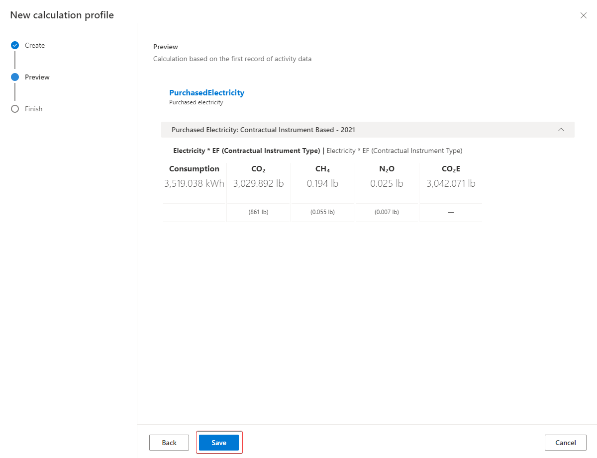

Great job, you have created a calculation profile. Calculation profiles are the mechanisms by which Calculation jobs are queued. You can set your Calculation profiles to run automatically when matching Activity Data is added or updated, as we chose in this scenario, or you can run them manually which we will discuss in Task 3 of this exercise. **Please continue to the next task.**

### Task 2: Create Electric Vehicle Miles Driven Calculation Profile

In this task, Alex will create a Calculation Profile for the miles driven by Wide World Importers’ fleet of electric vehicles for year 2021. They will use the calculation model defined earlier in this lab and filter the profile to only activity data for the Wide World Importers organizational unit, and where the unit type is mile. These filters will ensure that only the miles driven for Wide World Importers’ fleet of electric vehicles is included in the calculation job. This will exclude the purchased electricity, which was covered in the previous task.

1.  Navigate to “**Calculation profiles**” on the left side of the page.

    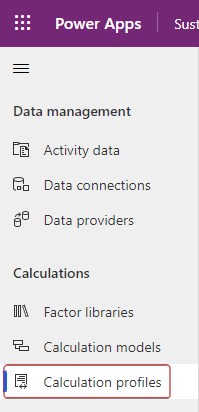

1.  Click “**+New Calculation profile**” to create a new Calculation profile

    

1.  Populate the following information on the New calculation profile wizard
    -   **Calculation profile name**: Electric Vehicle Miles Driven - 2021
    -   **Emission source**: Purchased electricity
    -   **Activity data to include in calculation**: Organizational Unit equals Wide World Importers AND Quantity unit equals mile
    -   **Calculation model**: Choose Electric Vehicle Miles Driven - 2021 in the dropdown list
    -   **Check Schedule Automatically run**

1.  The fields and their values are explained below:
    - (1) The **Calculation profile name** is used for identifying the calculation profile in the list.
    - (2) The **Emission source** is used to identify which activity data type should be used in the calculation.
    - (3) The **Activity data to include filter** is used to filter activity data to a specific subset of the activity data type.
    To create the filter perform the following steps: 
        
        1.  Click **Add-\>Add row** 
        
        
        1.  In the “Select a field” dropdown, choose “**Organizational Unit**”
        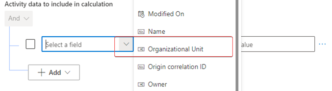

        1.  In the “Value” dropdown, choose “**Wide World Importers (Organizational unit)**”
        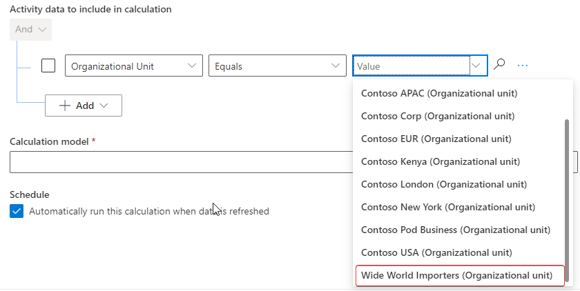

        1.  Click **Add-\>Add row** again
        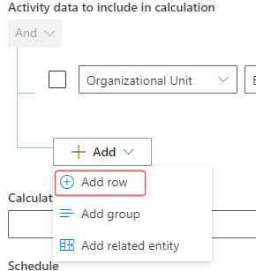

        1.  In the “Select a field” dropdown, choose “**Quantity unit**”
        

        1.  In the “Value” dropdown, choose “**mile**”
        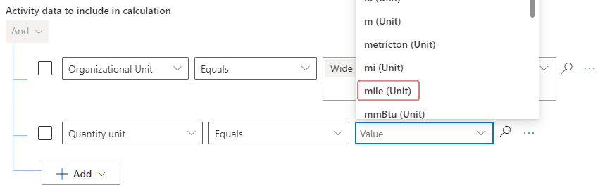

    - (4)  The **Calculation model** is used to identify which calculation model should be used for the calculation. **Be sure to choose the Calculation model from the dropdown list.**
    
    - (5)  “**Automatically run this calculation when data is refreshed**” is used to automatically trigger calculations when the matching activity data is refreshed.
    
    - (6) The form should resemble the image below, Click “**Next**”
        
        >[!NOTE] **Note**: Choose the Calculation model from the dropdown list
    
        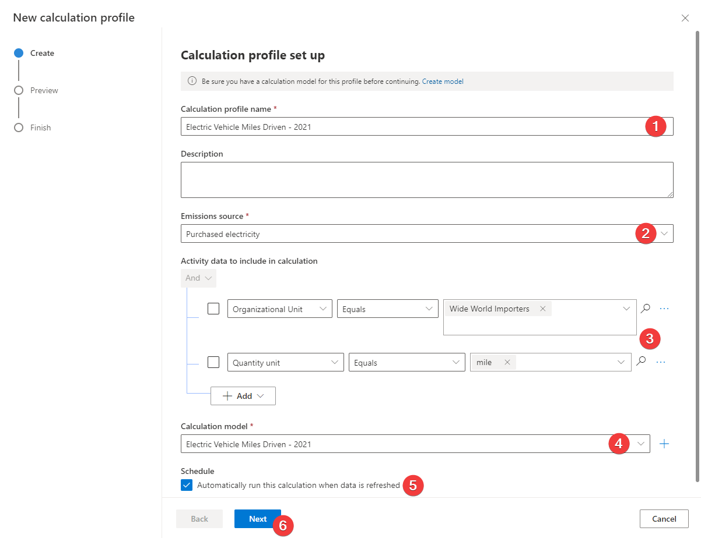

    On the “Preview” page of the New calculation profile wizard you will see the emissions calculated for the first row of data that matches your Activity data to include filter. **In this scenario, the values seen in the preview may be different than the image below.**

    These values were determined by converting the miles driven to kWh: (7484.724 / 100) \* 49 = 3667.515 kWh

    The consumed kWh converted to MWh: 3667.515/1000 = 3.667515 MWh

    Multiplying the converted consumption by each of the greenhouse gas factors from the emission factor (FRCC) determined in the factor mapping:

    -   CO2: 3.667515 \* 861 = 3,001.127 lb
    -   CH4: 3.667515 \* .055 = 0.238 lb
    -   N20: 3.667515 \* .007 = 0.033 lb

    Finally, multiplying the greenhouse gases by their GWP factor (Global Warming Potential) found in the Greenhouse gases table, and adding up the values.

    >[!NOTE] **Note**: the values in this by hand demonstration have been rounded to 3 decimal points resulting in a slightly different value. Microsoft Sustainability Manager computes up to 10 decimal points

    -   CO2: 3,001.127 \* 1 = 3,001.127 lb
    -   CH4: 0.238 \* 25 = 5.95 lb
    -   N20: 0.033 \* 298 = 9.834 lb
    -   CO2E: 3,001.127 + 5.95 + 9.834 = 3,016.911 lb

1. You can click “**Save**” to save your Calculation profile.

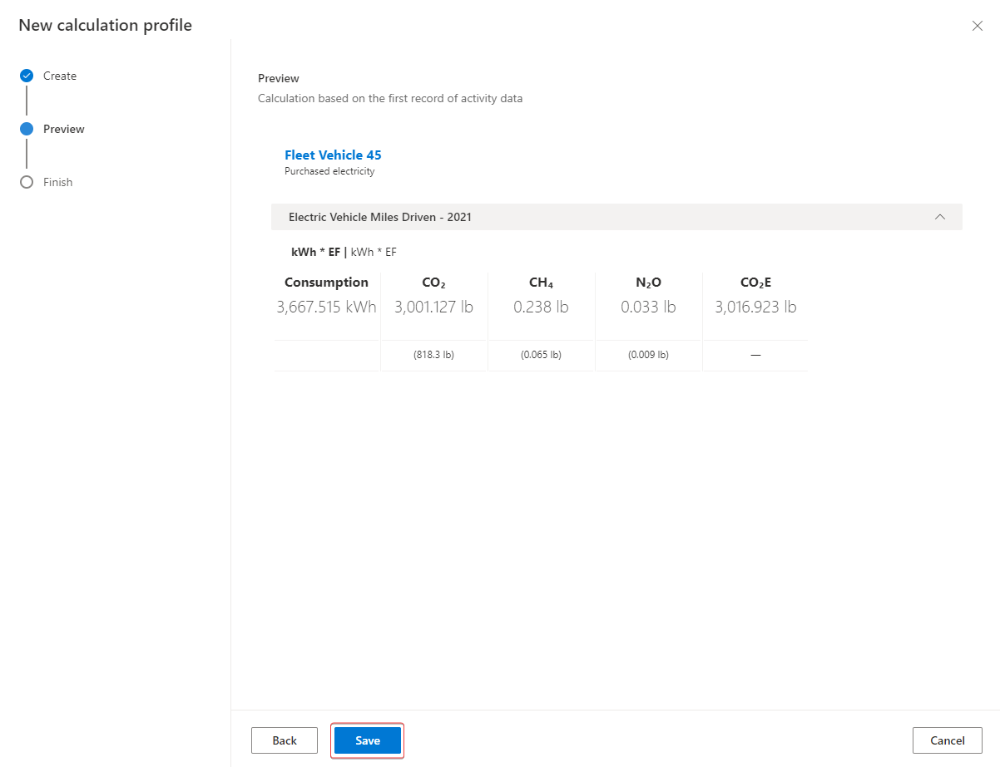

Great job, you have created a calculation profile. Calculation profiles are the mechanisms by which Calculation jobs are queued. You can set your Calculation profiles to run automatically when matching Activity Data is added or updated, as we chose in this scenario, or you can run them manually which we will discuss in Task 3 of this exercise. **Please continue to the next task.**

### Task 3: Run Calculation Profiles

In this task, Alex will run the newly created Calculation Profiles for the electricity purchased by Wide World Importers and miles driven by Wide World Importers fleet of electric vehicles. This will create a calculation job that will iterate over each activity data row matching the Calculation Profile filter criteria and use the Calculation Models created earlier in this lab to calculate the carbon emissions for each row. The results will be placed in the emissions table, which Alex will review once the calculations complete.

1.  Navigate to “**Calculation profiles**” on the left side of the page.

    

1.  To run the calculation profile for Purchased Electricity: Contractual Instrument Type - 2021:
    - (1) Select **Purchased Electricity: Contractual Instrument Based - 2021 - Wide World Importers** in the list
    - (2) Click **Run calculation** on the command bar

    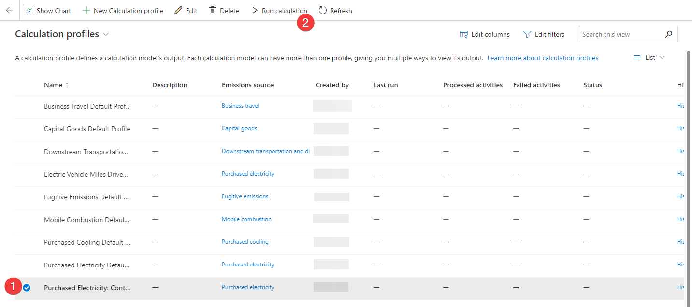

1.  To run the calculation profile for Electric Vehicle Miles Driven - 2021:
    - (1) Select **Electric Vehicle Miles Driven - 2021** in the list
    - (2) Click **Run calculation** on the command bar

    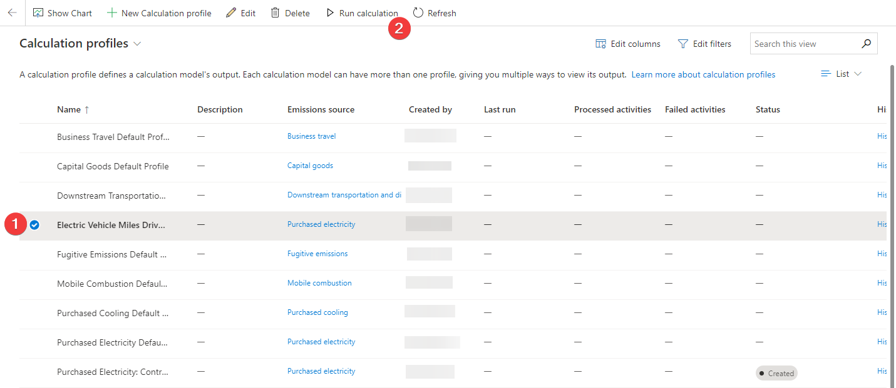

1.  After several minutes (approximately 6 minutes) both calculation jobs should be completed. Alex clicks the “**Refresh**” button on the command bar to check the status of the calculation jobs. The two Calculation profiles should now have a status of “**Succeeded**”.

    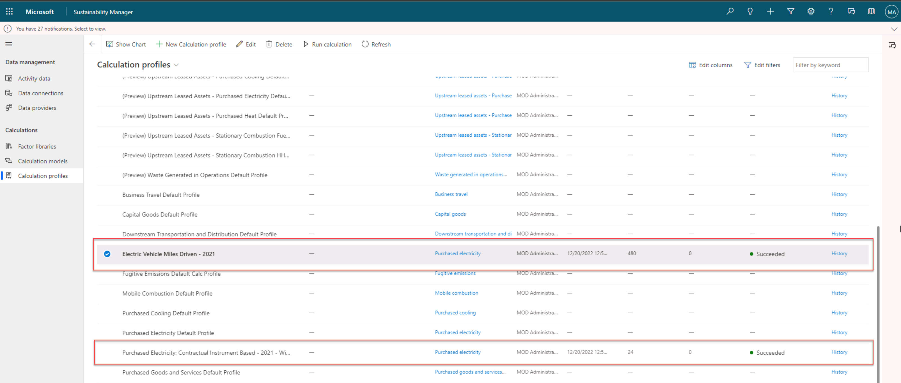

1.  In the bottom left corner, change the Area to **Analytics**

    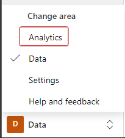

1.  Navigate to “**All emissions**” on the left side of the page.

    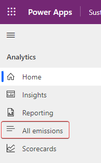

1.  The All emissions view shows all emissions that have been calculated or directly imported

    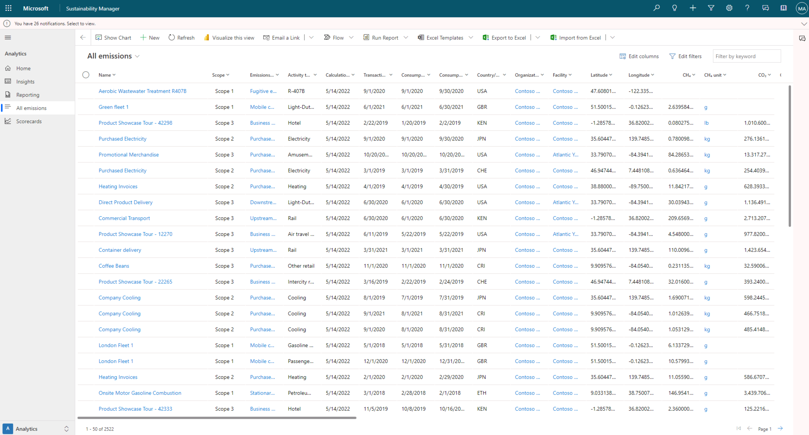

1.  Filter the view by clicking the down arrow next to the **Organizational Unit** column, and selecting **Filter by**

    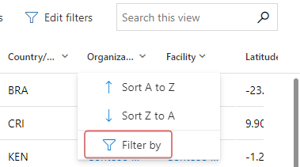

1.  Select “**Wide World Importers**” from the Filter By dialog

    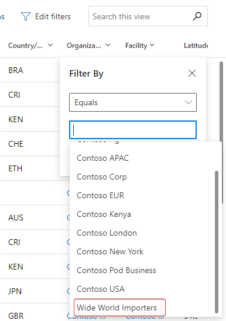

1.  Click **Apply** to apply the filter to the column

    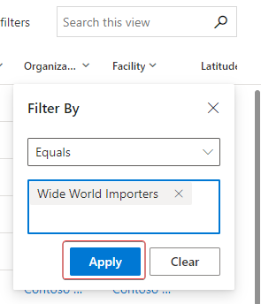

1.  After a few moments, the view will refresh, and the calculated emissions data for each of the activity data records imported in previous labs will be shown. Scroll to the right to see the CO2E carbon emission values.

    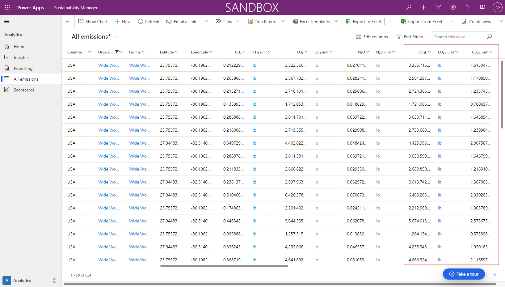

**Congratulations!** You have created and run Calculation profiles. Calculation profiles are the final step in calculating and recording your carbon emissions in Microsoft Cloud for Sustainability. From here you will be able to Report and Reduce your carbon emissions, which we will discuss in the next labs. It may take 30 minutes for your emissions to appear in the Reporting areas.
