# Module 7 Lesson 2 Lab 5: Goals and scorecard

## Overview

### Background

In the previous four labs, the master and system data were set up and calculations performed to report on emissions. In this lab, the focus is on setting carbon emission reduction goals and tracking them using scorecards. In the scorecard, emission reduction goals can be introduced based on the organization’s sustainability priorities and can be collaboratively tracked with various stakeholders using the Teams collaboration feature.

### Learning Objectives

In this lab, you will do the following:

-   Create Scorecards and Goals to monitor progress towards Carbon reduction targets
-   Understand goal check-ins
-   Configure and use Microsoft Teams Chat collaboration features

### Prerequisites

-   Microsoft Sustainability manager environment is set up with sample data
-   Lab 1 organization and reference data is entered
-   Lab 2 activity data is ingested
-   Lab 3 emissions are calculated
-   Lab 4 deep analysis and reporting review

### Solution Focus Area

Scorecards and goals can help curate sustainability metrics and track them against an organization’s key business objectives. After the scorecard is created that includes goals, the scorecard progression can be periodically checked including how the scorecard is progressing and to make any required adjustments.

There will probably be times when there is a need to share and discuss data, reports, analytics, or goals across many stakeholders in the organization. To help make those conversations contextual and collaborative, Teams Chat is available directly in Microsoft Sustainability Manager.

### Personas and Scenarios

In this lab, Amber Rodrigues – Sustainability specialist for Contoso Corp creates and monitors Carbon reduction goals. Based on the insights from the Deep Analysis dashboard, Amber creates a new scorecard for Wide World Importers and creates a goal to reduce their carbon emissions from the previous year. Amber sets up automatic goal check-ins to track the ongoing status of the goal.

Finally, Amber, with the help of Reed Flores – IT Admin for Wide World Importers, configures Microsoft Teams collaboration. Once configured, Amber opens a chat with one of their colleagues to discuss changes to a factor library, continuing Ambers great work to record, report, and reduce carbon emissions across Wide World Importers and the entirety of Contoso Corp.

In this lab exercise, we will focus on the scenarios illustrated below:

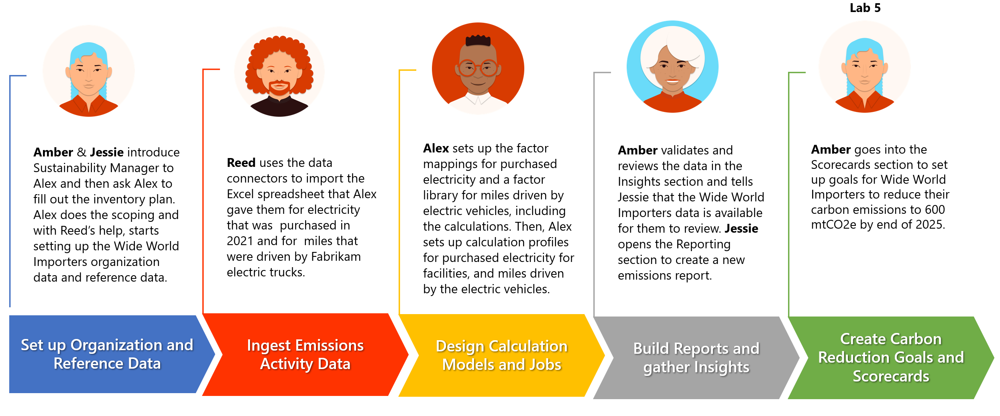

===

## Exercise 1: Define sustainability goals

In this exercise, you will learn about the steps that Amber takes to create scorecards and goals to help Wide World Importers track carbon reduction progress. Based on the results of the previous lab, Amber has determined that Wide World Importers needs to reduce their Scope 2: Purchased electricity carbon emissions. Scorecards and goals allow organizations to set carbon reduction targets and track their progress to that. You can explore this functionality in deeper detail on Microsoft Docs, please visit Overview of scorecards and goals +++https://docs.microsoft.com/en-us/industry/sustainability/reports-scorecards-goals+++.

1. Log into the virtual machine using the virtual machine credentials located on the **Resources** tab above.

1. Open a new browser window and navigate to +++https://make.powerapps.com+++.

1. Log into your Microsoft 365 tenant using the credentials for the tenant located on the Resources tab above.

1. If needed, change the environment to MC4S on the top bar.

1. Open the Sustainability Manager Application.
    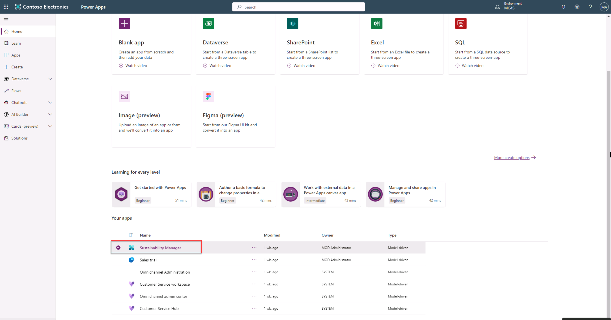

    >[!ALERT] **Important:** Please make sure that you have completed the previous labs to ensure that the scorecard and goals show meaningful data.

### Task 1: Create a new Scorecard

In this task, Amber will create a new scorecard to track the goals for Wide World Importers. Microsoft Sustainability Manager utilizes scorecards to group goals together.

1.  Change the current Area to **Analytics**, if necessary.

    

1.  Navigate to **Scorecards** on the left side of the page.

    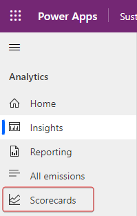

1.  On the **Scorecards** view, select **+Add Scorecard**.

    

1.  Amber uses the following information to populate the fields on the new Scorecard.
 
    (1) Enter the **Name**: +++Wide World Importers Reduction Plan - 2025+++

    (2) Select **Save**.

    > [!NOTE] **Note:** The name of the scorecard is used for identifying the scorecard in the list.

    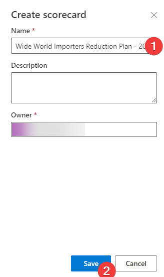

1.  Your new Scorecard will open automatically.

    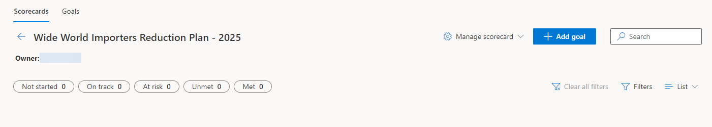

Great job, you have helped Amber create a new scorecard to track the goals for Wide World Importers. Scorecards are used to track progress towards an organization’s sustainability goals by serving to logically group goals together. In the next tasks we will discuss creating goals and goal check-ins.  **Please continue to the next task.**

### Task 2: Create a Goal

In this task, Amber will create a new goal instructing Wide World Importers to reduce their carbon emissions from 900 mtCO2E to 600 mtCO2E. Amber will enable automatic check-ins and status rules to ensure that the goal is automatically kept up to date. These automatic check-ins will occur once every 24 hours. Microsoft Sustainability Manager utilizes goals to help organizations like Contoso Corp and Wide World Importers track their carbon reduction goals.

1.  Select the **+Add goal** button to create a new goal.

    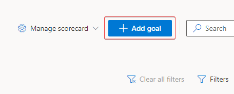

1. The first fields of the goal are explained below: 

    - **Goal name** is used for identifying the goal in the list.
    - **Owner** is used to identify the primary person responsible for monitoring and tracking goal progress.
    - **Scorecard** is used to specify which scorecard to associate the goal with. In this scenario, because the goal was created on the scorecard page, the scorecard field is automatically filled out.
    - **Organizational unit** is used to identify which Organizational unit the goal is associated with.
    - **Start date** is used to identify the starting time frame of the goal.
    - **End date** is used to identify the ending time frame of the goal.
    - **Unit of measure** is used to specify which unit you would like to measure in this goal.
    - **Starting value** is used to specify your starting point for the goal.
    - **Source of current value** is used to specify what the source of the current value is, if set to Enter Manually, or where to retrieve the current value from each day. The **Source of current value** can be a roll up from other child goals, or as in this scenario, Connected to data.

1.  Amber uses the following information to populate these fields on the new Goal. Enter the data:

    (1) **Goal name**: +++Reduce Scope 2 Emissions – 2022+++

    (2) **Owner**: +++MOD+++ and select **MOD Administrator**

    (3) **Scorecard**: Wide World Importers Reduction Plan - 2025

    (4) **Organizational unit**: Wide World Importers

    (5) **Start date**: 12/31/2021 (select from calendar, do not type)

    (6) **End date**: 12/31/2022 (select from calendar, do not type)

    >[!NOTE] **Note**: The automatic check-in process will not perform a check-in if the current date is outside of the Start and End date range. Wide World Importers chose 12/31/2021 to include the final calculation of 2021 as the first, or base, check-in value for the new goal

    (7) **Unit of measure**: mtCO2E

    (8)**Starting value**: +++900+++
   
    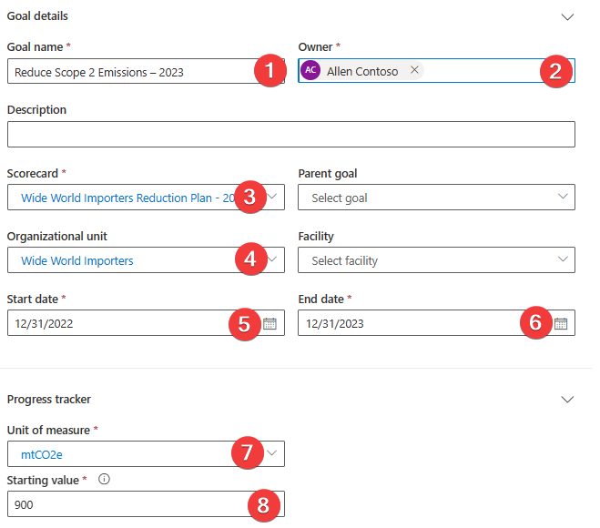

1. For **Source of current value**, Amber wants **Connect to data** with **Emission** as the **Data source** and **CO2E** as the **Value**. Select **Connect to data** and then select **Set up connection**.

    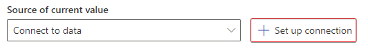

    1. Choose **Emission** as the **Data source**. This is the table where the data will come from.

    1. Select **CO2E** as the **Value**. This is the field where the data will come from.

    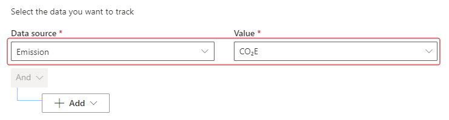  
  
1. Amber wants to filter the data by: **Org Unit equals Wide World Importers AND Consumption end date Last year**. 

    1. Select **Add -> Add row**.

        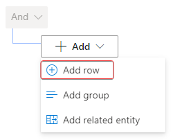

    1.  In the **Select a field** dropdown, choose **Organizational unit**.

        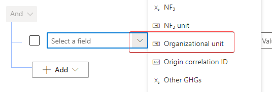

    1.  In the **Value** dropdown, choose **Wide World Importers (Organizational unit)**.

        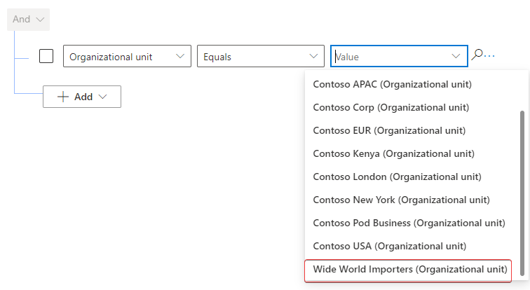

    1.  Select **Add -> Add row** again.

        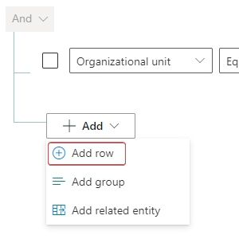

    1.  In the **Select a field** dropdown, choose **Consumption end date**.

        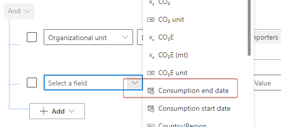

    1.  In the **Operator** dropdown, which currently says **Equals**, choose **Last year**.

        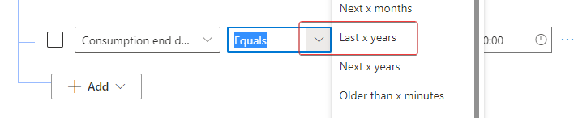

1.  At the top of the form, select **Calculate** to see a preview of the data that would be used for the current value check in. Copy this value. **The value calculated may be different from the image below.**

    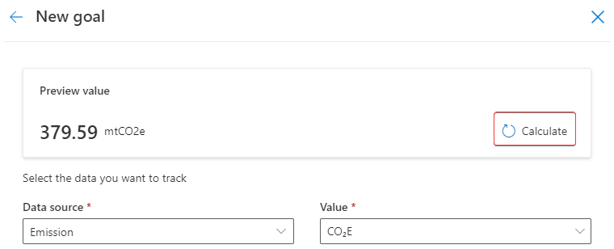

1.  The Current value data connection should look like the image below. Select **Confirm** when finished.

    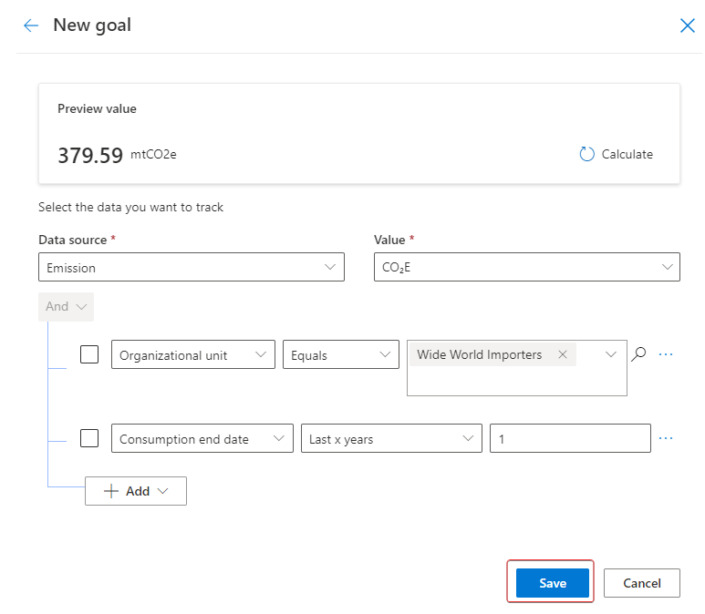

1.  The next fields of the goal are explained below:
    - **Source of target value** is used to specify what the source of the target value is. The **Source of target value** can be connected to data or, in this scenario, entered manually. 
    -  **Status update method** is used to specify how the status of the goal check ins will be set. The **Status update method** can be entered manually or, in this scenario, automatic to automatically set the status for goal check-ins based on a set of rules. 

1. Amber selects **Enter manually** for the **Source of target value** and our target of reducing our annual emissions as 600 mtCO2E. To do this:
    1. Select **Enter manually** for **Source of target value**.
    1. Set **Target value** to +++600+++ mtCO2E annual emissions.

        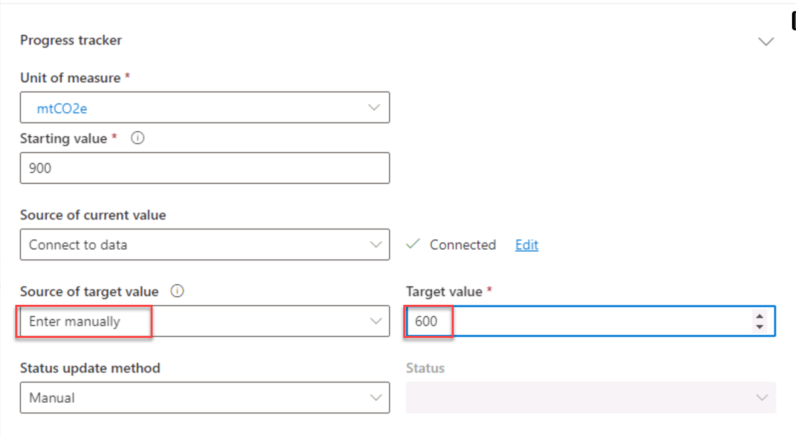

1. Amber selects **Automatic** for the **Status update method** and wants to create a rule to change the status to **At risk** when the value is over **600** or leave as **On track** otherwise. To do this, follow these steps:

    1.  Select **Automatic** next to **Status update method**.
    1.  Select **Setup status rules** to start a new rule for our Status.

        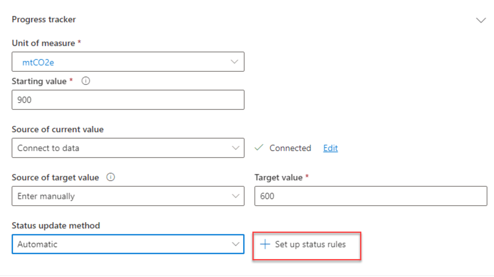

    1. Select **+ Add rule**.

        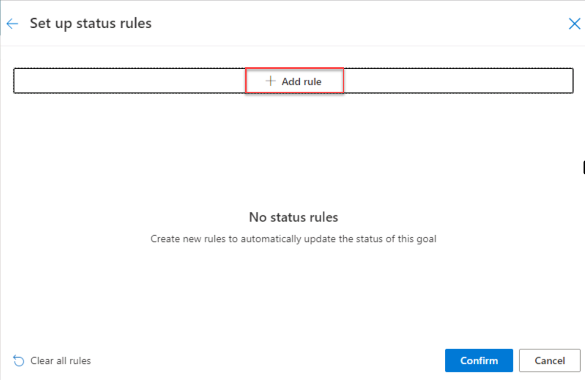

    1.  In the **Operator** dropdown, choose **is greater than**.

        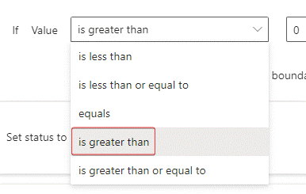

    1.  In the **Value** field, which currently says **0**, enter +++**600**+++, and select **At Risk** from the **Set status to** dropdown.

         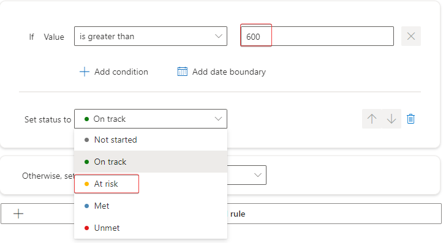

        This specifies that if the check-in value is greater than 600 (our target value), then the organization is at risk, and the check-in will have a status of At risk.

    1.  In the **Otherwise, change status to** dropdown, select **On track**.

        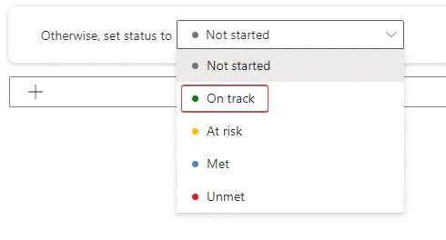

        This specifies that if the condition above is not met during a check-in, then we are on track to meeting the goal, and the check-in will have a status of On track.

    1.  The Status rules should look like the image below. Select **Confirm**.

        

    1.  Select **Save**.

    (need new image of finshed goal prior to Save)
        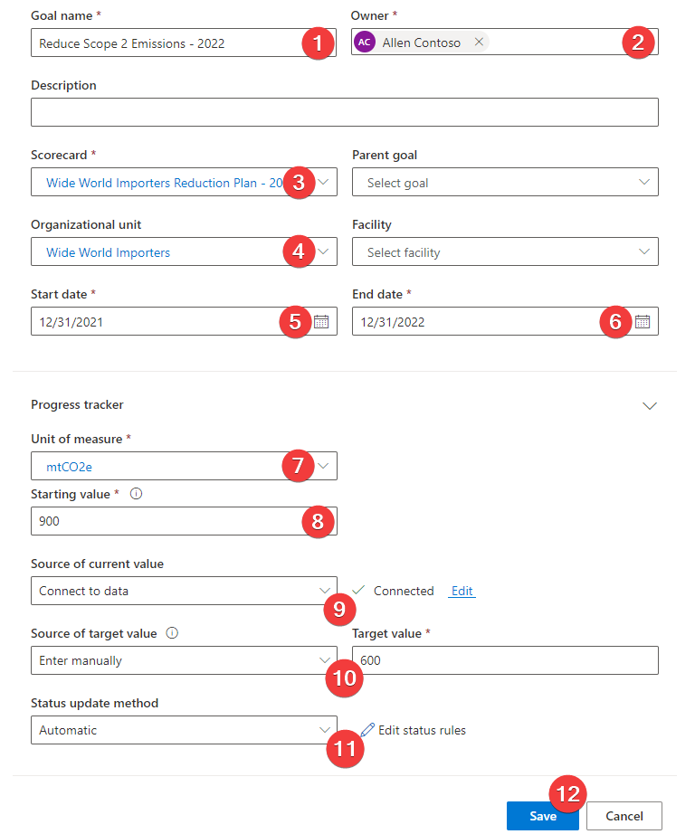

1.  The new goal should be visible in the list of goals for the scorecard.

    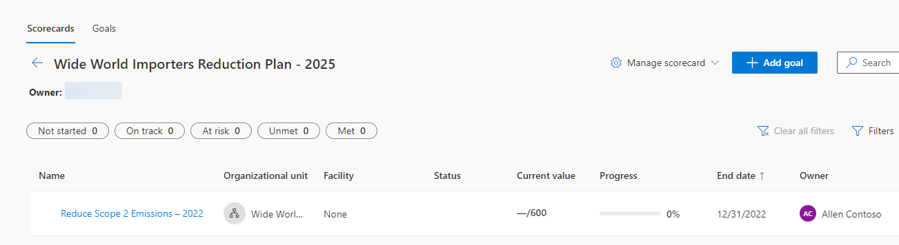

Great job, you have helped Amber create a goal for your scorecard instructing Wide World Importers to reduce their carbon emissions from 900 mtCO2E to 600 mtCO2E. You enabled automatic check-ins and status rules to ensure that the goal is automatically kept up to date. Goals are important to keep track of an organization’s progress towards reducing their carbon footprint. Any goals you have with a current value that is connected to data will have check-ins created roughly every 24 hours. Let’s go ahead and create our first check-in manually so you are familiar with the check-in data.  **Please continue to the next task**

### Task 3: Create a Goal Check-in

In this task, Amber will create a manual goal check-in Wide World Importers Scope 2 reduction goal, this will be for the first check-in, so they do not need to wait 24 hours for the first check-in to occur.

Sometimes we may have goals that are set to use manually check-ins if we are not able to connect data to them, or even after a goal with connected data is created, we need to wait roughly 24 hours for our first check-in to occur. In either of these situations, you may find it useful to be able to create and review a check-in. This task will take you through the process of creating a Goal Check-in.

1.  Amber opens the goal that was created in the previous task by selecting the goal name from the list in the scorecard.

    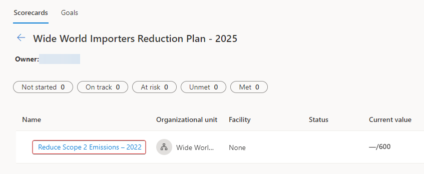

1.  Amber can see:

    (1) **Progress** towards the Reduce Scope 2 Emissions - 2022 goal

    (2) The goal check-in **History**

    (3) The **Goal details**

    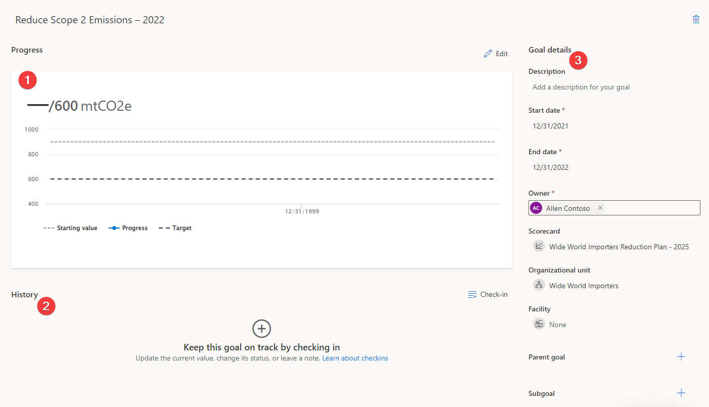

1.  In the **History** section, select either the **+** or the **Check-in** button to create a new Goal check-in for the first check-in.

    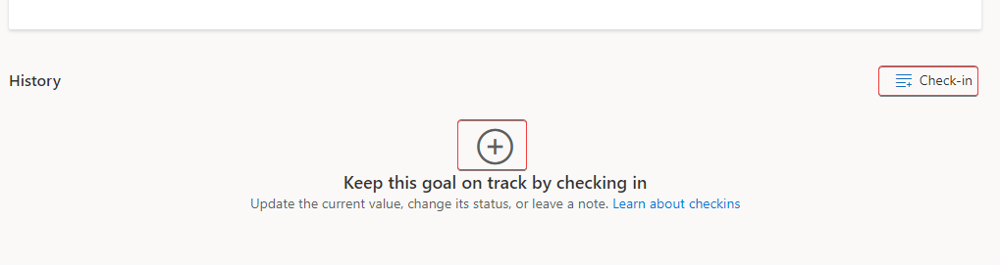

1.  A **New check-in** box will appear.

    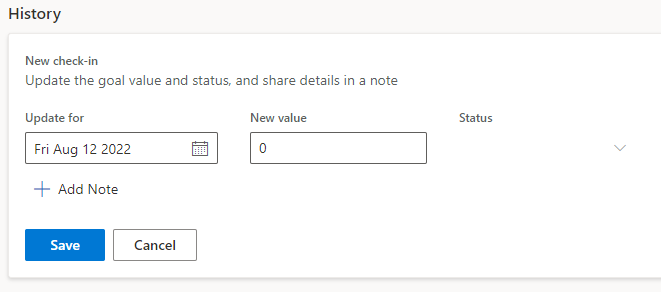

1.  The fields are explained below:

    - **Update for** is used identify what date the check-in was for. This may be the current date or a date in the past.
    - **New value** is used to specify the current value of the goal check-in. This value will be used on the Progress chart above

        >[!NOTE]Note: In this scenario, the Status will be automatically set based on the Status rules we set on the goal

    - **Note** is optionally used if you want to provide more information or context about the check-in, such as a heatwave increased heating which resulted in an abnormally high carbon emission value for this check-in.

1.  Populate the **New check-in** with the following data:

    (1) **Update for**: Use today’s date.

    (2) **New value**: The preview value from the Source of current value connection screen. In this scenario, +++379.59+++.

    (3) Select **Add Note** and set +++First check-in+++.

    (4) Select **Save**.

    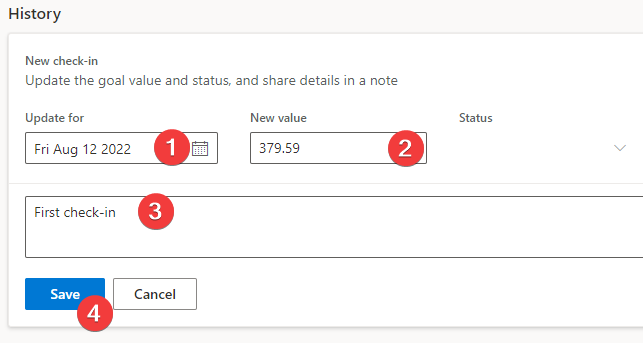

1.  Amber now sees:

    -   The **Progress** section has updated showing the latest check-in value and status, as well its plot on the graph.
    -   The **History** section shows the recently created check-in with the status automatically set based on the goal rules. Check-ins will be shown in the order of newest to oldest.

    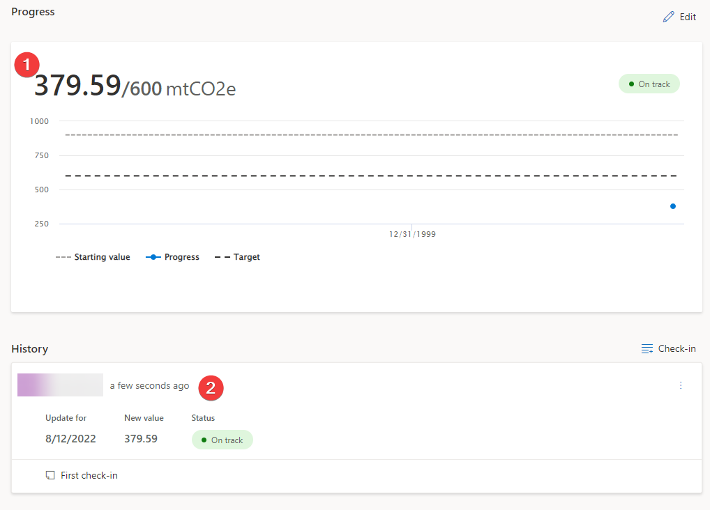

Great job, you have helped Amber create a scorecard and goal to help Wide World Importers track carbon reduction progress. These tasks are critical to helping an organization realize their Sustainability goals. Some important notes:

-  **Automated Goal check-ins run via a backend service roughly every 24 hours**, based on the time of day when the Microsoft Cloud for Sustainability was installed.
-  **As of the current release, there is not a way to change the timing for Automated Goal check-ins**.
-  You can create a manual check-in at any time.
-  You can import historical Goal Check-ins by using the native Power Platform data import wizard. The Goal Check-in table is called **Check-ins**.

**Please continue to the next task.**

===

## Exercise 2: Set up Teams collaboration

In this exercise, Reed Flores – IT Admin for Wide World Importers will configure integration with Microsoft Teams for Microsoft Sustainability Manager. Microsoft Teams offers several features useful for organizations. By integrating Microsoft Cloud for Sustainability with Microsoft Teams, you can improve the collaboration between your sustainability team and improve the performance of your carbon reduction goals. You can quickly collaborate with colleagues utilizing Microsoft Teams Chat embedded in Dynamics 365.

>[!NOTE] **Note**: The following task, **Enable enhanced Teams Integration and Turn on Microsoft Teams chats inside Dynamics 365**” requires Global Administrator rights in your tenant. 

### Task 1: Enable enhanced Teams Integration and Turn on Microsoft Teams chats inside Dynamics 365

By default, the Basic and Enhanced Microsoft Teams integration is disabled in Microsoft Sustainability Manager. In this Task, Reed will enable Microsoft Teams in Dynamics 365.

1.  Change the current Area to **Settings**.

    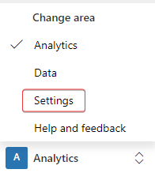

1.  Navigate to **Teams chat** on the left side of the page.

    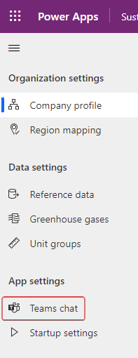

1.  On the **Microsoft Teams collaboration and chat** page, switch **Turn on the linking of Dynamics 365 records to Microsoft Teams channels** to **Yes**.

    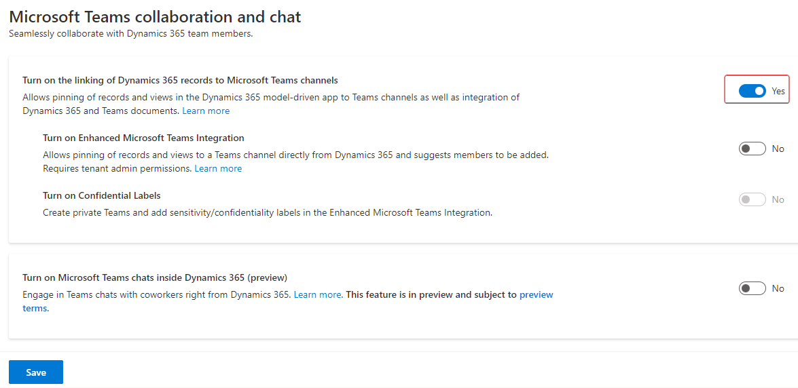

1.  Select the **Save** button at the bottom left.

    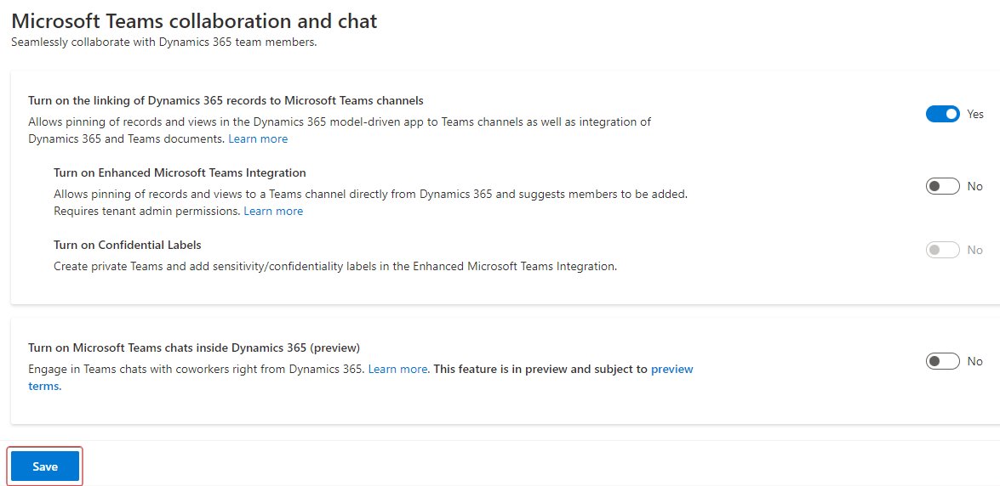

1.  After the page finishes saving, switch **Turn on Enhanced Microsoft Teams Integration** to **Yes**.

    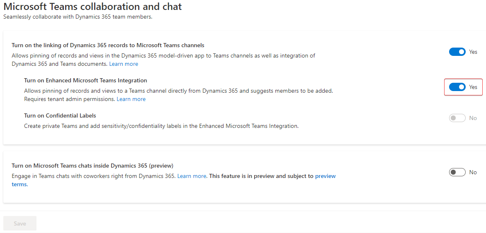

1.  Another pop-up window will open to grant permissions. Select the user you are signed in as currently (this account must be a global administrator).

    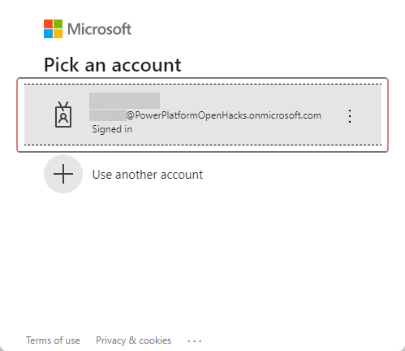

1.  Select **Accept** for requested permissions. It may take several minutes to configure. Ensure you do not have pop ups blocked that may interfere with the communication. If so, turn off blockers for this website, cancel and try connecting again.

    

1.  Once the dialog disappears, Select the **Save** button at the bottom left.

1.  Both Microsoft Teams Integration settings are now set to **Yes**.

    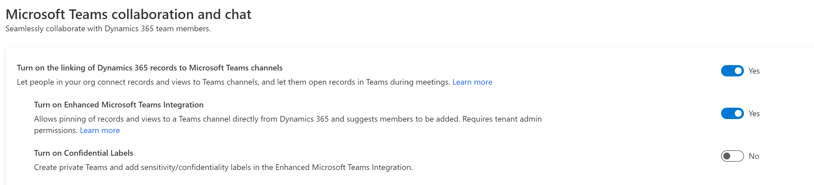

1.  On the **Microsoft Teams collaboration and chat** page, switch **Turn on Microsoft Teams chats inside Dynamics 365** to **Yes**.

    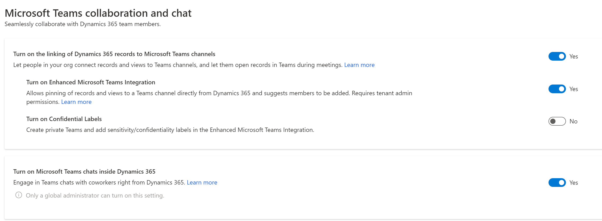

1.  Select the **Save** button at the bottom left.

    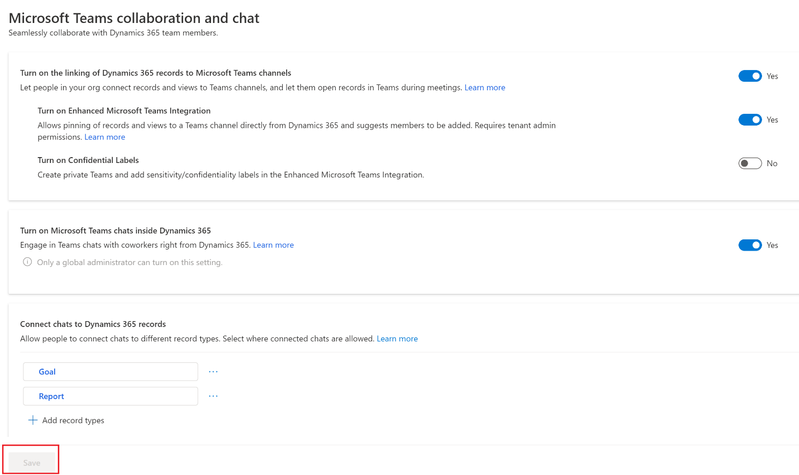

1.  Microsoft Teams chats inside Dynamics365 is now set to **Yes**, and a new section appears at the bottom of the screen called **Connect chats to Dynamics 365 records**.

    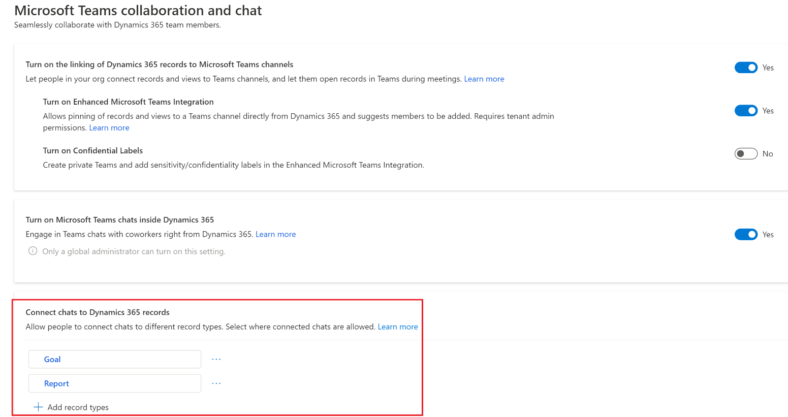

Great job, you have helped Reed enable Microsoft Teams integration for Dynamics 365 and turn on Microsoft Teams chats inside Dynamics 365. This will help Reed improve collaboration between teams and improve performance on goals. Please continue to the next task. **Please continue to the next task.**

### Task 2: Add Link chats to Dynamics 365 records

In this task, Reed will add a new Dynamics 365 record type, Factor Library, to the Link chats configuration. This feature allows other record types to be linked to Teams chats directly within Microsoft Sustainability Manager.

1.  In the Microsoft sustainability manager for your environment, navigate to **Settings -> Teams chat** on the left side of the page, if necessary.

    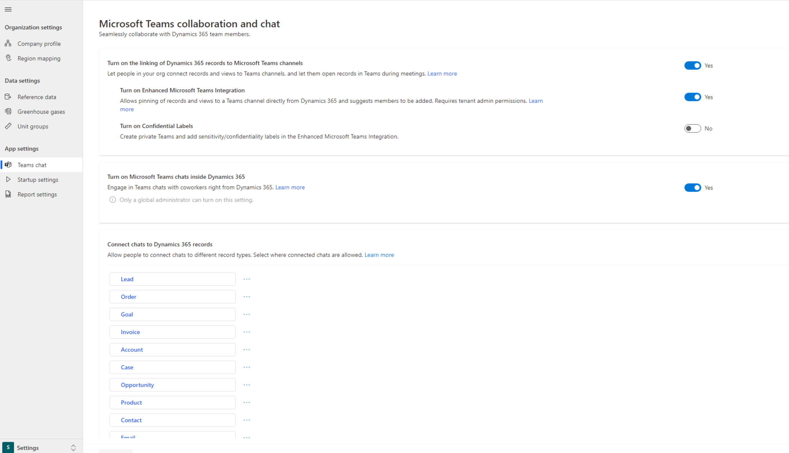

1.  On the **Microsoft Teams collaboration and chat** page, switch **Turn on Microsoft Teams chats inside Dynamics 365** to **Yes**, if necessary.

1.  In the **Connect chats to Dynamics 365 records** area, select **+Add Record Types** to add a Link chat configuration.

    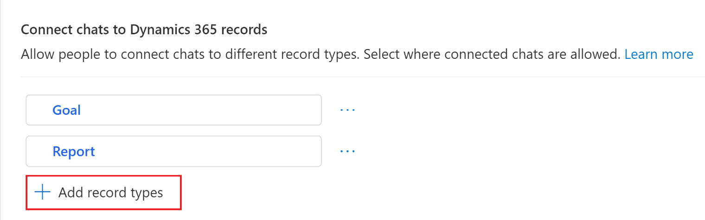

1.  On the **Allow chats to be connected to this record type** form, select +++Factor library+++ in the **Choose record type** lookup (you can scroll or type).

    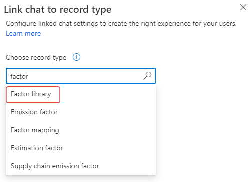

1.  Switch **Join chat** and **Include a note** to **On**. Select **Factor libraries** from the **Message view** dropdown.

    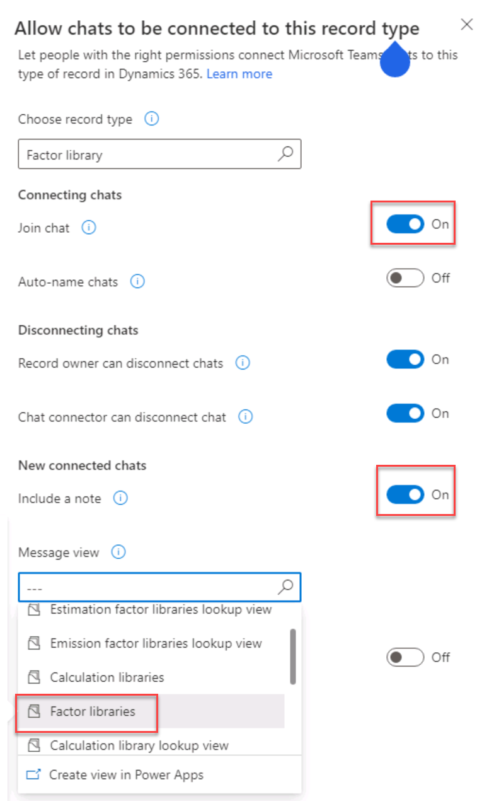

1.  Hovering the mouse over a view while the Message view list is open will give a preview of the message. The first 4-5 fields from the view are included in the message.

    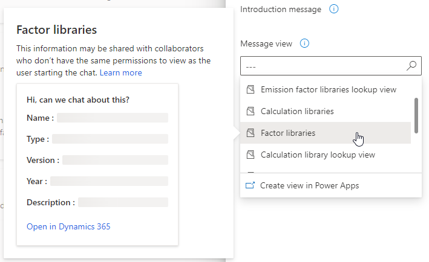

1.  Select **Save**.

   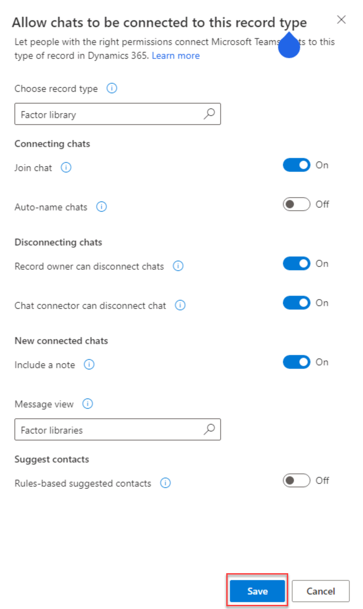

1.  Factor library is now visible in the list of connected record types.

    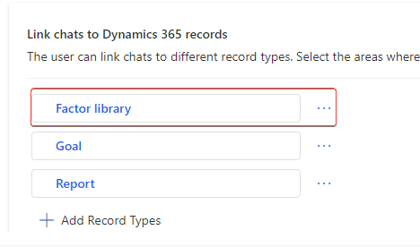

Great job, you have helped Reed turn on and configure a new Dynamics 365 record type, Factor Library, to the Link chats configuration. This will allow Reed to create linked Microsoft Teams chats directly inside of Cloud for Sustainability to discuss specific records. Next, we will test out the Microsoft Teams integration. **Please continue to the next task.**

### Task 3: Create a Microsoft Teams linked chat

In this task, Amber will create a linked chat to collaborate with Allen Contoso to discuss the EPA 2022 - eGRID in preparation for 2022 reporting needs.

1.  Change the current Area to **Data**.

    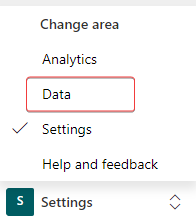

1.  Navigate to **Factor libraries** on the left side of the page.

    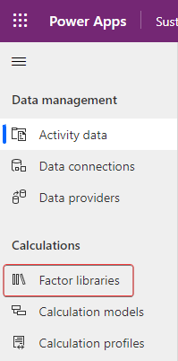

1.  Select the **EPA 2022 - eGRID** Factor library.

    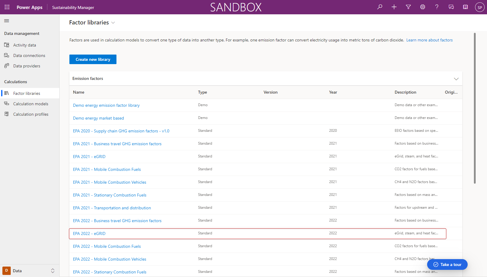

1.  Select the **Chat** icon in the top right corner of the screen to open the Microsoft Teams chats inside of Cloud for Sustainability.

    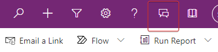

1.  Select **New connected chat** to create a new chat window with another user, Allen Contoso, to discuss changes to the Factor mappings on the EPA 2022 - eGRID Factor library.

    >[!NOTE] **Note**: You may need to wait a few minutes or perform a hard refresh (CTRL+F5) for the **New connected chat** button to appear the first time.

    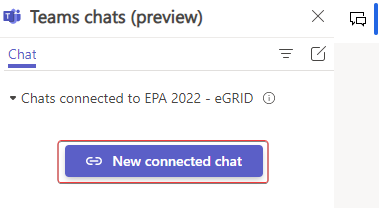

1.  On the **New linked chat** blade:

    (1)  Search for chat **Participants** - for this scenario use the dummy account, +++**Allen Contoso**+++.

    (2)  Add a note to provide context for the chat to the participants.

    (3)  When finished, select **Start chat**.

    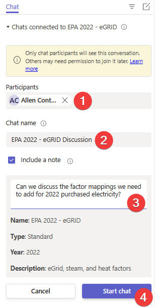

1.  In a few moments an embedded chat window with all participants will appear, and a message will be displayed with the note that was included, some of the record data, and a link to the record.

    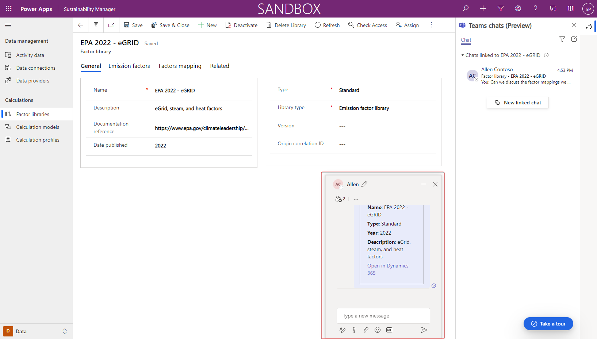

Great job, you have helped Amber create a linked chat to collaborate with Allen Contoso to discuss the EPA 2022 - eGRID in preparation for 2022 reporting needs.

**Congratulations!** Reed and Amber can now use the scorecard and its information in the new linked chat you set up with one of their colleagues to discuss changes to a factor library, continuing Ambers great work to record, report, and reduce carbon emissions across Wide World Importers and the entirety of Contoso corp. Linked chats can be used to help teams and organizations collaborate and improve efficiency by having the record context directly in the chat. You can configure many entities to have linked chats, as well as utilize custom system views to tailor the displayed fields to an organization’s needs.
